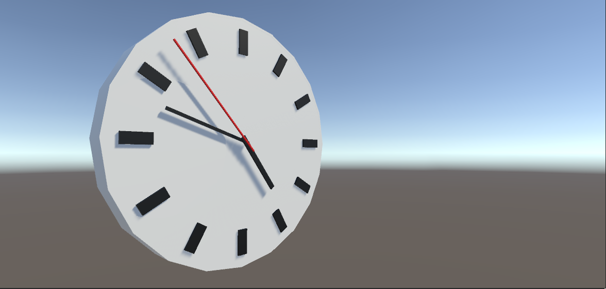
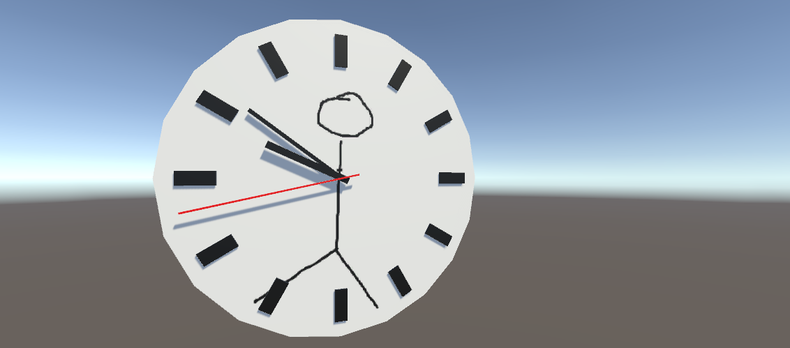

<!-- headingDivider: 3 -->
<!-- class: default -->

# Module 1

## Personal education gear

* laptop
* charger
* mouse
* eventually, a game controller

## What to expect

* C# basics
* Unity basics (in 3d)
* Some programming
* A Module project
* One-on-one meetings with me

## Module 1 Schedule

* **4.4. MA** Day 1:
  * Unity basics 0: [What is Unity?](unity-basics/0-what-is-unity.md), 1: [The Unity Interface](unity-basics/1-the-unity-interface.md)
* **5.4. TI** Day 2:
  * Unity basics 2: [Unity's Building Blocks](unity-basics/2-unity-building-blocks.md), 3: [Assets & Prefabs](unity-basics/3-assets-prefabs.md)
* **6.4. KE** Day 3: 
  * Programming 1: [Variables and Conditionals](programming/1-variables-and-conditionals.md)
* **7.4. TO** Day 4:
  * Unity basics 4: [Scripting Gameobjects](unity-basics/4-scripting-gameobjects.md)
  * Programming 0: [Introduction to Game Programming](programming/0-game-programming.md)
* **7.4. PE** Day 5:
  * Project management 1: [Git Basics](project-management/1-git-basics.md)
* **11.4. MA** Day 6:
  * Module project & Wrap-up

# Day 1: Introduction

## Schedule

* Morning
  * Introduction
  * Setup
  * Unity basics 0: [What is Unity?](unity-basics/0-what-is-unity.md)
  * Unity basics 1: [The Unity Interface](unity-basics/1-the-unity-interface.md)
* Afternoon
  * Working on exercises & Module project

## About me
* developer & instructor at Buutti
* indie game developer
* participated in >20 game jams
* worked on 36 small games
* releasing my first commercial game EMUUROM this year
## About this course

* Everyone will get to create multiple video games with Unity
* Course is separated into three four-Module [stages](Stages.md)
* [Stage 1](Stage1.md)
    * Learn the basics of Unity & game programming
    * With the acquired skills, make tiny games on your own
* Stage 2
	* Dive deeper into Unity
	* Learn about game design & game industry
	* Create games
* Stage 3
    * Create a game as a team effort
## About YOU

* Your name
* Your gamedev/programming/art/music background, if any
* Which video games have you played lately?

## Study Groups

* Group X
* Group Y
* Group Z

## Accounts

* Personal accounts you'll need to create if you don't already have:
	* Unity
	* GitHub
	* Google (for collaborating with Google Drive & Docs)
	* Discord (for communication)
	* later: Itch.io (for publishing your games)

## Applications

* (They're all preinstalled on your laptops already)
* Download [Unity Hub](https://unity3d.com/get-unity/download)
  * Install the latest Unity LTS (long term support) version 2020.3.27f1
* Install [Visual Studio Code](https://code.visualstudio.com/), aka VS code
  * See Tooltips: [Unity and VS Code](tooltips/unity-and-vsc.md)
* Install [Discord](https://discord.com/)
  * If you don't need don't work well with the browser version!)

## Unity basics 0

  * Unity basics 0: [What is Unity?](unity-basics/0-what-is-unity.md)

## Module projects

* During Stage 1, a new Module project is introduced every Module
* The deadlines for the projects are on Fridays, and we will continuously work on it during the Moduledays
* On Fridays, the projects are showcased
* Every project has three separate stages
  * ⭐ The ***MVP*** (minimum viable product)
  * ⭐⭐ Some extra feature included
  * ⭐⭐⭐ Includes an advanced feature (which isn't necessarily introduced during the classes), or a feature of your own design 
  * you can choose which stage you aim to complete 

---
<!-- _backgroundColor: lightgreen -->

## Module project 1: Clock

<!-- _backgroundColor: lightgreen -->
For the first Module project, you will create a 3d model of a clock with ticking hour, minute and second indicators.

The project is separated into individual exercises. For more help, you can follow the [CatlikeCoding clock tutorial](https://catlikecoding.com/unity/tutorials/basics/game-objects-and-scripts/).

## WP Exercise 1. Creating a project
<!-- _backgroundColor: lightgreen -->
* Install and setup all the tools needed and create your first 3D project for the course with the name `Module1Clock`.
* This project will be worked on step by step in the coming exercises.

## Unity basics 1
  * Unity basics 1: [The Unity Interface](unity-basics/1-the-unity-interface.md)

## WP Exercise 2. Building a simple clock
<!-- _backgroundColor: lightgreen -->
Create a 3D model of a clock from Unity's primitives with three hands and 12 hour indicators.

Unlike in the picture in a past slide, set all the indicators to 12. They will be later rotated to correct positions with C# scripting.

# Day 2

# Schedule

* Unity basics 2: [Unity's Building Blocks](unity-basics/2-unity-building-blocks.md)
* Unity basics 3: [Assets & Prefabs](unity-basics/3-assets-prefabs.md)
# Unity basics 2

  * Unity basics 2: [Unity's Building Blocks](unity-basics/2-unity-building-blocks.md)

## Unity basics 3

* Unity basics 3: [Assets & Prefabs](unity-basics/3-assets-prefabs.md)

## WP Exercise 3: Materials
<!-- _backgroundColor: lightgreen -->
* Create three materials for the clock: ***White***, ***Red*** and ***Black***.
* Create a picture in your project's Assets folder and use it as a texture for ***White***.

# Day 3: Scripting 1

## Schedule

* [Programming 1: Variables and conditionals](programming/1-variables-and-conditionals.md)
 
# Day 4: Assets & scripting

## Schedule

* Programming 0: [Introduction to Game Programming](programming/0-game-programming.md)
* Unity basics 4: [Scripting Gameobjects](unity-basics/4-scripting-gameobjects.md)

## WP Exercise 4: Using prefabs
<!-- _backgroundColor: lightgreen -->
Create a prefab out of the clock and then create a duplicate of it into the scene.

## Some programming & Unity basics 4

* Programming 0: [Introduction to Game Programming](programming/0-game-programming.md)
* Unity basics 4: [Scripting Gameobjects](unity-basics/4-scripting-gameobjects.md)

## WP exercise 5. Animating the clock
<!-- _backgroundColor: lightgreen -->
Make the clock hands move when time goes on.

⭐ Make the movement instantaneous: the second indicator moves once per second directly to the next position

⭐⭐ Make the movement smooth: the second indicator moves continuously at a rate of one full rotation per minute

⭐⭐⭐ Make the movement realistic: study how the hands of a real clock moves! The second indicator moves incrementally between fixed positions, but the movement is not instantaneous. Try to replicate this. 

# Day 4: Git

## Day 4 Schedule
* Morning
  * [Project management 1: Git Basics](project-management/1-git-basics.md)
* Afternoon
  * Working on the Module project
  * One-on-one meetings

## WP Exercise 6. Git Repository
<!-- _backgroundColor: lightgreen -->

* Create a remote repository for your Module project with the Unity gitignore file. The repository should be named `ModuleProject1Clock`, or something along the lines.
* Initialize Git in your Module project repository.
* Add remote (the one you just created), and pull the changes.
* Commit and Push your code to GitHub.

# Day 5: Wrap-up

## Day 5 Schedule

* Morning
  * Working on the Module project
  * One-on-one meetings
* Afternoon
  * Working on the Module project
  * 14:30 Module project presentations
