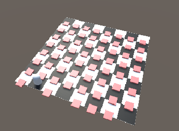
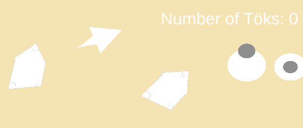
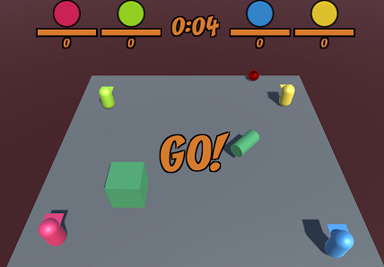

# Buutti Game Dev Academy

Welcome to the repository for the Buutti Game Dev academy course. The aim of the course is to teach basics of Unity, C# and game development.

The course is divided into three four-module stages (module being approximately a week long), and the topics are arranged into "books" whose chapters are introduced below.

The moon cycle 🌑🌒🌓🌔🌕 tells how done the material for the corresponding chapter is!

# Stages

|   | [Stage 1](Stage1.md)						  				 	  	|     | 
|---|-------------------------------------------------------------------|----:|
| 1 | [Module 1](Module1.md)											| 🌔 |
| 2 | [Module 2](Module2.md)											| 🌔 |
| 3 | [Module 3](Module3.md)											| 🌔 |

|   | [Stage 2](Stage2.md)						  				 	  	| 🌔 | 
|---|-------------------------------------------------------------------|----:|

|   | [Stage 3](Stage3.md)						  				 	  	| 🌔 | 
|---|-------------------------------------------------------------------|----:|
# Books

## About programming

|   | Programming										  				 	|     | 
|---|-----------------------------------------------------------------------|----:|
| 0 | [Introduction to Game Programming](programming/0-game-programming.md)   | 🌕 |
| 1 | [Variables and Conditionals](programming/1-variables-and-conditionals.md)| 🌕 |
| 2 | [Lists and Loops](programming/2-lists-loops.md)						| 🌕 |
| 3 | [Classes and Methods](programming/3-classes-methods.md)			 	| 🌔 |
| 4 | [Special Types](programming/4-special-types.md)					 	| 🌓 |

|   | Math										  				 	  	|     | 
|---|-------------------------------------------------------------------|----:|
| 0 | [Useful Math Functions](math/0-mathf.md)							| 🌔 |
| 1 | [Vectors](math/1-vectors.md)										| 🌔 |
| 2 | [Forces](math/2-forces.md)										| 🌔 |
| 3 | [Interpolation](math/3-interpolation.md)							| 🌔 |
| 4 | [Sinewaves](math/4-sinewaves.md)									| 🌒 |
|   | [Unity Math classes](math/5-math-classes.md)						| 🌒 |
|   | [Randomness](math/6-math-classes.md)								| 🌑 |

## About Unity

|   | Unity Basics									  				 	|     | 
|---|-------------------------------------------------------------------|----:|
| 0 | [What is Unity?](unity-basics/0-what-is-unity.md)					| 🌔 |
| 1 | [The Unity Interface](unity-basics/1-the-unity-interface.md) 		| 🌔 |
| 2 | [Unity's Building Blocks](unity-basics/2-unity-building-blocks.md)| 🌔 |
| 3 | [Assets & Prefabs](unity-basics/3-assets-prefabs.md)	 			| 🌔 |
| 4 | [Scripting Gameobjects](unity-basics/4-scripting-gameobjects.md)	| 🌔 |

|   | Unity Advanced											   	  	|     | 
|---|-------------------------------------------------------------------|----:|
| 1 | [Delayed actions](unity-advanced/1-delayed-actions.md)			| 🌔 |
| 2 | [Scriptable objects](unity-advanced/2-scriptable-objects.md) 		| 🌒 |
| 3 | [Events](unity-advanced/3-events.md)			 					| 🌒 |
| 4 | [Miscellaneous](unity-advanced/4-misc.md)							| 🌒 |
| 5 | [Object Pooling](unity-advanced/5-object-pooling.md)				| 🌑 |

|   | Unity Cookbook											   	  	|     | 
|---|-------------------------------------------------------------------|----:|
| 1 |																	|     |
|   | [2D basics](unity-cookbook/2d-basics.md)							| 🌔 |
|   | [Input handling](unity-cookbook/input-handling.md)				| 🌔 |
|   | [Transform](unity-cookbook/transform.md)							| 🌔 |
|   | [Collision](unity-cookbook/collision.md)							| 🌔 |
|   | [Physics](unity-cookbook/physics.md)								| 🌔 |
|   | [UI](unity-cookbook/UI.md)										| 🌔 |
|   | [Audio](unity-cookbook/audio.md)									| 🌔 |
| 2 |																	|     |
|   | [Tilemaps](unity-cookbook/tilemaps.md)							| 🌔 |
|   | [2D animation](unity-cookbook/2d-animation.md)					| 🌔 |
|   | [Pathfinding](unity-cookbook/pathfinding.md)						| 🌔 |
|   | [Scenes](unity-cookbook/scenes.md)								| 🌔 |
| 3 |	
|   | [Particle system](unity-cookbook/particle-system.md)				| 🌔 |
|   | [Saving and Loading](unity-cookbook/saving-loading.md)			| 🌑 |
|   | [3D Platforming](unity-cookbook/3dplatforming.md)					| 🌒 |
|   | [Building](unity-cookbook/building.md)							| 🌑 |

|   | Tooltips													   	  	|     | 
|---|-------------------------------------------------------------------|----:|
|   | [Unity and Visual Studio Code](tooltips/unity-and-vsc.md)		    | 🌔 |
|   | [Windows File Explorer tips](tooltips/using-file-explorer.md)		| 🌔 |
|   | [Unity Packages](tooltips/unity-packages.md)						| 🌒 |
|   | [Unity notes](tooltips/unity-notes.md)		                    | 🌒 |

## About game development

|   | Project management											 	|     | 
|---|-------------------------------------------------------------------|----:|
| 0 | [Git setup](project-management/0-git-setup.md)					| 🌕 |
| 1 | [Git basics](project-management/1-git-basics.md)					| 🌕 |
| 2 | [Git continued](project-management/2-git-continued.md)			| 🌕 |
| 3 | [GitHub tools](project-management/3-github-tools.md)				| 🌔 |
| 4 | [Scrum](project-management/4-scrum.md) 							| 🌕 |
|   | [Git cheat sheet](project-management/git-cheat-sheet.md) 				| 🌕 |
|   | [Unity Collab](project-management/unity-collab.md) 				| 🌑 |

|   | Game Dev													   	  	|     | 
|---|-------------------------------------------------------------------|----:|
|   | [Playtesting](gamedev/playtesting.md)								| 🌔 |
|   | [Tools](gamedev/tools.md)											| 🌔 |
|   | [Game Design](gamedev/gamedesign.md)								| 🌔 |
|   | [Game Industry](gamedev/gameindustry.md)							| 🌓 |
|   | [Accessibility](gamedev/accessibility.md)							| 🌓 |
|   | [Gamification](gamedev/gamification.md)							| 🌓 |
|   | [Business](gamedev/business.md)									| 🌒 |
|   | [Game Development](gamedev/gamedevelopment.md)					| 🌒 | 
|   | [Teamwork](gamedev/teamwork.md)									| 🌒 | 

# Code example repositories

Code examples are in different repositories. Links to repositories below, including the lists of lectures that the repositories contain the examples about.

### [ProgrammingExercises](https://github.com/borbware/ProgrammingExercises)

* [Variables and Conditionals](programming/1-variables-and-conditionals.md) 
* [Lists and Loops](programming/2-lists-loops.md)
* [Classes and Methods](programming/3-classes-methods.md)
* [Interpolation](math/3-interpolation.md)

### [ProgrammingExercises2D](https://github.com/borbware/ProgrammingExercises2D)

* [Input handling](unity-cookbook/input-handling.md)
* [Collision](unity-cookbook/collision.md)
* [Transform](unity-cookbook/transform.md)
* [Vectors](math/1-vectors.md)
* [Forces](math/2-forces.md)

### [DungeonCrawler](https://github.com/borbware/DungeonCrawler)

* [2D basics](unity-cookbook/2d-basics.md)
* [Tilemaps](unity-cookbook/tilemaps.md)
* [2D animation](unity-cookbook/2d-animation.md)

### [2DTopDownShooter](https://github.com/borbware/2DTopDownShooter)

* [2D basics](unity-cookbook/2d-basics.md)
* [Tilemaps](unity-cookbook/tilemaps.md)
* [2D animation](unity-cookbook/2d-animation.md)
* [Pathfinding](unity-cookbook/pathfinding.md)
* [Interpolation](math/3-interpolation.md) (smooth camera move with lerp)
* [Dialogue system](unity-cookbook/UI.md#ui-example-dialogue-system)

### [MultiplayerArena](https://github.com/borbware/MultiplayerArena)

* 4-player multiplayer
* Pausing
* Scene manager & Game manager singletons