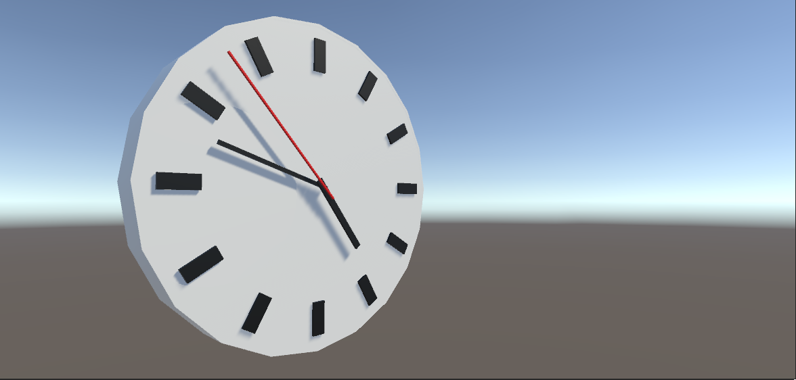

<!-- headingDivider: 3 -->
<!-- class: invert -->

# Week 1

## What to expect

* Familiarizing with the tools
* Learning the Unity interface
* C# basics
* Unity basics (in 3d)
* VS code basics
* Only a bit scripting
* Week project: Catlike Coding's clock exercise
# Day 1: Introduction
## About me
* developer & instructor at Buutti
* indie game developer
* participated in >20 game jams
* worked on 36 small games
* releasing first commercial game EMUUROM this year
## About this course

* We will make multiple video games with Unity
* Course is separated into three stages
* [Stages](Stages.md)
* [Stage 1](Stage1.md)
    * Learn the basics of Unity & game programming
    * With the acquired skills, make tiny games on your own
* Stage 2
	* Dive deeper in Unity
	* Learn about game design & game industry
	* Create a bit larger (yet still tiny) games in teams
* Stage 3
    * Create a single game project in the span of four weeks
## About YOU

* Your name
* Your gamedev/programming/art/music background
* Which video game you like pops to your mind first?
* What kind of a video game would you like to work on?
* What was your first video game experience?
* What is the last video game you played?
* Most disappointing game
* The worst game you've played
## Pienryhmiin jako
## Unity

[Unity basics 1. What is Unity?](unity-basics/1-what-is-unity.md)

## Applications

* Download [Unity Hub](https://unity3d.com/get-unity/download)
* Install latest Unity LTS (long term support) version 2020.3.27f1
* Install [Visual Studio Code](https://code.visualstudio.com/), aka VS code
  * during install: add to context menu
* Install [Discord](https://discord.com/)
  * (live streams don't work well with the browser version!)
## Accounts

* Personal accounts you'll need to create if you don't already have:
	* Discord (for communication)
	* Unity
	* Google (for collaborating with Google Drive & Docs)
	* later this week: Github (for version control)
	* even later: Itch.io (for publishing your games)

## Week projects

* During Stage 1, a new week project is introduced every week
* The deadlines for the projects are on Fridays, and we will continuously work on it during the weekdays
* On Fridays, the projects are showcased
* Every project has three separate stages
  * ⭐ The MVP (minimum viable product)
  * ⭐⭐ Some extra feature included
  * ⭐⭐⭐ Includes an advanced feature (which isn't necessarily introduced during the classes), or a feature of your own design 
  * you can choose which stage you aim to complete 

## Week project 1: Clock

For the first week project, you will create a 3d model of a clock with ticking hour, minute and second indicators.

The project is separated into individual exercises. For more help, you can follow the [CatlikeCoding clock tutorial](https://catlikecoding.com/unity/tutorials/basics/game-objects-and-scripts/).

<!-- _backgroundColor: purple -->

## Week Exercise 1. Creating a project
<!-- _backgroundColor: purple -->
* Install and setup all the tools needed and create your first 3D project for the course with the name `Week1Clock`.
* This project will be worked on step by step in the coming exercises.
## Unity Documentation

* [Docs: User Manual](https://docs.unity3d.com/Manual/UnityManual.html)
* if you don't know how something works, this should be the first place to learn from
* Docs will be heavily featured during the course!
## The Unity Interface

[Unity basics 2. The Unity Interface](unity-basics/2-the-unity-interface.md)

## Week Exercise 2. Building a simple clock
<!-- _backgroundColor: purple -->
Create a 3D model of a clock from Unity's primitives with three hands and 12 hour indicators.

Unlike in the picture below, set all the indicators to 12. They will be later rotated to correct positions with C# scripting.

---
<!-- _backgroundColor: purple -->

# Day 2: Assets & scripting

## Assets

[Unity basics 3: Assets](unity-basics/3-assets.md)

## Scripting GameObjects

See: [Unity basics 4: Scripting GameObjects](unity-basics/4-scripting-gameobjects.md)

# Day 3: Scripting 1
[Scripting 1: Variables and conditionals](scripting/1-variables-and-conditionals.md)

## Week exercise 3. Animating the clock
<!-- _backgroundColor: purple -->
Make the clock hands move when time goes on.

⭐ Make the movement instantaneous: the second indicator moves once per second directly to the next position
⭐⭐ Make the movement smooth: the second indicator moves continuously at a rate of one full rotation per minute
⭐⭐⭐ Make the movement realistic: study how the hands of a real clock moves! The second indicator moves incrementally between fixed positions, but the movement is not instantaneous. Try to replicate this. 
# Day 5: Wrap-up
## Working on the week project

* one-on-one meetings
  * useana päivänä, ei riitä perjantai
  * ehkä vain eka viikolla kaikille???
## Week project presentations

* playtesting
* iteration based on feedback