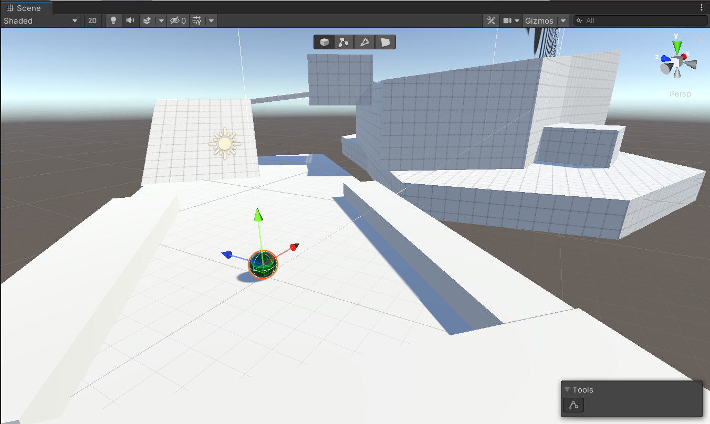

# Week 1

## What to expect

- Familiarizing with the tools
- Learning the Unity interface
- GameObjects, Components, Prefabs, Tags & Layers
- Only a bit scripting
- C# basics
- Week project: Catlike Coding's clock exercise

- Video Game Industry introduction
- Erikoistuminen
- Unity basics (in 3d)
- VS code basics
	- hyötyä visual studiosta?
- C# basics

# Day 1: Introduction

## About me

- Perttu Tuovinen
- developer & instructor at Buutti
- indie game developer
- participated in >20 game jams
- worked on 36 small games

## About this course

- We will make multiple video games with Unity
- Course is separated into three stages
- Stage 1
    - Learn the basics of Unity & game programming
    - With the acquired skills, make tiny games on your own
- Stage 2
	- Dive deeper in Unity
	- Learn about game design & game industry
	- Create a bit larger (yet still tiny) games in teams
- Stage 3
    - Create a single game project in the span of four weeks

## About YOU

- Your name
- Your gamedev/programming/art/music background
- Which video game you like pops to your mind first?
- What kind of a video game would you like to work on?
- What was your first video game experience?
- What is the last video game you played?
- Most disappointing game
- The worst game you've played

## About Unity

- A commericial closed-source game engine
- Free to use for projects under $100000 revenue
- pretty much the industry standard
	- plenty of resources available online!
- ubiquitous especially in game jams & mobile
- A huge kitchen sink of a software
- made originally for 3D games
- can be used for 2D, 3D, console, PC, mobile, ...
- uses the C# programming language

## The Unity Experience

- Unity has been around for a long time now
- 3.0 was the first version on Windows
- 
- Unity is updated continuously
  - usually people are stuck with the version they started the project with
    - -> multiple versions on the same machine
    - about 4 gigs per install
    - Unity Hub!
  - Old features & programming styles are deprecated and new ones are introduced
    - it helps a ton if you familiarize yourself with Unity history
    - some people are stuck with the old ways
    - it's useful to know which ways are old and which are still encouraged today
    - then again, tomorrow everything might have changed
- can occasionally crash
  - save your work constantly!
- Unity does many things for you that you do not need to know about
  - treat some aspects of Unity as black boxes
  - you give them input, and they give the desired output

### The Asset Store

- you can download assets to your project from the Asset Store
- Some assets are free, some paid
- 3D models, tools, controllers, ...
- With the Asset store, you don't have to reinvent every single wheel
  - Get the ball rolling and prototype quickly
  - But beware - this isn't a free lunch
  - You become dependent on third-party code
  - Sometimes it's faster to make your own system than learn another person's way of thinking

### The Unity Way

- There are usually many ways to approach a problem
- Sometimes, implementing something feels downright impossible!
- The reason might be that you're swimming against the current
  - you're not doing it the way Unity wants you to do it!
  - accustoming yourself to others' Unity projects gives you perspective 

## Installing the tools

- Unity Hub & Unity LTS version XX.XX
- VS Code
  - during install: add to context menu
- Discord
- Personal accounts
	- Discord
	- Unity
	- Google (Google Drive & Docs)
	- later: Github
	- even later: Itch.io

---

### Exercise 1.

- Install and setup all the tools needed and create your first 3D project for the course with the name "3DClock".

---

## Unity Documentation

- docs.unity.com
- your #1 resource for learning the ins & outs of Unity
- will be heavily featured during the course

## Game Objects

- Pretty much everything in Unity is a game object
- Game objects consist of components
- Some examples
  - 3d primitives
  - Camera
  - Light
  - Empty

## Editor views

- [Unity's Interface in Docs](https://docs.unity3d.com/Manual/UsingTheEditor.html)
- Views
  - Hierarchy window
  - Scene view
  - Game view
  - Inspector window
  - Project window
  - Console

- Views can be rearranged by dragging & dropping
- Try out different layouts from the top right "Layouts" dropdown menu

## Hierarchy window

- [Hierarchy in Docs](https://docs.unity3d.com/Manual/Hierarchy.html)
- shows the list of game objects in a **scene**
- double click to show object in Scene view
- game objects can be nested
  - parent vs child
  - position/rotation/scale is inherited from parent
- Add new game objects: [RMB] + choose from list

## Scene view

### Navigation

- [Scene view navigation in Docs](https://docs.unity3d.com/Manual/SceneViewNavigation.html)
- navigation shortcuts
  - move: [MMB]
  - orbit: [ALT+LMB]
  - zoom: roll [MMB] / [ALT+RMB]
  - rotate camera: [RMB]
  - flythru: hold [RMB], fly with [WASD] + [Q/E]
- the scene gizmo
  - "the axis thingy on the top right"
  - axis cones: change view to that axis
  - center cube: perspective / orthographic
- scene view camera settings

## Shortcuts for scene & hierarchy
  - [CTRL+C] + [CTRL+V] copy & paste
  - [CTRL+D] duplicate

### Toolbar

- [Toolbar in Docs](https://docs.unity3d.com/Manual/Toolbar.html)
- for manipulating existing stuff
- activating the tool changes the [LMB] behaviour
- navigation shortcuts still available in other tools!
- in move/rotate/scale, you can use the red, green and blue shapes to manipulate x,y,z axes, respectively
- the tools
  - Q: Hand Tool (navigate)
  - W: Move Tool
    - the squares in the center: move along a plane
  - E: Rotate Tool
  - R: Scale Tool
  - those are the most important ones
  - T: Rect Tool
    - Alternative Scale Tool
  - Y: Move+Rotate+Scale
- Pivot / Center
- Local / Global

## Inspector window

- [Inspector in Docs](https://docs.unity3d.com/Manual/UsingTheInspector.html)
- Game object properties
  - Active (the checkbox)
  - Name
  - Tag
  - Layer
- list of components inside a game object
- components can be turned off
- drag variable to change value

## Components

- Transform
  - included even in an empty game object by default
  - position / rotation / scale
- Collider
  - enables collision
  - different shapes and sizes
  - object can collide into other game objects and vice versa
  - isTrigger
- Renderer
  - the visible part of the game object
- Material
- RigidBody
  - for interacting with the physics engine 
- Script
  - custom C# code
  - the most versatile component

---

### Exercise 2.

Create a 3D model of a clock from Unity's primitives with three hands and 12 hour indicators.

---

# Day 2: Assets

## Game view

- [Docs: Game view](https://docs.unity3d.com/Manual/GameView.html)
- Simulates what your final rendered game will look like through your Scene Cameras
- Play & pause buttons
- When game is running, you can still manipulate the values in the Inspector window
  - a nice way to mess around and find the right values for physics interactions etc.
  - changes made during the play mode do not persist!!!!
  - protip: change play mode tint in Edit > Preferences > Colors to red.
  - 5% less frustration!

## Project window

- [Docs: Project window](https://docs.unity3d.com/Manual/ProjectView.html)
- List of Assets & Packages in your projects
- Assets
	- Scenes
	- Materials
	- Prefabricated game objects
	- Graphics
	- Sound effects
	- Music

## Prefabs
- [Docs: Prefabs](https://docs.unity3d.com/Manual/Prefabs.html)
- short for prefabricated object
- use cases...
  - "Same thing, but what if many?"
    - also, objects that share common traits but have different *overrides*
  - objects you want to instantiate during runtime
- How to turn a gameobject into a prefab:
  - [Docs: Creating Prefabs](https://docs.unity3d.com/Manual/CreatingPrefabs.html)
  - drag a gameobject from Hierarchy to Project view
  - it turns blue! 
  - this means it's now an instance of a prefab
- overridden values in Inspector are indicated in **bold**
- special buttons
  - [Docs: Editing a Prefab via its instances](https://docs.unity3d.com/Manual/EditingPrefabViaInstance.html)
  - Open
    - opens the prefab in Prefab mode, a scene where only the prefab exists
    - [Docs: Editing a Prefab in Prefab mode](https://docs.unity3d.com/Manual/EditingInPrefabMode.html)
  - Select
    - selects the Prefab asset in the Project window
  - Overrides dropdown
    - variations for the prefab presets
    - when you make changes into a prefab instance, you can set those changes to be the new default
    - [Docs: Instance overrides](https://docs.unity3d.com/Manual/PrefabInstanceOverrides.html)

## Tags & Layers
- Edit > Project Settings > Tags and Layers
### Tags
- GameObject.FindWithtag("tagname");
- GameObject.FindGameObjectsWithTag("tagname");
### Layers
- [Docs: Layers](https://docs.unity3d.com/Manual/Layers.html)
- Some layers...
	- Default
	- Ignore Raycast
	- Custom
- Ignore some layers in camera
	- Inspector > Camera > Culling Mask > Layers
- Ignore some layers in Viewport
	- Top right: Layers...
- Layers can be used for selective collision detection
  - [Docs: Layer-based collision detection](https://docs.unity3d.com/Manual/LayerBasedCollision.html)

## Console

- Error messages
- Debug messages

---

### Exercise 3.

Duplicate your clock.

---

# Day 3: Git

Git basics

---

### Exercise x.

Create a Github account.
Create a new repository with the Unity .gitignore template.
Initialize Git in your Week project folder, and push the project files to Github.

---

# Day 4

## Scripting basics

- adding functionality with C# script components
- [C# basics 1/2](#c-basics)
	- [Variables and conditionals](#variables-and-conditionals)
	- [Conventions](#conventions)
	- [Arrays and Loops](#arrays-and-loops)

---

### Exercise 4.

Make the clock hands move when time goes on.

---

# Day 5

## Working on week project

- one-on-one meetings

## Week project presentations????? Seuraavalla viikolla??????

- playtesting
- iteration based on feedback