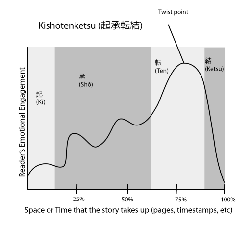

<!-- headingDivider: 3 -->
<!-- class: invert -->

# Game design

## Games

* "Voluntary engagement with unnecessary obstacles"
  * Jane McGonigal, *Reality is Broken*

* Types of games
  * Sports
  * Yard Games
  * Card games
  * Board Games
  * Pinball tables
  * Video Games
* Verbs -> Game Mechanics -> Player experience

## Verbs

* ***Verbs*** are the primary player actions
  * "Jump"
  * "Attack"
  * "Build"
* What verbs do these games have?
  * Laivan upotus
  * Kirkonrotta
  * Super Mario Bros.

## Game mechanics

* What are ***game mechanics***?
  * Wikipedia: "rules that govern and guide the player's actions, as well as the game's response to them."
* Examples of game mechanics:
  * [List of Board game mechanics](https://boardgamegeek.com/browse/boardgamemechanic)
* [Errant Signal: Perceivable Consequence](https://www.youtube.com/watch?v=XfFteTrAvZw)

## Playcentric Design Process

* As we remember from [Playtesting](playtesting#playtesting-as-part-of-design), it helps to put ***player experience*** first
* Set goals for player experience:
  * "How should the player feel during this sequence?"
  * ***Note:*** For player exp goals, we don't specify *how* features are implemented
  * Player exp goal example: "Freedom to pursue goals of the game in any order"
* Try to see your game from the lens of player experience
  * What is the player thinking?
  * What choices are offered? What choices are actually made? 
* Prototype fast & playtest very early
  * Either by creating a playable demo or, if possible, with pen and paper
  * Iterate based on player response

## Design for players

### Design for the players, not you

* In the development process, designers becomes blind to their own games
* Due to familiarity...
  * designers can make the game frustratingly hard
  * designers can forget to explain things that are obvious to *them*
* ***The only truth about your game is inside the mind of the player***
* If player feedback contradicts with your preconception, it's on you
* ***Extra:*** Create interesting outcomes for player mistakes
### Design to guide players

* The job of a game designer is to teach the player to play the game well
* [Zach Gage: Building Games That Can Be Understood at a Glance](https://www.youtube.com/watch?v=YISKcRDcDJg)
* [Tim Rogers: Link To The Past's Perfect First 10 Minutes](https://www.youtube.com/watch?v=yUJ1yGmVdx0)
* Invisible tutorial
  * [GMTK: Half-Life 2's Invisible Tutorial](https://www.youtube.com/watch?v=MMggqenxuZc)

### Design for different kinds of players

* Design for different types of players
  * [Wikipedia: Bartle's taxonomy of player types](https://en.wikipedia.org/wiki/Bartle_taxonomy_of_player_types)
    * ♣ Killers
    * ♦ Achievers
    * ♥ Socializers
    * ♠ Explorers

### Reasons for players to engage with games

* Mastery: grown skills in doing/accomplishing a task
* Autonomy: Ability and freedom to make meaningful choices
* Sensation: Physical sensations or the new
* Connection: Feeling connected to others/community

### Choices

* Illusory choices / meaningful choices
* Choices create a ***possibility space***
* More choices / More defined assets

## Design to make the game its best possible version

### Follow the fun

* The initial idea for your game might turn out to be boring to play
* Usually, there is *something* good, though
* ***Follow the fun***
  * If some random interaction happens to create interesting situations, build upon it
  * * "Players tend to optimize the fun out of game"
  	* -> Nudge players towards fun interactions
* Fun isn't the be-all-end-all of game design, however
  * [Errant Signal: An Aimless Diatribe On Fun](https://www.youtube.com/watch?v=lit0xPh_v5c)

### Elements that create themselves

* Are there some design elements that seem to "create themselves"?
  * ***Follow those elements***
  * [GMTK: The Games That Designed Themselves](https://www.youtube.com/watch?v=kMDe7_YwVKI)
  * If you were to create a puzzle game, but during design process, you notice that the game benefits from action elements
  * Maybe the game *wants* to be an action game after all?
  * [GMTK: Why is it so hard to make game design decisions?](https://www.youtube.com/watch?v=eE05LjNNenQ)

## Level design

* Many games are split into levels, stages, boards, etc...
* The field of level design is an art of its own
* [Dan Taylor: Ten Principles for Good Level Design](https://www.youtube.com/watch?v=iNEe3KhMvXM)
* [Maddy Thorson: Level Design Workshop: Designing Celeste](https://www.youtube.com/watch?v=4RlpMhBKNr0)
* [GMTK: How Mega Man 11's Levels Do More With Less](https://www.youtube.com/watch?v=nYxHMZX6lN8)
* [GMTK: Making Hitman 2's Best Level](https://www.youtube.com/watch?v=56iiP2xQn74)

### Kishōtenketsu

* Four-act structure
* Part of the Eastern storytelling tradition
  * [Example comic](https://touchmba.com/wp-content/uploads/2019/04/kishotenketsu-manga.jpg)
* Works for levels, worlds, whole games
  * Ki: Introduce
  * Shō: Develop
  * Ten: Twist
  * Ketsu: Conclude
* [GMTK: Super Mario 3D World's 4 Step Level Design](https://www.youtube.com/watch?v=dBmIkEvEBtA)

### Intensity graph

  * Ebb and flow
  
  * [jazz mickle knows how it's done](https://twitter.com/jazzmickle/status/1568566990121611264)

## Puzzle design

* "Gotcha" puzzle design
  * Show the lock before the key
  * Obvious solution fails!
* [GMTK: What Makes a Good Puzzle](https://www.youtube.com/watch?v=zsjC6fa_YBg)
* [GMTK: How Jonathan Blow Designs a Puzzle](https://www.youtube.com/watch?v=2zK8ItePe3Y)
* [GMTK: Puzzle Solving... or Problem Solving?](https://www.youtube.com/watch?v=w1_zmx-wU0U)

## Story design

* Story vs gameplay: The ludonarrative dissonance
  * [Errant Signal: The Debate That Never Took Place](https://www.youtube.com/watch?v=xBN3R0m31bA)
* [Laura E. Hall: Environmental Narrative: Telling Stories Without Saying Anything](https://www.youtube.com/watch?v=oXZTz3oR30A)
* [GMTK: How Level Design Can Tell a Story](https://www.youtube.com/watch?v=RwlnCn2EB9o)
* [GMTK: Telling Stories with Systems](https://www.youtube.com/watch?v=NyMndWpihTM)

* [GMTK: Can We Make Talking as Much Fun as Shooting?](https://www.youtube.com/watch?v=l9TzqNQBmr0)

## World design

* [Kate Edwards: A Geographer's Guide to Building Game Worlds](https://www.youtube.com/watch?v=EVGonAUUQ8c)
<!--

## Game design

* Start small. No, smaller than that.
* Use small integers
* The job of a game designer is that of a gardener
  * nourish good ideas
  * nip unnecessary and harmful weeds in the bud
  * grow a functional system enclosed in a limited space
-->

## Game design: Some basic principles

* Versatile verbs
  * [GMTK: The Secret of Mario's Jump (and other Versatile Verbs)](https://www.youtube.com/watch?v=7daTGyVZ60I)
* Dual purpose design: Do more with less
  * [GMTK: Downwell's Dual Purpose Design](https://www.youtube.com/watch?v=i5C1Uj7jJCg)
* Meaningful choices
  * [GMTK: The Power of Invisible Choices](https://www.youtube.com/watch?v=6HZuSzlN2eI)
* Feedback loops
  * [GMTK: How Games Use Feedback Loops](https://www.youtube.com/watch?v=H4kbJObhcHw)
* Synergic systems
  * [GMTK: How Synergies Make Slay the Spire Fun](https://www.youtube.com/watch?v=terD4Bk3L_8)

## Game feel

* Game feel in isolation
  * [GMTK: Secrets of Game Feel and Juice](https://www.youtube.com/watch?v=216_5nu4aVQ)
* Realistic vs gameistic physics

* [Errant Signal: Kinaesthetics](https://www.youtube.com/watch?v=MrFK4NlGCo0)
* [Squirrel Eiserloh: Juicing Your Cameras With Math](https://www.youtube.com/watch?v=tu-Qe66AvtY)
* [Martin Jonasson & Petri Purho: Juice it or lose it](https://www.youtube.com/watch?v=Fy0aCDmgnxg)
* [Jan Willem Nijman: The art of screenshake](https://www.youtube.com/watch?v=AJdEqssNZ-U)
* [Nicolae Berbece: Game Feel: Why Your Death Animation Sucks](https://www.youtube.com/watch?v=pmSAG51BybY)

## Good design?

* What design is good and what is not is usually subjective
* Some subjective rules of thumb:
  * Good design solves many problems at once
    * (and doesn't introduce new ones)
  * Good design explains itself
    * use real-world analogues: "water puts out fire"
  * Good design fuels creativity
    * complex outcomes out of simple rules 
  * Good design creates more good design

## Game Design Document (GDD)

* [Wikipedia: Game Design Document](https://en.wikipedia.org/wiki/Game_design_document) is a highly descriptive living software design document of the design for a video game
* Idea -> ( Prototype -> Playtesting ) -> GDD 
* [Wikipedia: GDD Table of contents](https://en.wikipedia.org/wiki/Game_design_document#/media/File:GDD_Example.jpg)
* [The original design document of Grand Theft Auto](https://www.gamedevs.org/uploads/grand-theft-auto.pdf)

## Reading

* Jesse Schell: Art of Game Design
* Tracy Fullerton: Game Design Workshop
* Richard Lemarchand: A Playful Production Process
* Jaakko Kemppainen: Pelisuunnittelijan peruskirja