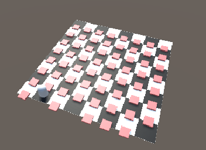
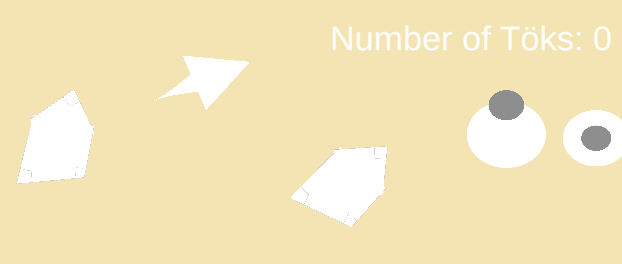
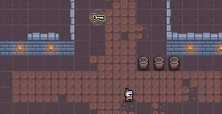
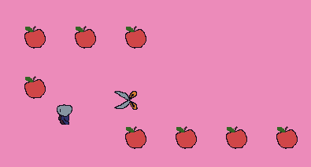
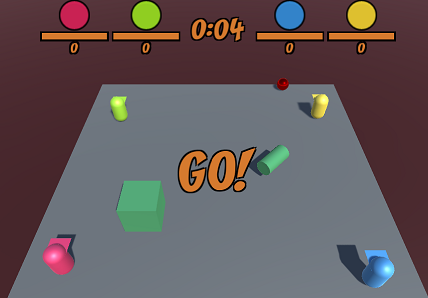

Welcome to the webpage for the Buutti Game Dev Academy course. The aim of the course is to teach basics of Unity, C# and game development.

The course is divided into three stages, with the stages divided into modules. Modules are approximately a week long. Topics are arranged into "books" whose chapters are introduced below.

The moon cycle 🌑🌒🌓🌔🌕 tells how done the material for the corresponding chapter is!

# Stages

|   |  		   | Slides 			  				 | Page		 				|     | 
|---|----------|-------------------------------------|--------------------------|----:|
| 1 | Module 1 | [🎞](modules/Module1-slides.html)   | [📖](modules/Module1)	| 🌔 |
| 1 | Module 2 | [🎞](modules/Module2-slides.html)   | [📖](modules/Module2)	| 🌔 |
| 1 | Module 3 | [🎞](modules/Module3-slides.html)   | [📖](modules/Module3)	| 🌔 |

# Books

## About programming

### Programming

|   |  		   | Slides 			  				 | Page		 				|     | 
|---|----------|-------------------------------------|--------------------------|----:|
| 0 | Introduction to Game Programming | [🎞](programming/0-game-programming-slides.html)  | [📖](programming/0-game-programming)	  | 🌕 |
| 1 | Variables | [🎞](programming/1-variables-slides.html)			| [📖](programming/1-variables)	 | 🌕 |
| 2 | Conditionals | [🎞](programming/2-conditionals-slides.html)	| [📖](programming/2-conditionals)	 | 🌕 |
| 3 | Functions | [🎞](programming/3-functions-slides.html)| [📖](programming/3-functions)	 | 🌕 |
| 4 | Loops | [🎞](programming/4-loops-slides.html)						| [📖](programming/4-loops)	 | 🌕 |
| 5 | Arrays and Lists | [🎞](programming/5-arrays-lists-slides.html)	| [📖](programming/5-arrays-lists)	 					| 🌕 |
| 6 | Classes and Methods | [🎞](programming/6-classes-methods-slides.html)	| [📖](programming/6-classes-methods)	 		 	| 🌔 |
| 7 | Special Types | [🎞](programming/7-special-types-slides.html)			| [📖](programming/7-special-types)	 		 	| 🌓 |
| 8 | Game Programming Patterns | [🎞](programming/8-game-programming-patterns-slides.html)	| [📖](programming/8-game-programming-patterns)	 				 	| 🌒 |

### Math

|   |  		   | Slides 			  				 | Page		 				|     | 
|---|----------|-------------------------------------|--------------------------|----:|
| 0 | Useful Math Functions | [🎞](math/0-mathf-slides.html) | [📖](math/0-mathf)	 				| 🌔 |
| 1 | Vectors | [🎞](math/1-vectors-slides.html) | [📖](math/1-vectors)										| 🌔 |
| 2 | Forces | [🎞](math/2-forces-slides.html) | [📖](math/2-forces)										| 🌔 |
| 3 | Interpolation | [🎞](math/3-interpolation-slides.html) | [📖](math/3-interpolation)							| 🌔 |
| 4 | Sinewaves | [🎞](math/4-sinewaves-slides.html)	 | [📖](math/4-sinewaves)								| 🌒 |

## About Unity

|   | Unity Basics									  				 	|     | 
|---|-------------------------------------------------------------------|----:|
| 0 | [What is Unity?](unity-basics/0-what-is-unity-slides.html)					| 🌔 |
| 1 | [The Unity Interface](unity-basics/1-the-unity-interface-slides.html) 		| 🌔 |
| 2 | [Unity's Building Blocks](unity-basics/2-unity-building-blocks-slides.html)| 🌔 |
| 3 | [Assets & Prefabs](unity-basics/3-assets-prefabs-slides.html)	 			| 🌔 |
| 4 | [Scripting Gameobjects](unity-basics/4-scripting-gameobjects-slides.html)	| 🌔 |

|   | Unity Advanced											   	  	|     | 
|---|-------------------------------------------------------------------|----:|
| 1 | [Delayed actions](unity-advanced/1-delayed-actions-slides.html)			| 🌔 |
| 2 | [Scriptable objects](unity-advanced/2-scriptable-objects-slides.html) 		| 🌒 |
| 3 | [Events](unity-advanced/3-events-slides.html)			 					| 🌒 |
| 4 | [Miscellaneous](unity-advanced/4-misc-slides.html)							| 🌒 |
| 5 | [Object Pooling](unity-advanced/5-object-pooling-slides.html)				| 🌑 |

|   | Unity Cookbook											   	  	|     | 
|---|-------------------------------------------------------------------|----:|
| 1 |																	|     |
|   | [2D basics](unity-cookbook/2d-basics-slides.html)							| 🌔 |
|   | [Input handling](unity-cookbook/input-handling-slides.html)				| 🌔 |
|   | [Transform](unity-cookbook/transform-slides.html)							| 🌔 |
|   | [Collision](unity-cookbook/collision-slides.html)							| 🌔 |
|   | [Physics](unity-cookbook/physics-slides.html)								| 🌔 |
|   | [UI](unity-cookbook/UI-slides.html)										| 🌔 |
|   | [Audio](unity-cookbook/audio-slides.html)									| 🌔 |
| 2 |																	|     |
|   | [Tilemaps](unity-cookbook/tilemaps-slides.html)							| 🌔 |
|   | [2D animation](unity-cookbook/2d-animation-slides.html)					| 🌔 |
|   | [Pathfinding](unity-cookbook/pathfinding-slides.html)						| 🌔 |
|   | [Scenes](unity-cookbook/scenes-slides.html)								| 🌔 |
| 3 |	
|   | [Particle system](unity-cookbook/particle-system-slides.html)				| 🌔 |
|   | [3D animation](unity-cookbook/3d-animation-slides.html)					| 🌔 |
|   | [Saving and Loading](unity-cookbook/saving-loading-slides.html)			| 🌑 |
|   | [3D Platforming](unity-cookbook/3dplatforming-slides.html)					| 🌒 |
|   | [Building](unity-cookbook/building-slides.html)							| 🌑 |

|   | Tooltips													   	  	|     | 
|---|-------------------------------------------------------------------|----:|
|   | [VS Code Setup](tooltips/vscode-setup-slides.html)	                	    | 🌔 |
|   | [Using VS Code with Unity](tooltips/using-vscode-slides.html)		        | 🌓 |
|   | [Using Windows File Explorer](tooltips/using-file-explorer-slides.html)    | 🌔 |
|   | [Unity Packages](tooltips/unity-packages-slides.html)						| 🌒 |
|   | [Unity notes](tooltips/unity-notes-slides.html)		                    | 🌒 |

## About game development

|   | Project management											 	|     | 
|---|-------------------------------------------------------------------|----:|
| 0 | [Git setup](project-management/0-git-setup-slides.html)					| 🌕 |
| 1 | [Git basics](project-management/1-git-basics-slides.html)					| 🌕 |
| 2 | [Git continued](project-management/2-git-continued-slides.html)			| 🌕 |
| 3 | [GitHub tools](project-management/3-github-tools-slides.html)				| 🌔 |
| 4 | [Scrum](project-management/4-scrum-slides.html) 							| 🌕 |
|   | [Git cheat sheet](project-management/git-cheat-sheet-slides.html) 				| 🌕 |
|   | [Unity Collab](project-management/unity-collab-slides.html) 				| 🌑 |

|   | Game Dev													   	  	|     | 
|---|-------------------------------------------------------------------|----:|
|   | [Playtesting](gamedev/playtesting-slides.html)								| 🌔 |
|   | [Tools](gamedev/tools-slides.html)											| 🌔 |
|   | [Game Design](gamedev/gamedesign-slides.html)								| 🌔 |
|   | [Game Industry](gamedev/gameindustry-slides.html)							| 🌓 |
|   | [Accessibility](gamedev/accessibility-slides.html)							| 🌓 |
|   | [Gamification](gamedev/gamification-slides.html)							| 🌓 |
|   | [Business](gamedev/business-slides.html)									| 🌒 |
|   | [Game Development](gamedev/gamedevelopment-slides.html)					| 🌒 | 
|   | [Teamwork](gamedev/teamwork-slides.html)									| 🌒 | 

# Code example repositories

Code examples are in different repositories. Links to repositories below, including the lists of lectures that the repositories contain the examples about.

### [ProgrammingExercises](https://github.com/borbware/ProgrammingExercises)

* [Variables](programming/1-variables-slides.html) 
* [Conditionals](programming/2-conditionals-slides.html) 
* [Loops](programming/4-loops-slides.html)
* [Arrays and Lists](programming/5-arrays-lists-slides.html)
* [Classes and Methods](programming/6-classes-methods-slides.html)
* [Interpolation](math/3-interpolation-slides.html)

### [ProgrammingExercises2D](https://github.com/borbware/ProgrammingExercises2D)

* [Input handling](unity-cookbook/input-handling-slides.html)
* [Collision](unity-cookbook/collision-slides.html)
* [Transform](unity-cookbook/transform-slides.html)
* [Vectors](math/1-vectors-slides.html)
* [Forces](math/2-forces-slides.html)

### [DungeonCrawler](https://github.com/borbware/DungeonCrawler)

* [2D basics](unity-cookbook/2d-basics-slides.html)
* [Tilemaps](unity-cookbook/tilemaps-slides.html)
* [2D animation](unity-cookbook/2d-animation-slides.html)

### [2DTopDownShooter](https://github.com/borbware/2DTopDownShooter)

* [2D basics](unity-cookbook/2d-basics-slides.html)
* [Tilemaps](unity-cookbook/tilemaps-slides.html)
* [2D animation](unity-cookbook/2d-animation-slides.html)
* [Pathfinding](unity-cookbook/pathfinding-slides.html)
* [Interpolation](math/3-interpolation-slides.html) (smooth camera move with lerp)
* [Dialogue system](unity-cookbook/UI-slides.html#ui-example-dialogue-system)

### [MultiplayerArena](https://github.com/borbware/MultiplayerArena)

* 4-player multiplayer
* Pausing
* Scene manager & Game manager singletons