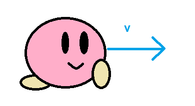

<!-- headingDivider: 3 -->
<!-- class: invert -->

# 1. Vectors

## What is a vector?

* Vector is a mathematical thingy with a **length** and a **direction**
* Often represented by an arrow (see next slide)
* Can have multiple dimensions (also called components)
  * In our case usually 2 or 3: 
  * $x$, $y$, and possibly $z$
* Video games are full of vectors!
  * Used for depicting position, velocity, acceleration, forces....

### 2D vector example


* This is a 2D vector $\vec{A} = (6, 3)$
  * x-component $\vec{A}_x = 6$
  * y-component $\vec{A}_y = 3$
* Vectors start from the origin, or $(0,0)$
* In C#:
  
  ```c#
  Vector2 vectorA = new Vector2(6,3);
  ```

### 2D vector length

* The length of a 2D vector is given by the Pythagoras theorem
  * $|\vec{A}| = \sqrt{\vec{A}_x^2 + \vec{A}_y^2}$
  * $|(6,3)| = \sqrt{6^2 + 3^2} = \sqrt{36 + 9} = \sqrt{45} \approx 6.7$

* In C#:
  
  ```c#
  float length = Mathf.Sqrt(Mathf.Pow(vectorA.x, 2) + Mathf.Pow(vectorA.y, 2));
  ```
  * Vector classes have a shorthand, too: `A.magnitude`

## Vector arithmetic

* [Manual: Understanding Vector Arithmetic](https://docs.unity3d.com/2019.3/Documentation/Manual/UnderstandingVectorArithmetic.html)
* Let's introduce the most important vector operations
  * Addition
  * Subtraction
  * Scalar multiplication
  * Extra: vector multiplication
    * Dot product
    * Cross product (WIP)
* C# examples included

### Vector addition

* sum of two vectors is calculated by summing up the individual components
* $\vec{C} = \vec{A} + \vec{B}$
  $= (3, 3) + (6, -2)$
  $= (3 + 6, 3 - 2) = (9, 1)$
* can be illustrated by moving $\vec{B}$ to start from the endpoint of $\vec{A}$

  ```c#
  Vector2 A = new Vector2(3.0f, 3.0f);
  Vector2 B = new Vector2(6.0f,-2.0f);
  Vector2 C = A + B;
  ```
  


### Vector subtraction

* difference of two vectors, $\vec{A} - \vec{B}$
  * $-\vec{B}$ is is "flipped" $\vec{B}$: $\vec{B} = (6, -2) \Rightarrow -\vec{B} = (-6, 2)$
  * $\vec{C} = \vec{A} - \vec{B}$
    $= (3, 3) - (6, -2)$
    $= (3 - 6, 3 - (-2))$
    $= (3 - 6, 3 + 2)$
    $= (-3, 5)$
* $\vec{A} - \vec{B}$ starts from the endpoint of $\vec{B}$ and ends in the endpoint of $\vec{A}$

  ```c#
  Vector2 A = new Vector2(3.0f, 3.0f);
  Vector2 B = new Vector2(6.0f,-2.0f);
  Vector2 C = A - B;
  ```


### Scalar multiplication

* When a vector is multiplied by a scalar (a number), the vector is *scaled*
  * If a vector is multiplied by 2, its length doubles
    $2 \cdot \vec{A}$
    $= 2 \cdot (3,2)$
    $= (2 \cdot 3, 2 \cdot 2)$
    $= (6, 4)$

  ```c#
  Vector2 A = new Vector2(3.0f,3.0f);
  Vector2 C = 2 * A;
  ```


### Special cases for scalar multiplication

* If the scalar is negative, the vector gets flipped
  * that's what happened in subtraction
  * $-\vec{A} = -1\cdot \vec{A} = -1 \cdot (6,4) = (-1 \cdot 6,-1 \cdot 4) = (-6, -4)$
* What about division?
  * it's basically multiplication as well
  * $\vec{A} / 5 = \frac{1}{5} \cdot \vec{A} = \frac{1}{5} \cdot (6,4) = (\frac{1}{5} \cdot 6,\frac{1}{5} \cdot 4 ) = (\frac{6}{5},\frac{4}{5} ) = (1.2, 0.8)$
  
  

# Vectors in Unity

## Vectors in video games

* position
* velocity
* acceleration
* rotation
* forces

## Vector classes

* Unity has two Vector classes, [Vector2](https://docs.unity3d.com/ScriptReference/Vector2.html) and [Vector3](https://docs.unity3d.com/ScriptReference/Vector3.html)
  * "2" and "3" here are the number of dimensions: (x,y) and (x,y,z)
  * 
    ```c#
    Vector2 position = new Vector2(1.0f, 2.0f)
    ```
* Vector components can be accessed with the dot notation:
  * `position.x`, `position.y`, `position.z`
* Vectors can't be directly modified: 
  * No: `position.x = 3.0f`
  * 
    ```c#
    position = new Vector2(3.0f, position.y);
    ```

* Length of a vector can be acquired with `vector.magnitude`
  * [Script Reference: Vector3 magnitude](https://docs.unity3d.com/ScriptReference/Vector3-magnitude.html)

## Velocity vector

* Velocity is an important concept in game development!
* It's the ***rate of change*** of position
  * `new_position = old_position + velocity;`
* 3-dimensional velocity vector can be added like this to GameObject's position in an `Update()` method:
  * `transform.position += velocity;`
  * We can use player input, collision, etc. to adjust the velocity as needed
---
***Note:*** Velocity vector is usually drawn so it starts from the moving object
  * (Remember, though, that vectors do not "know" its starting positions.)

    

## Acceleration vector

* Another important concept is ***acceleration***
* It's the rate of change of a GameObject's velocity!
  * `new_velocity = old_velocity + acceleration`;
* We can use acceleration to change Rigidbody's velocity
  * `rb.velocity += acceleration`;
* We can't use that for GameObjects without rigidbodies, but we can store velocity in a separate variable
  ```c#
  velocity += acceleration;
  transform.position += velocity;
  ```
* This might seem like a cheap trick, but actually allows us to create ***smoother motion*** if we use player input, collision, etc to control acceleration instead of velocity

## Distance vector

* To get the distance vector between two objects, we use vector subtraction
  * `vector_B - vector_A`
  * `transform.position - otherGameObject.transform.position;`
* To just get the length of the distance vector, a.k.a, the distance:
  * `Vector2.Distance(vector_A, vector_B)`

## Special vectors of Unity

* See Static properties in [Script Reference: Vector3](https://docs.unity3d.com/ScriptReference/Vector3.html)
  * `Vector3.right`: the global $x$ axis
  * `Vector3.up`: the global $y$ axis
  * `Vector3.forward`: the global $z$ axis

## Common vector operations

### Normalizing a vector

* When we are not interested about the length of a vector, only its **direction**, it helps to *normalize* the vector
* Normalizing means setting the length of a vector to be $1$
* This is achieved by dividing the vector by its length
* $\vec{A}_{normalized} = \vec{A} / |\vec{A}|$
* in C#, the normalized version of any vector can be easily accessed:
  ```c#
  Vector2 UnitVector = A.normalized;
  ```

### Rotating a vector

* In Unity, rotation is represented by [Quaternions](5-math-classes#quaternion) (fin. kvaternio, kvaterniot)
* To rotate a vector by a given angle, you can do a ***Quaternion rotation operation***:
  ```c#
  Vector3 rotatedVector = Quaternion.Euler(0, 0, 90) * originalVector;
  ```
  * This isn't a regular multiplication, so do note that Quaternion.Euler has to be on the ***left side*** of the vector.
* To rotate a Quaternion:
  ```c#
  myQuaternion *= Quaternion.Euler(0, 0, 90);
  ```
* ***Note:*** the Transform and Quaternion classes have many rotation methods available, see [Transform Class: Rotation](../unity-cookbook/transform#rotation)

## Dot product: Vector's alignment with another vector
<!-- _backgroundColor: #5d275d -->

* If you want to know how much two vectors point to the same direction, we can use the ***dot product***
  * [Script Reference: Vector3.Dot](https://docs.unity3d.com/ScriptReference/Vector3.Dot.html)
* The dot product returns a number, not a vector!
  * $\vec{A} \cdot \vec{B} = A_{x} \cdot B_{x} + A_{y} \cdot B_{y} + A_{z} \cdot B_{z}$
* For normalized vectors, `Vector3.Dot` returns 
  * $1$ if they point in exactly the same direction
  * $-1$ if they point in completely opposite directions
  * $0$ if the vectors are perpendicular

### Dot product example
<!-- _backgroundColor: #5d275d -->

* Check if two rigidbodies are moving to the same direction:
  ```c#
  float alignment = Vector3.Dot(
    _rigidBody.velocity.normalized,
    otherGameObjectRigidBody.velocity.normalized)
  ```

## Note about distance

* Note: when performance is important, using magnitude can be a bad idea: it includes the costly square root operation
  * if you need to only compare magnitudes, or you're squaring it right away, use `.sqrMagnitude` instead!

## Exercise 1. I'm being avoided
<!-- _backgroundColor: #29366f -->

Create a scene with two GameObjects, a player and a static enemy.
Calculate **the distance** between the player and the enemy.

If the distance is smaller than some given threshold value,

  - ⭐ Change the color of the enemy (and set the color back to default when you're no more on the range)
  - ⭐⭐ Make the enemy shoot at player!
  - ⭐⭐⭐ Move the enemy farther away from the player along the shortest possible path.

## Reading & watching

* [Manual: Vector Cookbook](https://docs.unity3d.com/2019.3/Documentation/Manual/VectorCookbook.html)

* [Brackeys video: Vectors](https://www.youtube.com/watch?v=wXI9_olSrqo)

* [Freya Holmér video: Vectors & Dot Product](https://www.youtube.com/watch?v=MOYiVLEnhrw)