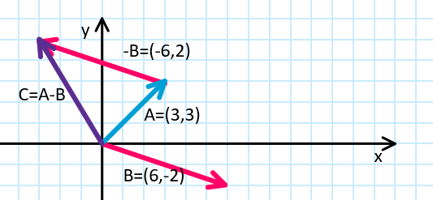

<!-- headingDivider: 3 -->
<!-- class: default -->
# Game math 1: Vectors

# Vector theory
## What is a vector?

* vector is a mathematical thingy with a **length** and a **direction**
* often represented by an arrow (see next slide)
* can have multiple dimensions (also called components)
  * in our case usually 2 or 3: 
  * x, y, and possibly z
* video games are full of vectors!
  * used for depicting position, velocity, acceleration, forces....

### 2D vector example
* This is a 2D vector $\vec{A} = (6, 3)$
  * x-component $\vec{A}_x = 6$
  * y-component $\vec{A}_y = 3$
* Vectors start from the origin, or $(0,0)$


### 2D vector length

* The length of a 2D vector is given by the Pythagoras theorem
  * $|\vec{A}| = \sqrt{\vec{A}_x^2 + \vec{A}_y^2}$
  * $|(6,3)| = \sqrt{6^2 + 3^2} = \sqrt{36 + 9} = \sqrt{45} \approx 6.7$

* In C#... 
  * `Mathf.Sqrt(A.x^2 + A.y^2)`
  * Vector classes have a shorthand, too: `A.Magnitude`

## Vector arithmetic

* [Manual: Understanding Vector Arithmetic](https://docs.unity3d.com/2019.3/Documentation/Manual/UnderstandingVectorArithmetic.html)
* Let's introduce the most important vector operations
  * addition
  * subtraction
  * scalar multiplication
  * Extra: vector multiplication
    * dot product
    * cross product
* C# examples included
### Vector addition
* sum of two vectors is calculated by summing up the individual components
* $\vec{C} = \vec{A} + \vec{B} = (3, 3) + (6, -2) = (3 + 6, 3 - 2) = (9, 1)$
* can be illustrated by moving $\vec{B}$ to start from the endpoint of $\vec{A}$


```c#
Vector2 A = new Vector2(3.0f, 3.0f);
Vector2 B = new Vector2(6.0f,-2.0f);
Vector2 C = A + B;
```

### Vector subtraction

* difference of two vectors, $A - B$:
  * B is "flipped": If $\vec{B} = (6, -2)$, then $-\vec{B} = (-6, 2)$
  * $$\vec{C} = \vec{A} - \vec{B} = (3, 3) - (6, -2) = (3 - 6, 3 - (-2)) = (3 - 6, 3 + 2) = (-3, 5)$$
* $\vec{A} - \vec{B}$ starts from the endpoint of $\vec{B}$ and ends in the endpoint of $\vec{A}$

```c#
Vector2 A = new Vector2(3.0f, 3.0f);
Vector2 B = new Vector2(6.0f,-2.0f);
Vector2 C = A - B;
```

### Scalar multiplication

* When a vector is multiplied by a scalar (a number), the vector is *scaled*
  * If a vector is multiplied by 2, its length doubles
  * $2 \cdot \vec{A} = 2 \cdot (3,2) = (2 \cdot 3, 2 \cdot 2) = (6, 4)$

```c#
Vector2 A = new Vector2(3.0f,3.0f);
Vector2 C = 2 * A;
```

### Special cases for scalar multiplication

* If the scalar is negative, the vector gets flipped
  * that's what happened in subtraction
  * $-\vec{A} = -1\cdot \vec{A} = -1 \cdot (6,4) = (-1 \cdot 6,-1 \cdot 4) = (-6, -4)$
* What about division?
  * it's basically multiplication as well
  * $\vec{A} / 5 = \frac{1}{5} \cdot \vec{A} = \frac{1}{5} \cdot (6,4) = (\frac{1}{5} \cdot 6,\frac{1}{5} \cdot 4 ) = (\frac{6}{5},\frac{4}{5} ) = (1.2, 0.8)$
  
  

# Vectors in Unity

## Vectors in video games

* position
* velocity
* acceleration
* rotation
* forces

## Vector classes

* Unity has two Vector classes, ***Vector2*** and ***Vector3***
  * 2 and 3 are the number of dimensions: (x,y) and (x,y,z)
  * `Vector2 position = new Vector2(1.0f, 2.0f)`
    * can be modified by accessing the vector with the dot notation:
    * `position.x = 3.0f`

* length of vector can be acquired with `vector.Magnitude`
  * it's calculated internally with the Pythagoras' theorem:
  * `Mathf.Sqrt(position.x^2 + position.y^2 + position.z^2)`

## Velocity vectors
  * velocity vector: velocity_x and velocity_y components
    * `new_position = old_position + velocity`
    * vector addition!
    * usually depicted as starting from the moving object
## Distance vectors

* distance vector between two objects
  * `Vector2.Distance(vector_A, vector_B)`
  * subtraction
  * `vector_B - vector_A`
  * length of the vector: pythagoras


## Special vectors of Unity

* See Static properties in [Script Reference: Vector3](https://docs.unity3d.com/ScriptReference/Vector3.html)
  * Vector3.up
  * Vector3.right
  * Vector3.forward
  * etc...

## Common vector operations

### Normalizing a vector

* When we are not interested about the length of a vector, but the **direction** instead, it helps to *normalize* the vector
  * that is, to set its length to be one
* this is achieved by dividing the vector by its length
* $\vec{A}_{normalized} = \vec{A} / |\vec{A}|$
* in C#, the normalized version of every vector can be easily accessed:
  `Vector2 UnitVector = A.normalized;`

### Rotating a vector

* In Unity, rotation is represented by [Quaternions](5-math-classes.md#quaternion)
* To rotate a vector by a given angle, you can do a ***Quaternion rotation operation***:
  ```c#
  Vector3 rotatedVector = Quaternion.Euler(0, 0, 90) * originalVector;
  ```
  * This isn't a regular multiplication, so do note that Quaternion.Euler has to be on the ***left side*** of the vector.
* To rotate a Quaternion:
  ```c#
  myQuaternion *= Quaternion.Euler(0, 0, 90);
  ```

* ***Note:*** the Transform and Quaternion classes have many rotation methods available, see [Transform Class: Rotation](../unity-cookbook/transform.md#rotation)

## Note about distance

* Note: when performance is important, using magnitude can be a bad idea: it includes the costly square root operation
  * if you need to only compare magnitudes, or you're squaring it right away, use `.sqrMagnitude` instead!


## Exercise 1. I'm being avoided
<!-- _backgroundColor: Khaki -->

Calculate distance between two GameObjects (player and enemy).

If the distance is smaller than a threshold value, 
a) change the color of the static GameObject (and set the color back to default when you're no more on the range)
b) make the enemy shoot at player
c) move the static GameObject farther away from the GameObject along the shortest possible path


## Script reference

* Most of the previous examples apply to both Vector2 and Vector3 classes.
* Vector2
  * [Script Reference: Vector2](https://docs.unity3d.com/ScriptReference/Vector2.html)
* Vector3
  * [Script Reference: Vector3](https://docs.unity3d.com/ScriptReference/Vector3.html)
  * [Script Reference: Vector3 Dot product](https://docs.unity3d.com/ScriptReference/Vector3.Dot.html)
  * [Script Reference: Vector3 magnitude](https://docs.unity3d.com/ScriptReference/Vector3-magnitude.html)
* [Manual: Vector Arithmetic](https://docs.unity3d.com/2019.3/Documentation/Manual/UnderstandingVectorArithmetic.html)

## Reading & watching

* [Manual: Vector Cookbook](https://docs.unity3d.com/2019.3/Documentation/Manual/VectorCookbook.html)

* [Brackeys video: Vectors](https://www.youtube.com/watch?v=wXI9_olSrqo)

* [Freya Holmér video: Vectors & Dot Product](https://www.youtube.com/watch?v=MOYiVLEnhrw)