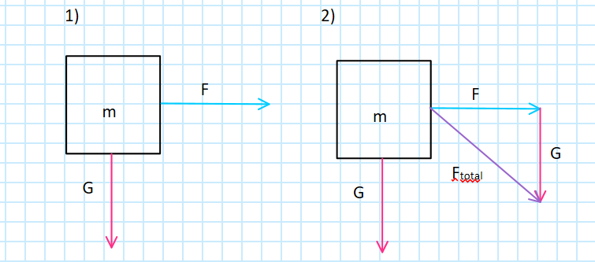

<!-- headingDivider: 3 -->
<!-- class: invert -->

# 2. Forces

## What is a force?

* In physics, a force is an influence ("push or pull") that can change the motion of an object
* Force causes an object to ***accelerate***
  * This in turn changes the object's ***velocity***
  * ...which changes the object's ***position***

* [Brackeys video: Forces](https://www.youtube.com/watch?v=HEJ_UtSbinY)

### Force vector

* $\vec{F} = m\vec{a}$
  * the unit of force is *Newton* ($N = kg \cdot m/s^2$)
  * force equals mass times acceleration
  * the force is a ***vector***
  * so it not only has a ***magnitude***, but also a ***direction***

### Note about forces in games

* In games, we're generally more interested in the gained ***acceleration*** than the actual force
  * $\vec{a} = \vec{F} / m$
  * The bigger the mass, the smaller the acceleration!

### Multiple forces

Force vectors can be added together to acquire the total force:

## Torque

* Torque is the rotational equivalent of linear force
* Torque "makes things turn"
* In simplified terms, torque is force times length of the lever arm
* $T_{A} = F_{A} \cdot r_{AO}$
* Unit of torque is *Newtonmeter* ($Nm = kg \cdot m/s^2 \cdot m$)

### Torque... vector?

  

* More precisely, torque is a vector, produced by a ***cross product*** between the lever arm vector and a force vector
  * $\vec{\tau} = \vec{r} \times \vec{F}$
* ***Note:*** Cross product between two vectors produces a new vector ***perpendicular*** to both the two

## Forces in Unity

* In Unity, forces are applied by the physics engine
  * See: [Physics](../unity-cookbook/physics)
  * We need a Rigidbody component to apply forces to a GameObject.
* If you want more control, you can also create your own code e.g., for simulating planets in a star system

## Exercise 1. Forces
<!-- _backgroundColor: #29366f -->

Create a 3D scene where a player character can push around rigid bodies by applying a force to them.

How would you calculate the direction of the force?

***Hint:*** you need to use the concepts of ***distance*** and ***normalization***.

## Reading & Watching

* [Physics for idiots: Dynamics](https://physicsforidiots.com/physics/dynamics/)