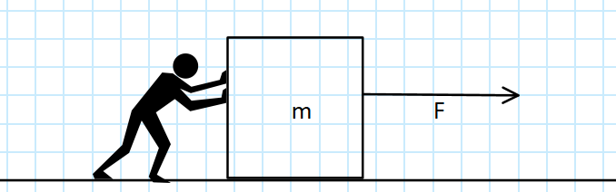
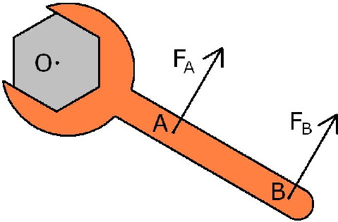

<!-- headingDivider: 3 -->
<!-- class: invert -->

# 2. Forces

## What is a Force

- In physics, a force is an influence ("push or pull") that can change the motion of an object
- force causes an object to **accelerate**
  - this in turn changes the object's **velocity**
  - ...which changes the object's **position**

* [Brackeys video: Forces](https://www.youtube.com/watch?v=HEJ_UtSbinY)

### Force vector

- $\vec{F} = m\vec{a}$
  - the unit of force is *Newton* ($N = kg \cdot m/s^2$)
  - force equals mass times acceleration
  - the force is a *vector*
  - so it not only has a magnitude, but also a *direction*

## Torque

* torque is the rotational equivalent of linear force
* torque "makes things turn"
* in simplified terms, torque is force times length of the lever arm
* $T_{A} = F_{A} \cdot r_{AO}$
* unit of torque is *Newtonmeter* ($Nm = kg \cdot m/s^2 \cdot m$)

### Torque vector

* more precisely, torque is the cross product between the lever arm vector and the force vector
* $\vec{\tau} = \vec{r} \times \vec{F}$

## Forces in Unity

* in Unity, forces are applied by the Physics engine
  * if you want more control, you can also create your own code for e.g., simulating planets in a star system

* See: [Physics](../unity-cookbook/physics.md)

## Reading & Watching

* [Physics for idiots: Dynamics](https://physicsforidiots.com/physics/dynamics/)