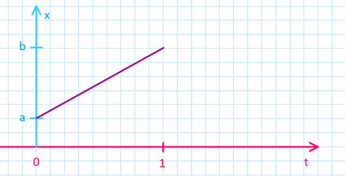
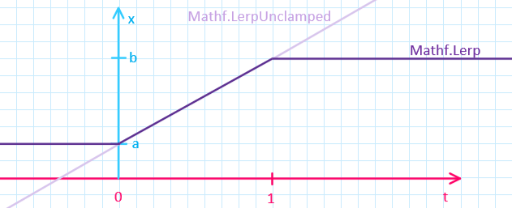
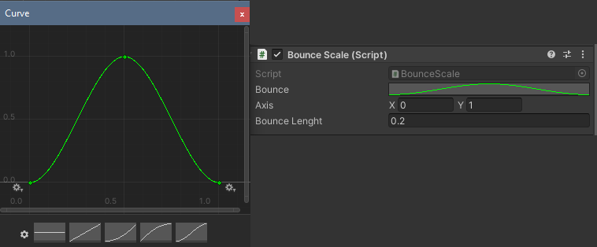

<!-- headingDivider: 3 -->
<!-- class: invert -->

# 3. Interpolation

## Lerp

  
  * "Lerp", or  linear interpolation, is a commonly used function in gamedev
    * returns the value $x$, which goes from $a$ to $b$, when $t$ goes from $0$ to $1$
    * when $t = 0$, $x = a$
    * when $t = 0.5$, $x = (b - a) / 2$ ("halfway")
    * when $t = 1$, $x = b$
  * [`Mathf.Lerp(a, b, t)`](https://docs.unity3d.com/ScriptReference/Mathf.Lerp.html)

### Lerp example

```c#
Mathf.Lerp(5.0f, 15.0f, 0f);   // returns 5.0f
Mathf.Lerp(5.0f, 15.0f, 0.5f); // returns 10.0f
Mathf.Lerp(5.0f, 15.0f, 1.0f); // returns 15.0f
```

### Note about Clamping



* what if t is smaller than 0 or larger than 1?
* Unity's `Mathf.Lerp` is clamps the returned value automatically
  * $x$ is $a$ at minimum and $b$ at maximum
* with [`Mathf.LerpUnclamped`](https://docs.unity3d.com/ScriptReference/Mathf.LerpUnclamped.html), the value is extrapolated when outside the limits!

## Exercise 1. Do a lerp!
<!-- _backgroundColor: #29366f -->
After pressing a button once, lerp GameObject's color from red to blue.

***Bonus:*** After pressing twice, lerp the color back to red.
***Bonus bonus:*** What if you press the button _during_ lerping?

## Lerping different data types

* Some data types are more complicated than just one float value
* You can of course lerp every number value individually
* Other way around: some types have their own built-in lerps
  * [Vector2.Lerp](https://docs.unity3d.com/ScriptReference/Vector2.Lerp.html)
  * [Vector3.Lerp](https://docs.unity3d.com/ScriptReference/Vector3.Lerp.html)
  * [Quaternion.Slerp](https://docs.unity3d.com/ScriptReference/Quaternion.Slerp.html)

### Slerp example

```c#
Vector3 relativePos = target.position + new Vector3(0,.5f,0) - transform.position;

transform.localRotation = 
  Quaternion.Slerp(
    transform.localRotation,
    Quaternion.Lookrotation(relativePos),
    Time.deltaTime
  );

transform.Translate(0,0, 3 * Time.deltaTime);
```


## Other interpolation functions

* Smooth interpolation
  * [Mathf.SmoothStep](https://docs.unity3d.com/ScriptReference/Mathf.SmoothStep.html): Like Lerp but with ***smoothing*** in start and finish 
  * [Mathf.SmoothDamp](https://docs.unity3d.com/ScriptReference/Mathf.SmoothDamp.html): Spring-like motion towards destination
  * [Mathf.MoveTowards](https://docs.unity3d.com/ScriptReference/Mathf.MoveTowards.html): Move linearly towards destination with a ***max speed limit***
* Angle versions (These take into account that the angle loops from 360 back to 0)
  * [Mathf.LerpAngle](https://docs.unity3d.com/ScriptReference/Mathf.LerpAngle.html)
  * [Mathf.SmoothDampAngle](https://docs.unity3d.com/ScriptReference/Mathf.SmoothDampAngle.html)
  * [Mathf.MoveTowardsAngle](https://docs.unity3d.com/ScriptReference/Mathf.MoveTowardsAngle.html)

## Custom interpolation

* Lerping is a *linear* operation: the rate of change is constant during the process
* Sometimes we want smoothing that is controlled more precisely than with SmoothStep and the like
* Luckily, we can also create custom curves

### Custom interpolation with an animation curve

* for custom interpolation curves, use the `AnimationCurve` variable
* `[SerializeField] AnimationCurve curve;`
* The curve can be manipulated in the inspector:
  
  * Click on the default curve images on the bottom to create a curve 

### Controlling values with the curve

* If the curve starts from 0 and ends in 1, you can use it as a replacement for `Mathf.Lerp`
* If the curve starts from and ends in 0, you can create an animation that loops back to the initial value!
* `curve.Evaluate(t)` returns a value from the graph (by default, between 0 and 1)
  ```c#
  float InterpolateCurve(float a, float b, float t)
  {
      return a + (b - a) * curve.Evaluate(t);       
  }
  ``` 
* Now, `Mathf.Lerp(a, b, t)` can be replaced with `InterpolateCurve(a, b, t)`

### Animation curve example

```c#
public AnimationCurve bounce;
...
// If timer is on, do animation
if(Time.time < bounceTimer)
{
    // Calculate valid time for curve (in between 0 and 1)
    float scaleTime = (bounceTimer - Time.time) / bounceLenght;

    // Get the value from curve at the time of the animation
    // and multiply it with the desired scaled axis
    // then add it to default scale (1, 1, 1)
    transform.localScale = Vector2.one + axis * bounce.Evaluate(scaleTime);
}
```

## Extra: Note about lerping on the fly
<!-- _backgroundColor: #5d275d -->

* You may have seen lerp performed "on the fly" like this:
  ```c#
  transform.position = Vector3.Lerp(transform.position, target.position, Time.deltaTime);
  ```
* That is, the start point changes every frame!
  * This creates a deceleration ("braking") in the end which results in a smoother finish
  * This means the interpolation isn't linear anymore
  * Also, now the lerp process does not take the time it's supposed to: it finishes much faster!
* That being said, this is a very fast way to create a camera that follows the player a bit behind. If that's what you're after, you can use it
  * But remember: This isn't the way Lerp was meant to be used, so your mileage may wary. You're on your own now.

## Inverse lerp

* [Script Reference: Inverse lerp](https://docs.unity3d.com/ScriptReference/Mathf.InverseLerp.html)
  * `Mathf.InverseLerp(a, b, x)`
  * Returns the answer to the inverse problem of Lerp:
    * "When we know a value $x$ that is between $a$ and $b$, what is $t$?"
    * In other words, how far is $x$ between $a$ and $b$, as a fraction

## Remapping with lerp & inverse lerp

* [Freya Holmér: Inverse Lerp and Remap](https://www.gamedev.net/articles/programming/general-and-gameplay-programming/inverse-lerp-a-super-useful-yet-often-overlooked-function-r5230/)

* What if we want to map a range $t_0 \dots t_1$ to range $a \dots b$?
* Or in other words, map a variable `input` in range `inputMin`$\dots$`inputMax` 
  * And get a result that is in a range `outputMin`$\dots$`outputMax`.
* The function that achieves this is a sort of a "generalization" of lerp & inverse lerp:
    ```c#
    float Remap (float inputMin, float inputMax, float outputMin, float outputMax, float input)
    {
        float t = Mathf.InverseLerp(inputMin, inputMax, input );
        return Mathf.Lerp( outputMin, outputMax, t );
    }
    ```
  * If `input` has the value of `inputMin`, the function returns the value `outputMin`.

## Reading

* [Learn: Linear interpolation](https://learn.unity.com/tutorial/linear-interpolation?uv=2019.3&courseId=5c61706dedbc2a324a9b022d&projectId=5c8920b4edbc2a113b6bc26a#5c8a48bdedbc2a001f47cef6)
* [gamedevbeginner.com: The right way to Lerp in Unity](https://gamedevbeginner.com/the-right-way-to-lerp-in-unity-with-examples/#lerp_vector3)
* [easings.net](https://easings.net/): a source for different easing functions beyond linear interpolation