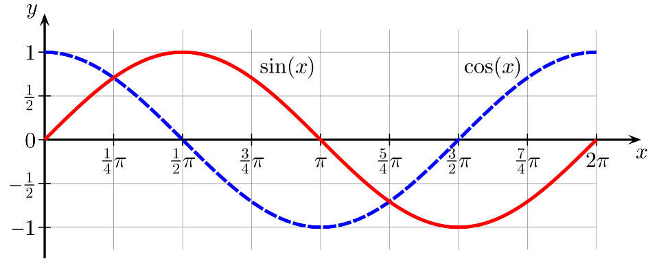
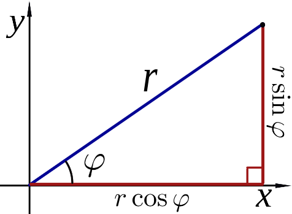

<!-- headingDivider: 3 -->
<!-- class: invert -->

# 4. Sinewaves
[Brackeys video: Sinewaves](https://www.youtube.com/watch?v=pEXdTLsEAjk)

## Sine and cosine

* [Script reference: Mathf.Sin](https://docs.unity3d.com/ScriptReference/Mathf.Sin.html)
* $\sin(x)$ and $\cos(x)$ are oscillating functions that return a value between $1$ and $-1$
  * here, $x$ is an ***angle*** measured in ***radians*** (rad).
* Their form is the same, but $\cos$ is shifted from $\sin$ by $\pi/2$ rad:
  	$\sin(x + \pi/2) = \cos(x)$


## Sin & Cos triangle definition

## Circular motion

## Extra: Polar coordinates

* [Wikipedia: Polar coordinate system](https://en.wikipedia.org/wiki/Polar_coordinate_system)
* Any two-dimensional vector $\vec{r} = (x,y)$ can be represented by its ***length*** $r$ and ***rotation angle*** $\varphi$
	$x = r \cos{\varphi}$
	$y = r \sin{\varphi}$




### Code example

```c#
double phi = Mathf.pi/2;
double r = 5.0f;

Vector2 vec = new Vector2(
    r * Mathf.Cos(phi),
    r * Mathf.Sin(phi)
);
```

### From cartesian ($x$ and $y$) to polar coordinates ($r$ and $\varphi$)

* What about the other way around?
  	$r = \sqrt{x^2 + y^2}$
	$\varphi = \mathrm{atan2}(y,x)$
	* $\mathrm{atan2}$ is an important function in game development
	* [Script Reference: Mathf.Atan2](https://docs.unity3d.com/ScriptReference/Mathf.Atan2.html)
* In code:
	```c#
	Vector2 vec = new Vector2(4.0f, 2,0f);

	double r = vec.Magnitude;
	double phi = Mathf.Atan2(vec.y, vec.x);
	```