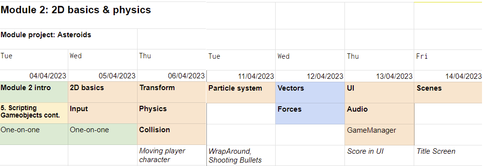

<!-- headingDivider: 3 -->
<!-- class: invert -->
# Module 2

## What to expect

* Actual gamedev!!
* Unity basics in 2d
* Input & movement
* Collision & physics
* More programming

## Module 2 Schedule

<!-- | Day 1 | Day 2 | Day 3 | Day 4 | Day 5 | Day 6 | Day 7 | 
|-------|-------|-------|-------|-------|-------|-------|
| 12.4. TI	| 13.4. KE	| 14.4. TO	| 19.4. TI	| 20.4. KE	| 21.4. TO | 22.4. PE | 
| UB4: [Scripting Gameobjects](unity-basics/4-scripting-gameobjects.md) | UC: [2D](unity-cookbook/2d-basics.md), [Input](unity-cookbook/input-handling.md), [Transform](unity-cookbook/transform.md),  [Collision](unity-cookbook/collision.md), [Materials for success](https://www.businessoulu.com/en/events/game-team.html) (remote) | P2: [Lists and Loops](programming/2-lists-loops.md) | P0: [Introduction to Game Programming](programming/0-game-programming.md), M1: [Vectors](math/1-vectors.md), M2: [Forces](math/2-forces.md) | M0: [Useful math](math/0-mathf.md), UC: [Audio](unity-cookbook/audio.md) | [UI](unity-cookbook/UI.md) | Playtesting, Wrap-up |

--- -->

# Day 1: GameObject scripting

## Module project 2: Asteroids
<!-- _backgroundColor: #257179 -->
*  Recreate the classic arcade game Asteroids in Unity.
     * [Youtube: Asteroids gameplay](https://www.youtube.com/watch?v=WYSupJ5r2zo)

Goal:
* ⭐ MVP: Create a playable single-screen game of Asteroids.
## Extra goals:
<!-- _backgroundColor: #257179 -->
* ⭐⭐ Add one of the following features:
  * Hi scores & scoreboard
  * Level progression: new asteroids appear and make the game progressively more difficult
  * Twin-stick shooter: Use right stick to control the bullet direction
  * Co-op: Add second player
* ⭐⭐⭐ Spice up the game: Add a game mechanic of your own design

## MP exercise 0.
<!-- _backgroundColor: #257179 -->
Examine the gameplay video, then play the example Unity-built Asteroids.

In your groups, write down:
* What features do you see? 
* How would you begin implementing them?
* Which feature would you implement first?

## MP exercise 1. Player controls
<!-- _backgroundColor: #257179 -->

Now back on your own, make a new project for the module project and create the player controlled ship.

## MP exercise 2. The titular threat
<!-- _backgroundColor: #257179 -->

Add asteroids to the scene.

## MP exercise 3. Interactivity
<!-- _backgroundColor: #257179 -->

Destroy player if it hits an asteroid.

# Day 2: 2D basics & Input
<!-- 
## MP Exercise 4.

* [Asteroids component listing](asteroids-components.md) -->

# Day 3: Transform & Collision
<!-- 
# Day 3 schedule

[Programming 2: Lists and Loops](programming/2-lists-loops.md) -->

# Day 4: Particles & animation

<!-- ## Day 4 Schedule

  * [Math 0: Useful math functions](math/0-mathf.md)
  * [Unity cookbook: Audio](unity-cookbook/audio.md)
  * [Unity cookbook: Particle system](unity-cookbook/particle-system.md)
  * [Unity cookbook: Animation curve](unity-cookbook/animation-curve.md) -->

# Day 5: Vectors & Forces
<!-- : UI

## Day 5 schedule

  * [Unity cookbook: UI](unity-cookbook/UI.md) -->

## MP Exercise 4. Basic UI
<!-- _backgroundColor: #257179 -->

Show Player's lives and Score.

# Day 6 Audio & UI

# Day 7: Scenes & Playtesting

