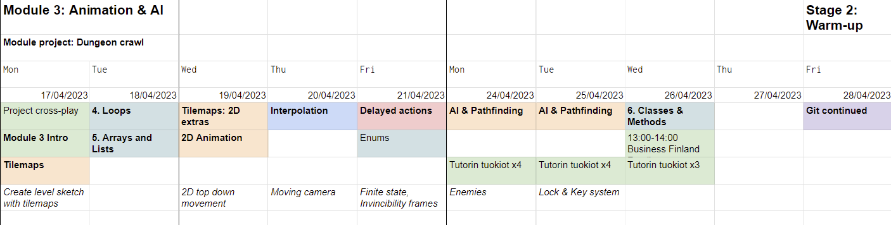

<!-- headingDivider: 3 -->
<!-- class: invert -->
# Module 3

<!-- ## Module 3 Schedule

| Day 1 | Day 2 | Day 3 | Day 4 | Day 5 |
|-------|-------|-------|-------|-------|
| 25.4. MA | 26.4. TI | 27.4. KE | 28.4. TO | 29.4. PE |
| UC: [Tilemaps](unity-cookbook/tilemaps.md) | P0: [Game Programming](programming/0-game-programming.md) | AI & Pathfinding | [Particle system](unity-cookbook/particle-system.md) |  Playtesting????? |
| UC: [2D animation](unity-cookbook/2d-animation.md)  | P2: [Lists and Loops](programming/2-lists-loops.md) | M0: [Useful math](math/0-mathf.md) | | Wrap-up?????? | -->

## Module project 3: Dungeon crawler
<!-- _backgroundColor: #257179 -->

⭐ MVP
  * Top-down movement
  * Tile-based level (bigger than one screen!)
  * Player character
    * Animations
    * Attack action (punch or shoot)
    * Health
  * Enemies that hurt the player
* ***Optional:*** Health item pickups 
---
<!-- _backgroundColor: #257179 -->
⭐⭐
Pick one:
* Player defense
* Keys that open doors
* Enemy AI
---
<!-- _backgroundColor: #257179 -->
⭐⭐⭐
* Pick one:
  * Boss fight
  * A power-up that is required to clear the dungeon
  * Co-op
  * Multiple floors

## MP Exercise 1. Tiles!
<!-- _backgroundColor: #257179 -->

Pick a tile map (or two) for your game!

* https://0x72.itch.io/dungeontileset-ii
* https://pixel-poem.itch.io/dungeon-assetpuck
* https://cupnooble.itch.io/sprout-lands-asset-pack
* https://cainos.itch.io/pixel-art-top-down-basic
* https://raou.itch.io/topdown-rpg-pixel-art-tileset
* https://pixel-boy.itch.io/ninja-adventure-asset-pack
* https://o-lobster.itch.io/simple-dungeon-crawler-16x16-pixel-pack
* https://szadiart.itch.io/rogue-fantasy-catacombs
* https://ansimuz.itch.io/patreons-top-down-collection

More available on [opengameart.org](https://opengameart.org/)