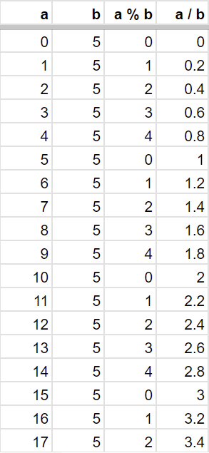

<!-- headingDivider: 3 -->
<!-- class: invert -->

# Variables

## About C#

* C# is a general-purpose object-oriented language
* Created by Microsoft in 2000 as a competitor for Java
* Syntax
  * Pretty much everything will be inside a class
  * Curly brackets `{` and `}` mark the **bodies** of statements
    * Namespaces, classes, functions...
* Semicolon at the end of most statements
  * VS code tells if it's missing!

### C# syntax example

```c#
using System;

namespace MyAwesomeProgram
{
    class Program
    {
        static void Main(string[] args)
        {
            Console.WriteLine("Hello World!");
        }
    }
}
```
* In Unity, we don't (necessarily) have to deal with namespaces.  

## Variable declaration

1) Modifiers (not necessary) 
2) Type declaration
3) Variable name
4) Initial value (not necessary) after `=`
5) Line ending with `;`

    ```c#
    int number = 1;
    ```

## Commenting
  * one line
    ```c#
    // one line comment
    ```
  * multiline 
    ```c#
    /* this is a
    multi-line
    comment */
    ```
* Comments are not executed
* Use to 
  1) explain your intent
  2) comment out actual code for testing and debugging

## The most important variable types
  * `bool`: truth value (true / false)
    ```c#
    bool booleanValue = true;
    ```
  * `int`: whole number
    ```c#
    int wholeNumberValue = 3;
    ```
  * `double` & `float`: decimal number (double = double precision)
    ```c#
    float numberValue = 3.0f;
    ```
  * `string`: text field
    ```c#
    string text = "text is here";
    ```

## Modifiers

* A common modifier to add in front of a variable is `const`, short for constant
* If we know that a value of a variable is never going to change during the execution of the script, we can set it to `const`:
  ```c#
  const string text = "I never change!";
  ```
* Other modifiers include [access modifiers](6-classes-methods.md#access-modifiers).

## Unity Console

* Console Window
  * Error messages
  * Debug messages
* `Debug.Log(textVariable)`
  * Use it to print stuff into the console 
  * As the name suggests, it's used for *debugging*
  * You can print other variable types as well, not only strings!
* `Debug.LogWarning()`
* `Debug.LogError()`

---


## Basic arithmetic operations
  * `+` (addition)
  * `-` (subtraction)
  * `*` (multiplication)
  * `/` (division)

## Extra: Modulo operator
<!-- _backgroundColor: #5d275d -->
  * `%`
    * modulo operator (remainder)
    * great for looping a range



## Exercise 1: Trying out variables
<!-- _backgroundColor: #29366f -->

* Create a new Unity project for simple programming exercises.
* Create a new C# script component inside an empty GameObject.
* Declare two variables `a` and `b` with the type `double`.
* In the `Start()` function, print to console four operations: the sum, difference, fraction and product.

* What happens if either of them is equal to zero?

## Reading

Microsoft's own [C# Reference](https://docs.microsoft.com/en-us/dotnet/csharp/language-reference/) is a great way to dive deeper into the language. 

Some basics covering the syntax in C# are covered here: 

* [Sepeli ry: C# (In Finnish)](https://sepeliry.github.io/c.html)
* https://www.tutorialspoint.com/csharp/index.html
* https://www.w3schools.com/cs/default.asp
