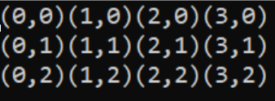

<!-- headingDivider: 3 -->
<!-- class: invert -->

# 4. Loops

## Loops?

* used for:
  * repeating blocks of code 
  * looping through collections of data (more later...)
  * running a program (more laterer...)
* types of loops:
  * While
  * Do While
  * For
  * Foreach

## `while` loop

* while loop keeps executing its code block as long as the condition in its statement is true:
  * 
    ```c#
    int count = 0;
    while(count < 4)
    {
        Debug.Log(count);
        count++;
    }

    // Outputs '0', '1', '2' and '3'
    ```

## `do while` loop

* similar to while loop, but it executes the code block once **even if the statement isn't true**
* try the following code: what happens if you change the initial value of `count` to 5?

```c#
int count = 0;
do
{
    Debug.Log(count);
    count++;
} while (count < 4);

// Outputs '0', '1', '2' and '3'
```

## `for` loop

* for loops are used when the number of iterations is **predefined**
* for loop is initialized in three steps:
```c#
for (initialvalue;condition;increment)
{
    doStuff();
}
```
* **The initial value** is set *before the first* iteration
* **The condition** is checked *before each* iteration
* **The increment** is executed *after each* iteration

### For loop example 1

```c#
for (int i = 0; i < 4; i++)
{
    Debug.Log("Current: " + i);
}
/* Outputs
Current: 0
Current: 1
Current: 2
Current: 3 
*/
```

### For loop example 2

```c#
for (int i = 4; i > 0; i--)
{
    Debug.Log("Current: " + i);
}
/* Outputs
Current: 4
Current: 3
Current: 2
Current: 1 
*/
```

## Breaking out of loops: `break`

* To stop the execution of a loop completely, use the `break` keyword:
  ```c#
  int i = 0;
  while (true)
  {
      i++;
      if (i == 3)
          break;
  }
  // i is now 3
  ```

## Skip ahead: `continue`

* To skip the **current** iteration, use the `continue` keyword
  ```c#
  int i = 0;
  while(i < 10)
  {
      i++;
      if (i % 2 == 0)
          continue;
      Debug.Log(i);
  }
  // Prints every odd number from 1 to 10
  ```

## Nested loops

* Loop inside a loop is often used for generating or going through two-dimensional data
  ```c#
  int rows = 3;
  int columns = 4;

  for (int i = 0; i < rows; i++)
  {
      for (int j = 0; j < columns; j++)
      {
          Debug.Log("(" + j.ToString() + "," + i.ToString() + ")");
      }
  }
  ```
  

## While vs. for: when to use?

* for loops when the number of iterations is **predefined**
  * when going through a list, for example.
* while loops when we want to do something many times, but don't know when to stop

## Exercise 1. Loops 1
<!-- _backgroundColor: #29366f -->

Create a loop whose number of iterations is set in an integer variable `numberOfEnemies`.

Run a loop that many times and write the message `Creating enemy 1`, `Creating enemy 2`, etc. to console.

## Exercise 2. Loops 2
<!-- _backgroundColor: #29366f -->

Suppose you have a given number of collectibles in a level.

You want a given percentage of them, say, 10%, to be shiny collectibles.

Create a loop that runs until this condition is met, and prints into console `Converted collectible 1 to shiny`.

## Exercise 3. Field of Cubes
<!-- _backgroundColor: #29366f -->

Create a loop that instantiates a 8 * 8 field of cubes on a plane.

***Extra:*** If there's a cube already in the location, add an exception to NOT add a cube there!