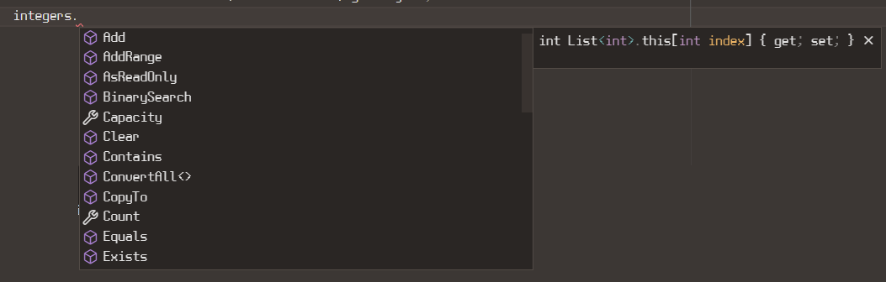
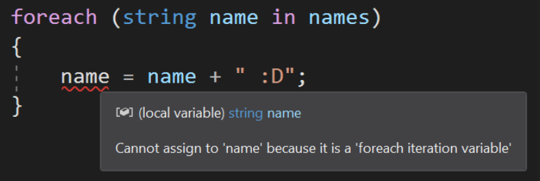

<!-- headingDivider: 3 -->
<!-- class: invert -->

# 5. Arrays & Lists

## Arrays

* Arrays are a collection of variables of the same type, which allocate neighboring memory locations
* Declared with square brackets following the type of the elements:
	```c#
	int[] userIds;
  ```
* Declaring an array does not *yet* allocate space from memory
## Creating empty arrays

* Initialize an empty array with a length of 3 using the following syntax:
  ```c#
  int[] userIds = new int[3];
  ```
* Assign a value to an element in an array by specifying the index in square brackets:
  ```c#
  userIds[0] = 104;
  ```
* Indexing starts from `0`: the above line assigns a value of 104 to the **first element** of the array
  * if a length of array is 3, the array items are accessed with indices 0,1,2
* Print the length of an array
    ```c#
    Debug.Log(userIds.Length);
    ```
## Creating and populating arrays simultaneously

* You can also create an array containing values with one statement:
  ```c#
  string[] names = new string[3] { "Johannes", "Rene", "Ville" };
  ```
* The same works without specifying the length in the brackets:
  ```c#
  double[] balances = new double[] { 1.3, 200.3, 9332.14 };
  ```
* ...and without the `new double[]` part, as well:
  ```c#
  double[] balances = { 1.3, 200.3, 9332.14 };
  ```
### Arrays: Unity example

* Creating and accessing an array of gameobjects
```c#
public GameObject[] players;

void Start ()
{
	players = GameObject.FindGameObjectsWithTag("Player");
	
	for(int i = 0; i < players.Length; i++)
	{
		Debug.Log("Player Number "+i+" is named "+players[i].name);
	}
}
```
## Multidimensional arrays
* C# supports multidimensional arrays:
  ```c#
  char[,] letters = new char[3, 4]
  {
      {'a', 'b', 'c', 'd'},
      {'e', 'f', 'g', 'h'},
      {'i', 'j', 'k', 'l'}
  };
  Debug.Log(letters[1, 3]);       // Outputs "h"
  ```
* ***Note:*** These do not show up in Unity's inspector

# Lists

## Lists

* a similar data structure to arrays
* unlike arrays, the size of lists can be easily changed
* more suitable for dynamic data
* Declaration and initialization:
  ```c#
  using System.Collections.Generic;

  // ...
  
  List<int> userIds = new List<int>();
  ```
* ***Note:*** you can't call new List<int>() outside a method!

* Value assignment:
  ```c#
  userIds[0] = 22;
  ```
## The List class

* a key benefit of using Lists lie in the built-in functionalities of the List class
* after declaring a list, type `nameOfYourList.` and VS Code shows what's available:
  
## List functionalities

* some are fields (no brackets), some are methods (functions with brackets `()`)
  * `list.Count` tells the length of the list
  * `list.Add(newItem)` adds `newItem` to the end of the list
  * `list.Remove(item)` removes `item` from list
  * `list.Contains(item)` checks if `item` is in the list & returns boolean
  * `list.Find(predicate)` finds an item from the list that matches the given predicate. More about it later!

## Exercise 1. Enemy names
<!-- _backgroundColor: #29366f -->

Create a list of names for enemy characters.

Print to console `There are [X] enemy names.`

1. Create a function `addName(enemyName)` that
   * adds a new enemy name to the list
   * prints out `Added [enemyName]. Now there are [X] enemy names.`

2. Create a function `removeLastName()` that
   * removes the last enemy name from the list
   * prints out `Removed [enemyName].`

3. Print out all the names from the list that start with the letter "S".

## Iterating through an array with `for`
```c#
  string[] starters = new string[] 
  {
      "Bulbasaur", 
      "Charmander", 
      "Squirtle"
  };

  for (int i = 0; i < starters.Length; i++)
  {
      Debug.Log(starters[i]);
  }
```

## Iterating through a list with `for`

```c#
List<string> starters = new List<string>() 
{
      "Chikorita", 
      "Cyndaquil"
      "Totodile", 
};

for(int i = 0; i < starters.Count; i++)
{
    Debug.Log(starters[i]);
}
```
* note: lists use `.Count` instead of `.Length`!

## Better iteration with `foreach`

```c#
  string[] starters = new string[] 
  {
      "Bulbasaur", 
      "Charmander", 
      "Squirtle"
  };

  foreach (string starter in starters)
  {
      Debug.Log(starter);
  }
```
* Use if
  a) you don't need the index while looping through list/array
  b) you aren't mutating, i.e, editing, the array/list elements (see example below)

### Foreach mutation blocked




### Foreach Unity example

```c#
  foreach (GameObject enemy in GameObject.FindGameObjectsWithTag("Enemy"))
  {
      Debug.Log(enemy.name);
  }
```

## Deleting an element from list

* As lists are dynamic, their elements can be deleted
* There are two ways to delete an element from a list: 
  1) `list.RemoveAt(index);`
	* [RemoveAt](https://learn.microsoft.com/en-us/dotnet/api/system.collections.generic.list-1.removeat?redirectedfrom=MSDN&view=net-7.0#System_Collections_Generic_List_1_RemoveAt_System_Int32_) removes the element at the given index
  2) `list.Remove(element);`
	* [Remove](https://learn.microsoft.com/en-us/dotnet/api/system.collections.generic.list-1.remove?redirectedfrom=MSDN&view=net-7.0#System_Collections_Generic_List_1_Remove__0_) removes the first occurrence of the given element from the list

### Reverse `for` loop


* You can't delete an element when looping through a list normally
  * The length of the list changes after deletion $\Rightarrow$ you'll eventually try to refer to an nonexistent element! 
* Easy fix: loop through the list in a ***reverse order***

	```c#
	for (int i = list.Count; i >= 0; i--)
	{
		list[i] = 1337;
	}
	```
* This way, you won't run into reference issues

## Copying a list

* Copying a list of value types
    ```c#
    List<YourType> newList = new List<YourType>(oldList);
    ```
* Copying a list of reference types
    ```c#
    List<YourType> oldList = new List<YourType>();
    List<YourType> newList = new List<YourType>(oldList.Count);

    oldList.ForEach((item)=>
        {
            newList.Add(new YourType(item));
        });
    ```

<!-- _footer: "[See more about value vs reference types in Chapter 3](6-classes-methods#reference-type-vs-value-type)" -->
## Exercise 2. Looping through
<!-- _backgroundColor: #29366f -->
Loop through the starters array, and print the starter and its number like this:
`#001 Bulbasaur`

Now, edit the strings with a loop to include this number as well. 


## Exercise 3. Creative data
<!-- _backgroundColor: #29366f -->

Create two-dimensional data structure with x,y coordinates.

Create a function `populateLevel()` that creates new enemy GameObjects in the scene based on these coordinates.

Also, create a function `newCoordinate(x, y)` that can be used to add new coordinates into the data structure.

***Extra:*** What if you want to populate the level with enemies and collectibles, both of which saved in the same data structure?

## Exercise 4. List of lights
<!-- _backgroundColor: #29366f -->

Continue exercise 1 from [Scripting gameobjects](../unity-basics/4-scripting-gameobjects).

Instead of three lights, have nine lights, each with a tag "Light" (preferably as a prefab).

Control the lights from the light switch with a program that runs through a list of all the lights instead of switching them on and off individually.
