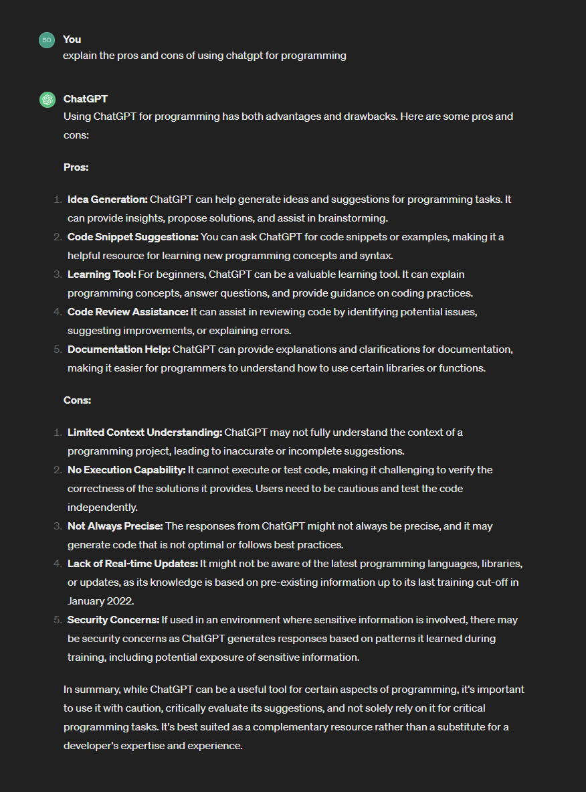
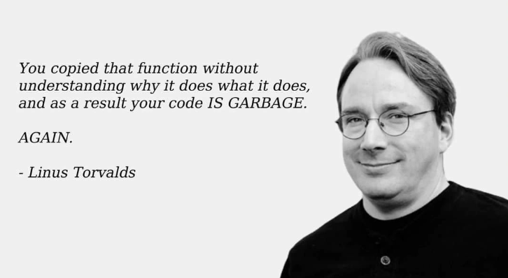

<!-- headingDivider: 3 -->
<!-- class: invert -->

# Using Generative AI For Programming

## The rise of generative AI

* [Generative AI](https://en.wikipedia.org/wiki/Generative_artificial_intelligence) is the new hotness in the whole IT field
* Generative AI models
  * ...learn the patterns and structure of their input training data
  * ...generate new data that has similar characteristics
  * a.k.a. write a prompt, and you get text/code/images/videos/music/etc
* [Large Language Model (LLM)](https://en.wikipedia.org/wiki/Large_language_model) is a form of generative AI
  * Used often in a chat-like interface 
  * OpenAI's GPT series is a LLM, a technology that fuels the popular [ChatGPT](https://chat.openai.com/) chatbot

<!-- 
## ChatGPT

* milloin kannattaa käyttää
  * esimerkkejä
  * tiedonhaku vs valmiin koodin tuotto
 -->

## GitHub Copilot

* GitHub's [paid code auto-completion service](https://github.com/features/copilot) that is advertised as *AI pair programming*
* What is it *really*?
  * Autocomplete on steroids, $10/month
  * See Copilot [here](https://www.youtube.com/watch?v=edSZh-tpTIk) in action
  * It looks like magic, right?
  * This could be useful for generating basic boilerplate code
    * But wait, there's `var` variables there...
    * Old JS! Shouldn't be used nowadays!
    * You might know this, but not everyone knows that

## How does generative AI work?

* All AI models need data
  * GitHub Copilot is trained on [your public GitHub code](https://docs.github.com/en/copilot/copilot-individual/about-github-copilot-individual#:~:text=GitHub%20Copilot%20is%20trained%20on%20all%20languages%20that%20appear%20in%20public%20repositories.)
  * GPT-3 is trained on 17 GB of text, GPT-4 on 45 GB
* AI does not know when it's wrong, when it's using bad practices
  * TBH, it does not *know* anything
    * It just returns an answer that best matches your prompt
    * It might be exactly what you need, but it also might not
* The future of AI is worse: At some point, AI will be taught on AI-generated code
  * The quality of the result worsens!

## Is ChatGPT any good?

* Okay, we know the risks. What's ChatGPT good for?
* Let's ask ChatGPT!
* Summary:
  * Makes mistakes
  * Doesn't understand context
  * ...And I somewhat disagree the pros 3-5

## Using ChatGPT professionally

* Do note that GPT-3 and GPT-4 (the paid version, $20/month) are not equal in terms of quality of results
* I asked two senior developers who've used ChatGPT professionally for its pros and cons
* Some comments I got:
  * "I don't usually use it for writing code, but for other stuff"
  * "It makes some mindless tasks way faster"
  * "Not always right, but surprisingly often!"
  * "Works for some languages, but not all"

### Example use cases (Dev 1)

1) Finding causes for error messages
    * ChatGPT can the cause for a given error message faster than a developer
       * You give code & error message -> ChatGPT gives fixed code as a result
    * **Gotcha:** This works when you are working on something that ***someone else has worked on before***
  
2) Explaining architectural solutions
     * Examples:
       * "How to set up a service in AWS for x number of people"
       * "How to set up an event based service"

### Example use cases (Dev 1), cont.

3) Reading documentation for you
   * Make a summary of a long documentation!
4) Writing regexes
5) Writing helper functions
   * "Make sure this string is 4 characters long"
   * "Give me input validation for x"
   * Always test the results with care

<!-- ## peetu

* en yleesä käytä koodin kirjottamiseen
* voi olla nopeempi löytää virheviestin syyn ku seniori
  * ei piä paikkaasa t JR
    * toimii jos teet jotain mitä muutkin on tehny
  * syöttää virheviestin
    * -> antaa korjatun koodin vastineeksi
* tosi hyvä lukemaan dokumentaatiota
  * varsinkin jos ei oo tavallisin tapa käyttää jotain kirjastoa
  * (käyttää githubin esimerkkikoodia)
* hyvä selittää arkkitehtuurisia ratkasuja
  * "pitäs pistää aws:ssä palvelu pystyyn x määrälle ihmisiä"
  * "miten aws:ssä laittaa event based palvelu"
* "ei se aina oikee oo, mut se on yllättävän tarkka" -->

<!-- ## Peetu 2

* molemmat:
  * regexien kirjottaminen!
  * apufunktiot
* Copilot:
  * "make sure this is 4 characters long"
    * koodaa validaatio automaattisesti
* copilotilla voi tehä samoja juttuja -->

### Example use cases (Dev 2)

1) Give high-level specs for a program
     * "I should do software in framework X that should do Y"
     * ChatGPT gives a basis for the software
     * This is a good *starting point* for writing your software
       * ...but rarely even a single line of the basis are left in the final software!
2) Help you understand code you can't fathom at all
     * "Convert this to Python!"
3) When you have to write something you've never written before
   * But don't trust it on this

---

* If the programming language is strict about its syntax, ChatGPT results are generally better
     * Rust is good, C++ bad
     * Also: Does not work with C++ well because there is so much badly written or obsolete C++ on the Internet!
<!-- 
## Ronkainen

* korkean tason speksit. "mun pitäis tehä tällanen softa"
  * antaa pohjan
  * harvemmin siitä jää yhtään riviä jälelle
  * siitä on hyvä alottaa
* koodia mistä et ymmärrä yhtään mitään (TÄMÄ!)
  * sanot chatgpt:lle: muuta tää pythoniksi
* cpp:n kanssa ei oikein toimi koska maailmassa on niin paljon paskaa cpp :D
  * myös vanhentunutta
  * kun kieli on tarkka omasta syntaksistaan niin auttaa chatgptssä asdf
  * rust hyvä, cpp huono
* kun pitää tehä jotain ihan uutta -->

## Let's also remember these words from Linus

## Generative AI is here to stay

* I don't believe for a second generative AI will make programmers obsolete
* It won't go away, though, and it will change the nature of ***some*** programming
* It's a new tool, and in a field where we get new tools every year, it's good idea to keep your mind open for new tools
* It's not a silver bullet, however
  * It can make you bypass learning altogether
    * And you ***NEED*** to understand code in order to use AI tools effectively
  * It can make you write worse code
    * ...but it can also make you a faster programmer.
    * ...and a faster programmer is a better programmer!

## AI is a good servant, but a bad master

<!-- _footer: If you don't remember anything else from this lecture, remember this. -->
## Reading & Watching

* [Practical AI - Mitä jokaisen tulisi tietää tekoälystä](https://cs.edukamu.fi/practical-ai-fi)
* [Tekoäly on hyvä renki mutta huono isäntä - näin algoritmit muuttavat yhteiskuntaa ja arkeamme](https://www.helsinki.fi/fi/uutiset/tekoaly/tekoaly-hyva-renki-mutta-huono-isanta-nain-algoritmit-muuttavat-yhteiskuntaa-ja-arkeamme)
* [Patrick Boyle: Is AI Actually Useful?](https://www.youtube.com/watch?v=FTs35x-xUg4)
* [Tom Scott: I tried using AI. It scared me.](https://www.youtube.com/watch?v=jPhJbKBuNnA)
* [Business Insider: ChatGPT has been losing its mind and no one seems to know why](https://www.businessinsider.com/chatgpt-giving-users-unhinged-answers-no-one-knows-why-openai-2024-2?r=US&IR=T)
* [Erik Hoel: Here lies the internet, murdered by generative AI](https://www.theintrinsicperspective.com/p/here-lies-the-internet-murdered-by?utm_campaign=post&utm_medium=web)