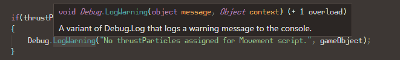

<!-- class: invert -->
# Unity and VS Code
---
## Basics

- Set VS Code as your Unity default editor
  - Edit > Preferences > External Tools > External Script Editor
  - Install the prerequisities for code completion & other niceness
    - https://code.visualstudio.com/docs/other/unity
---
## VS code shortcuts

- [CTRL+SHIFT+UP/DOWN] move code line
- [CTRL+SHIFT+D] duplicate line
- [CTRL+TAB] / [CTRL+SHIFT+TAB] View: Open Next Editor / View: Open Previous Editor
  - You need to change this manually
- [CTRL+Ö] for showing/hiding terminal
- [CTRL+.] for auto-"using" / auto-creating missing functions
---
## Method tips

- [F2]: Rename variable and update references
- [CTRL+click] 
  - jump to definition
  - jump to references
- Hover over method name to see details
  - argument types
  - return types
  - overloads

