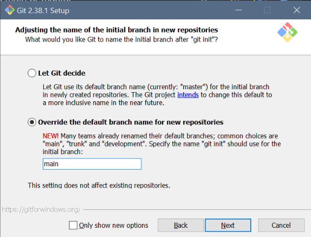
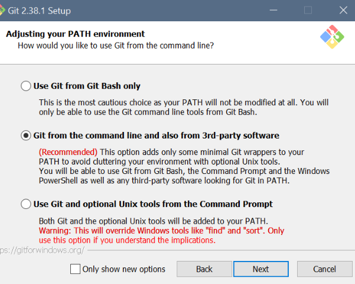
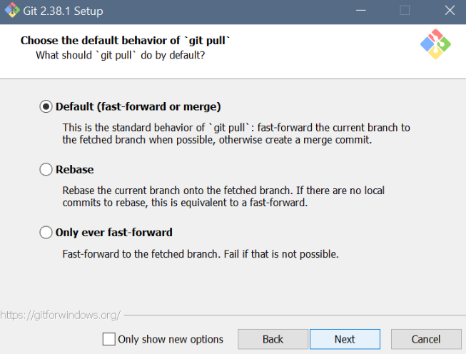
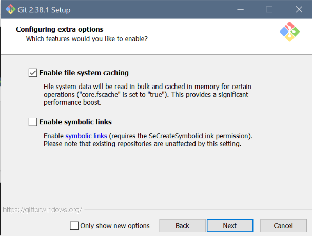

<!-- headingDivider: 3 -->
<!-- class: invert -->

# Project Management 0. Git setup

## What is Git?

* Git is a version control tool originally created by Linus Torvalds in 2005
* Keeps track of code changes
* Can be used to backup code in the cloud
* Enables cooperation with other team members
* Ubiquitous in software development

## Git vs cloud storage

* Git is different from cloud storage services like Dropbox, Google Drive or OneDrive
  * Instead of automatic syncing, you deliberately *push to* and *pull from* the cloud
  * Cloud services are easier for starters
  * ...but in projects of more than one person, tracking changes would be a pain
* Git has a steep learning curve
	* To ease things, there are some visual tools like **Sourcetree** or **Sublime Merge**
	* To use them effectively, you still need to understand how Git works, though

## GitHub

* Git *could* be used locally, but is usually combined with a remote storage service like [GitHub](https://github.com/), [GitLab](https://gitlab.com/) or [BitBucket](https://bitbucket.com/)
  * These services can also double as a programming portfolio
  * Commonly used in open source projects
* On this course we'll use GitHub

## Setup

* Install Git
  * Windows/Mac: [git-scm.com](https://git-scm.com)
    * Installation instructions are included in the following slides.
    * If a setting is not mentioned in the instructions, you can leave it as the default option.
  * Linux: `sudo apt-get install git`

## Git setup: Settings for Windows

<div class="columns">
<div>


</div>
<div>


Set manually after setup with:
```
git config core.editor code --wait
```


</div>
</div>

---

<div class="columns">
<div>



Set manually after setup with:
  ```
  git config --global init.defaultBranch main
  ```

</div>
<div>



</div>
</div>

---

<div class="columns">
<div>


</div>
<div>



</div>
</div>

---

<div class="columns">
<div>


Set manually after setup with:

```
git config --global credential.helper wincred
```

</div>
<div>



</div>
</div>

## Command line

* Git is operated via the ***command line***, a.k.a, the ***terminal***
* There are many kinds of command line syntaxes out there. Some examples:
  * Windows: ***PowerShell*** (new), ***cmd*** (old)
  * Linux, (also included in the Windows Git install): ***bash***
* We're using PowerShell, which can be accessed inside VS Code
* In VS Code, open/close terminal by pressing ***CTRL+Ö*** (in the Fin/Swe layout)

### Basic commands and the working directory

* To do actions in Git, you don't press buttons, you write commands
* Most commands act on the currently open folder, a.k.a. the ***working directory***
  * ***Path*** to the directory is shown next to the terminal cursor:
    `PS E:\borb\code\unity-basics-course>`
* `ls` tells the contents of the working directory
* `cd` is used to move to another directory
  * Use `cd programming` to move to the `programming` subfolder
    `PS E:\borb\code\unity-basics-course\programming>`
  * Use `cd ..` to move one step up in the hierarchy (to the parent directory)
    `PS E:\borb\code\unity-basics-course>`
* ***Note***: `..` is a shorthand for to the parent directory, `.` for the current directory

## Extra: Help, this is horrible!
<!-- _backgroundColor: #5d275d -->
* Do you feel more at home in graphical UIs?
* If the command line is not your thing, you can also use [GitHub Desktop](https://desktop.github.com/)
* It's a Windows application for working with GitHub repositories
* It will show the Git history as a visual timeline
* ***Note:*** Even when using GitHub desktop, it still helps if you understand the Git commands that still are executed under the hood, though!
---
<!-- _backgroundColor: #5d275d -->


## Btw: Config
* To configure your Git username for every project:
  * Use `git config --global user.name "myUserName"`
  * and `git config --global user.email "my.email.address@domain.com"`
* If you do not do this, Git will ask to do it anyway at some point