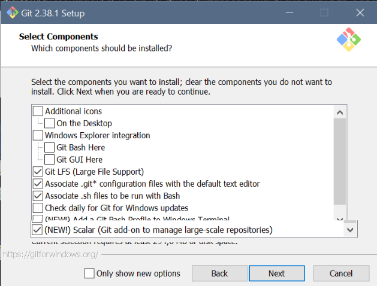
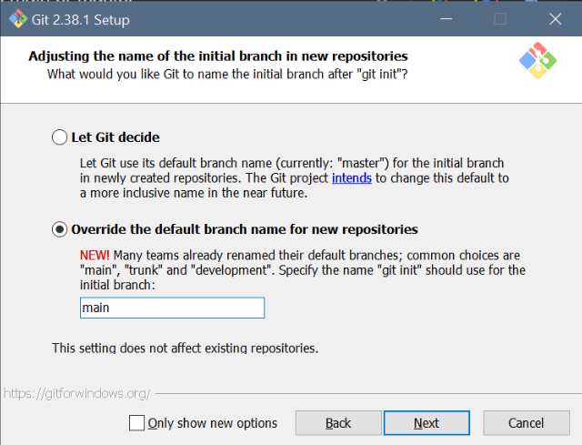
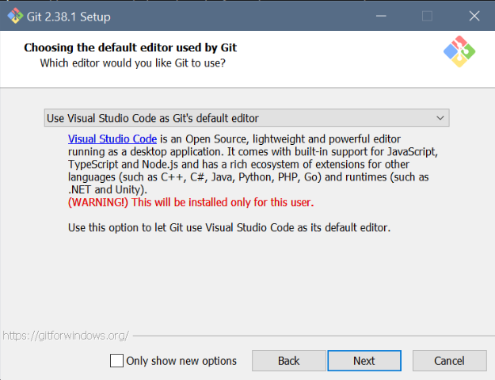
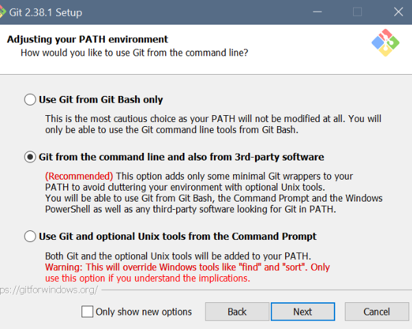
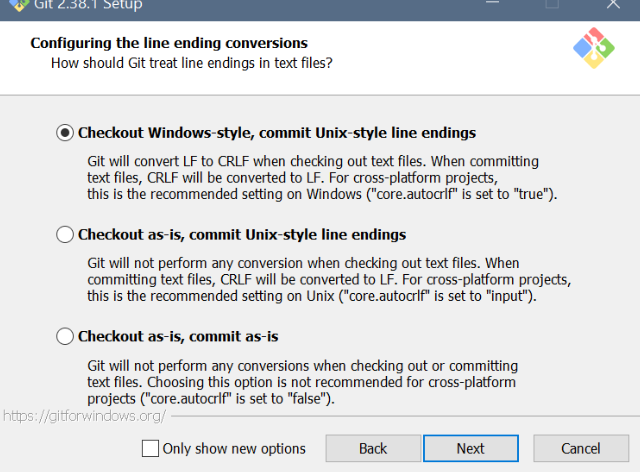
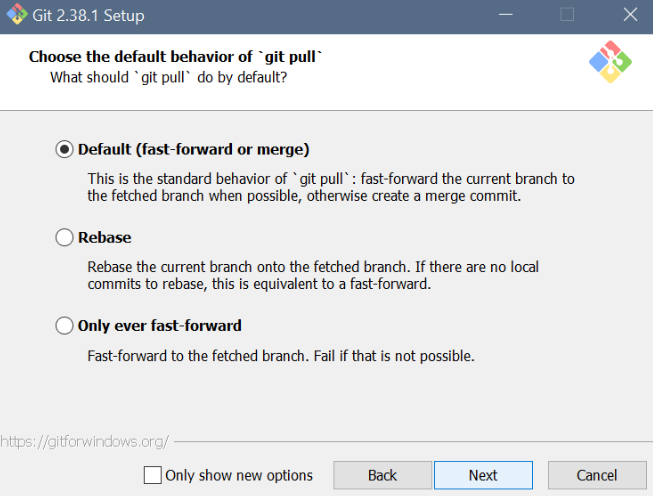
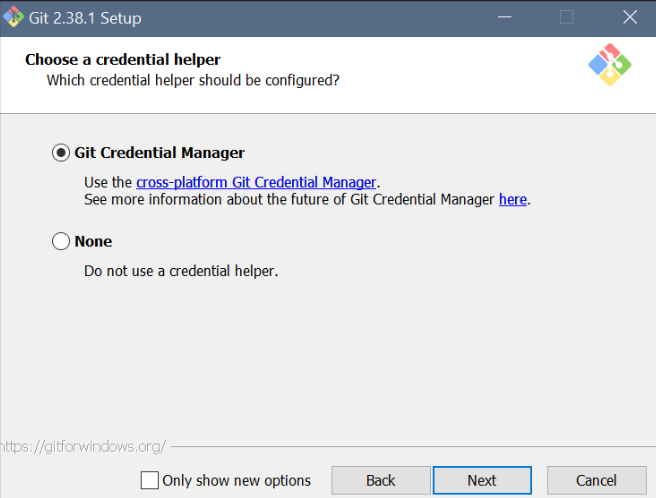
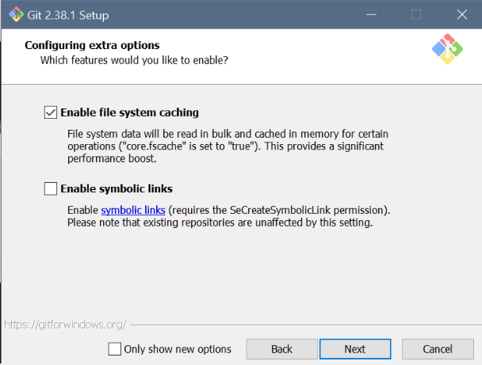
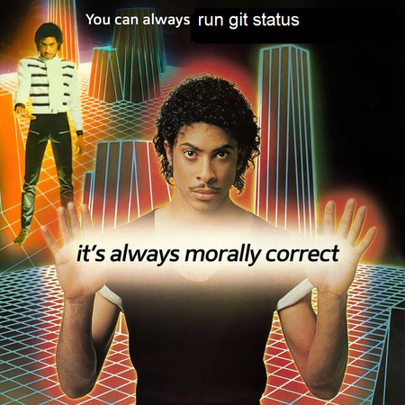
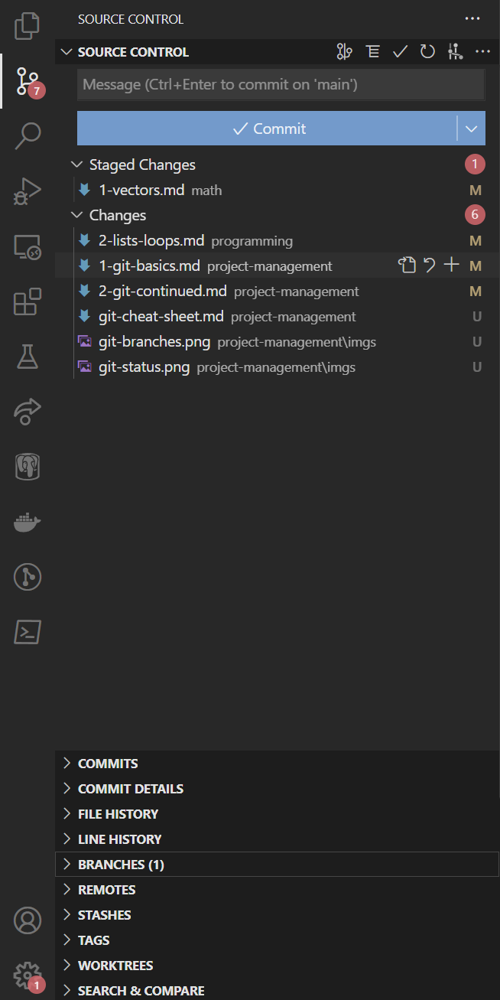

<!-- headingDivider: 3 -->
<!-- class: default -->

# Project Management 1. Git basics

# 1. About Git & setup
## What is Git?

* Git is a version control tool originally created by Linus Torvalds in 2005
* Keeps track of code changes
* Can be used to backup code in the cloud
* Enables cooperation with other team members
* Ubiquitous in software development

## Git vs cloud storage

* Git is different from cloud storage services like Dropbox, Google Drive or OneDrive
  * Instead of automatic syncing, you deliberately *push to* and *pull from* the cloud
  * Cloud services are easier for starters
  * ...but in projects of more than one person, tracking changes would be a pain
* Git has a steep learning curve
	* To ease things, there are some visual tools like **Sourcetree** or **Sublime Merge**
	* To use them effectively, you still need to understand how Git works, though

## GitHub

* Git *could* be used locally, but is usually combined with a remote storage service like [GitHub](https://github.com/), [GitLab](https://gitlab.com/) or [BitBucket](https://bitbucket.com/)
  * These services can also double as a programming portfolio
  * Commonly used in open source projects
* On this course we'll use GitHub

## Setup

* Install Git
  * Windows/Mac: [git-scm.com](https://git-scm.com)
      * During installation: ✅ Enable Git Credential Manager
      * (Easier logging in to GitHub)
  * Linux: `sudo apt-get install git`

## Git setup: Settings for Windows

<div class="columns">
<div>



</div>
<div>


Set manually after setup with:
  ```
  git config --global init.defaultBranch main
  ```

</div>
</div>

---

<div class="columns">
<div>



Set manually after setup with:
```
git config core.editor code --wait
```
</div>
<div>



</div>
</div>

---

<div class="columns">
<div>



</div>
<div>



</div>
</div>

---

<div class="columns">
<div>



Set manually after setup with:

```
git config --global credential.helper wincred
```

</div>
<div>



</div>
</div>

## Command line

* Git is operated via the ***command line***, a.k.a, the ***terminal***
* There are many kinds of command line syntaxes out there. Some examples:
  * Windows: ***PowerShell*** (new), ***cmd*** (old)
  * Linux, (also included in the Windows Git install): ***bash***
* We're using PowerShell, which can be accessed inside VS Code
* In VS Code, open/close terminal by pressing ***CTRL+Ö*** (in the Fin/Swe layout)

### Basic commands and the working directory

* To do actions in Git, you don't press buttons, you write commands
* Most commands act on the currently open folder, a.k.a. the ***working directory***
  * ***Path*** to the directory is shown next to the terminal cursor:
    `PS E:\borb\code\unity-basics-course>`
* `ls` tells the contents of the working directory
* `cd` is used to move to another directory
  * Use `cd programming` to move to the `programming` subfolder
    `PS E:\borb\code\unity-basics-course\programming>`
  * Use `cd ..` to move one step up in the hierarchy (to the parent directory)
    `PS E:\borb\code\unity-basics-course>`
* ***Note***: `..` is a shorthand for to the parent directory, `.` for the current directory

## Extra: Help, this is horrible!
<!-- _backgroundColor: pink -->
* Do you feel more at home in graphical UIs?
* If the command line is not your thing, you can also use [GitHub Desktop](https://desktop.github.com/)
* It's a Windows application for working with GitHub repositories
* It will show the Git history as a visual timeline
* ***Note:*** Even when using GitHub desktop, it still helps if you understand the Git commands that still are executed under the hood, though!
---
<!-- _backgroundColor: pink -->


## Btw: Config
* To configure your Git username for every project:
  * Use `git config --global user.name "myUserName"`
  * and `git config --global user.email "my.email.address@domain.com"`
* If you do not do this, Git will ask to do it anyway at some point

# 2. Workflow

## Basic Git workflow

* You have to tell everything you want to happen to Git ***explicitly*** by using ***Git commands***
* A common Git workflow consists of these four steps:
 1) ***Edit:*** You make changes in some code file
 2) ***Stage:*** You tell Git what files you've changed ([`git add`](#git-add))
 3) ***Commit:*** You tell Git what changes you made in that file ([`git commit`](#git-commit))
 4) ***Push:*** You upload those changes to a remote repository ([`git push`](#git-push))

## Repositories

* ***Repository*** is essentially a place to store code files in
* Usually, we are dealing with ***two*** repositories: a ***local*** and a ***remote*** one
  * A local repository is the one on your computer
  * A remote repository is stored in a cloud service like GitHub
  * [Here](https://github.com/borbware/unity-basics-course) is the remote repository for the materials of this course
  * Changes are synced between these two repositories ***manually***
## `git init`

* Initialization needs to be done for every new Git repository
* There are two ways to initialize a repo:
  * a) Creating the local repository first: 
    * Use `git init` to make your current folder a new Git repository 
  * b) Creating the remote repository first **/** continuing an existing project: 
    * *Clone* a remote repository into your computer (See: [`git clone`](#git-clone))
* ***Note:*** Never initialize a Git repository in a cloud storage folder!

## `.git` folder
* Initialization adds a hidden `.git` folder inside a directory
  * This is where Git stores all its repository data.
  * ***Do not touch it!***
* The .git folder ONLY appears in the root directory of the repository
  * If you see the `.git` folder in any of the subdirectories of the repository, something has gone wrong!
  * You have initialized a repository inside repository

## `git status`

* Using the command `git status` shows your current situation.
* If you're unsure what to do, it's never a bad idea to run `git status`



## `git add`

* Uploading changes to GitHub from your local machine takes three steps (see [Basic Git workflow](1-git-basics.md#basic-git-workflow) from earlier) 
* The first phase is ***staging*** with `git add`:
  * The command `git add readme.md` stages the file `readme.md`
  * After doing it, `git status` tells this:
    ```
    Changes to be committed:
      (use "git restore --staged <file>..." to unstage)
            modified:   readme.md
    ```

---
* Basically, with `git add file` you tell Git that you want to do *something* with `file`.
* ***Note:*** If you just want to push all the changes you've made, you can use `git add .` to stage all the files in your current folder and its subfolders
  * Be careful! Only do this after checking what changes have been made with `git status`
* ***Note 2:*** Use `git add <filename> -p` if you only want to stage **some** lines from a file you've worked on.
* ***Note 3:*** The counterpart to `git add` is `git rm`, which removes previously added files from Git's perspective

## `git commit`

* After you have staged all the files you want, the second step is to ***commit*** your changes
  * In the commit, you will explain what changes you've made
  * This message will be visible in GitHub
  * `git commit -m "add new enemy"`
* Every new commit creates a new point in the project timeline.
  * You can always jump back between different points (See `git checkout`)
* Commit message should clearly, concisely tell what kind of changes you have made

## `git push`

* The third step is ***pushing*** the changes to GitHub
* The previously-made commit action is **local**
  * No changes have gone to the remote repository yet!
  * To upload changes to the remote repository, use `git push`
  * Then you're done!
---
* ***Note:*** When pushing for the first time, Git might nag you:
  ```
  fatal: The current branch master has no upstream branch.
  To push the current branch and set the remote as upstream, use

      git push --set-upstream origin main
  ```
* You can just follow its orders (see the command on the third line!) and you're good to go 
* Generally, when Git gives you a warning, error, or some other message, it's a good idea to ***read it and follow the orders***.

## Exercise 1a. Initializing a repo
<!-- _backgroundColor: Khaki -->

* Create a new repository on GitHub and clone it with HTTPS to your machine.
* Then, create a new file `GitTest.md` with some lines of text in it.
* Commit and push changes to GitHub.
* Go to GitHub and see that the file is there!

## `git pull`

* `git pull` applies changes from the remote repository into the local repository 
  * Counterpart to `push`
* Very common when working in a team
  * **Note**: During teamwork it's a good idea to ***always pull before pushing***
* If you only work alone on a single computer, seldom needed

<!-- _footer: "`git pull` is actually two commands in one. It's the same thing as doing `git fetch <branch>` + `git merge <branch>`" -->

## `git clone`

* Remote repositories have an URL address that can be used to download the code to your machine
  * The address can be found under the *Clone* button in the repository webpage
* Use the URL to download a remote repository:
  * Run `git clone <URL>`
  * Example: `git clone https://github.com/borbware/unity-basics-course.git`
  * Remember: this initializes the repo, so `git init` not needed.
* Simplest way to create a new, empty repository:
  * 1 - Initialize the repo in the Github/Gitlab/etc website
  * 2 - Clone the repo.

## `git remote`

* If you have initialized a Git repo already with `git init`, don't use `git clone`!
  * Instead, run `git remote add origin <URL>`
  * Here, the name `origin` refers to the remote repository
  * `origin` is just the default name for a remote: other names can be used instead!
* To check which remote repository the current local repository is linked to, use 
  * `git remote -v`

<!-- _footer: "A repository can have multiple remotes. Use `git remote` to list them all." -->

## Exercise 1b. Cloning a repo
<!-- _backgroundColor: Khaki -->

* Create a new repository on GitHub and clone it with HTTPS to your machine.
* Then, create a new file `GitTest.md` with some lines of text in it.
* Commit and push changes to GitHub.
* Go to GitHub and see that the file is there!

## Extra: HTTPS vs SSH
<!-- _backgroundColor: pink -->

* There are two ways to communicate with GitHub, ***HTTPS*** and ***SSH***
* HTTPS: `https://github.com/borbware/unity-basics-course.git`
  * the easier way
  * you log in with your GitHub credentials that get stored in the Git Credential Manager
* SSH: `git@github.com:borbware/unity-basics-course.git`
  * [Connecting to GitHub with SSH](https://docs.github.com/en/authentication/connecting-to-github-with-ssh)
  * You need to generate a computer-specific SSH key and add it to your GitHub settings

## `.gitignore`

* Sometimes your project has local files that should ***NOT*** be uploaded to GitHub 
  * List those files in a `.gitignore` file in your Git project folder
* You can create it by yourself and define file names or folders which Git will then ignore in the commits, e.g.,
  ```
    someScript.cs
    /folder
    *.html
  ```
* ***Note:*** If you add a file to `.gitignore` that was committed earlier, Git doesn't "forget" it automatically.
  * You can make Git forget it with `git rm --cached filename`

## VS code: Source control

* The ***source control*** tab is very useful for managing your Git workflow
* Unstaged changes are shown under ***Changes***
  * Press the $+$ button to stage a file 
* Staged files are shown under ***Staged changes***
  * Press the $-$ button to unstage a file
* Click the filename to see what changes you've made in a side-by-side comparison view
* Press $\curvearrowleft$ to discard the changes made to the file (be careful!)



## Exercise 2. Git collaboration
<!-- _backgroundColor: Khaki -->

* Work on this exercise with your group.
* Choose someone's test repository from Exercise 1b to use in this exercise.
* While others clone the repo to their machine, the owner should add other group members as collaborators of the repo in the repository's settings on GitHub.
* Then, everyone should make changes to the markdown file in the repository!

What happens if you make changes to the same line simultaneously?

# Unity-specific stuff

## Unity `.gitignore`

* In Unity projects, we have to use a specific `.gitignore` template to keep the repository nice and clean
  * You WILL notice if you forget to add it
  * If you create a new Unity project repository in Github/etc, you can create the repo with a Unity template that adds the needed `.gitignore` file automatically to the remote repo
  * You can also add it by yourself before the first commit, though

## Creating a new Unity GitHub repo

1) Create a new repository using the ***+ > New Repository*** menu.
2) Specify a repository name
3) Select whether it’s ***Public*** or ***Private***
4) ✅ ***Add .gitignore*** and select the Unity template
5) Click ***Create Repository***

### Initializing the repo

1) Create a new Unity project, or choose an old one
2) Open the project in VS code
3) Create a new repository in GitHub (see prev. slide)
4) Initialize Git in the project folder, pull the `.gitignore` file, make your first commit and push.
    `git init`
    `git remote add origin [remote-url]`
    `git pull origin main`
    `git add .`
    `git commit -m "first commit"`
    `git push --set-upstream origin main`

### Teamwork note

* Only one team member has to follow the instructions above!
* Others will just grab the code from GitHub with `git clone`. 

## Troubleshooting: master vs. main

```
error: failed to push some refs to [your-url]
```

* Possible reason: GitHub has a `main` branch, while your local repository has `master`
* ***Fix:*** Run `git branch -m main` to rename your local `master` to `main`

## Note about longer `push` and `pull` commands

* After initialization, why do I have to use longer `push` and `pull` commands?
  * Short answer: because we didn't clone the repo, but rather added the remote into an empty one with `git remote add origin`.
  * `git pull origin main`: After adding a remote, we don't yet know which ***branch*** to pull from. `main` (or `master`!) is the default branch
  * `git push --set-upstream origin main`: In the first `push`, we decide which branch to link our current branch into.
  * Afterwards, we can just use `git push` and `git pull`.

## Unity and LFS

* With Unity, it might be a good idea to use [Git Large File Storage](https://git-lfs.github.com/) (LFS)
* [Tutorial: Using Git Large File Storage (LFS) with Unity](https://riptutorial.com/unity3d/example/7178/using-git-large-file-storage--lfs--with-unity)
  * Install Git LFS
  * Add the stuff from the link to `.gitattributes`
    * Close your Unity project before applying the changes!! 

## Unity Version Control settings

[Manual: Version control integrations](https://docs.unity3d.com/Manual/Versioncontrolintegration.html)

## Reading

* [How to Git with Unity](https://thoughtbot.com/blog/how-to-git-with-unity)
* [Git and Unity: Getting Started](https://medium.com/@linojon/git-and-unity-getting-started-ad7c42be8324)
* [Using version control in VS code](https://code.visualstudio.com/docs/sourcecontrol/overview)