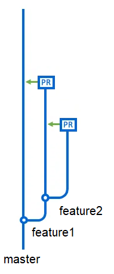
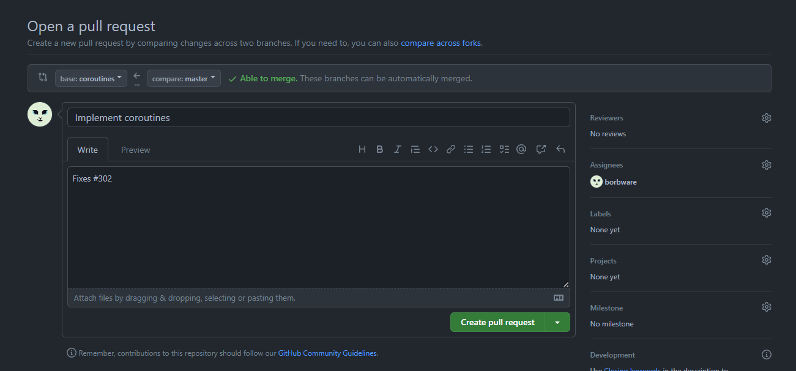
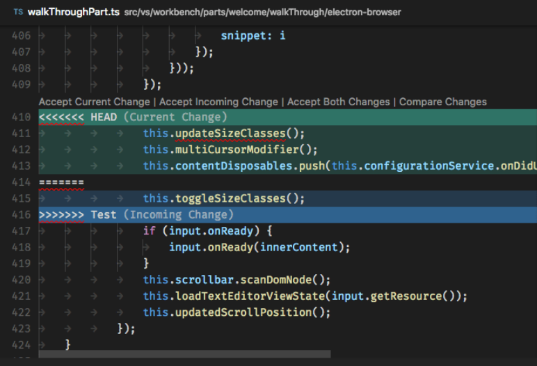

<!-- headingDivider: 3 -->
<!-- class: default -->

# Project Management 2. Git continued

## Branches
* A Git repository can have multiple ***branches***
* By default, a Git repository has only one branch
  * named either `master` or `main`
* Using multiple branches makes it possible to work on new features step by step in their own ***feature branches***
  * Meanwhile, the `master` branch is kept clean and in a working state
  * Only when the feature is completed, the branch is merged into the `master` branch! 



### Active branch

* Even though your local repository can have multiple branches, only one of them is *active* at a given time
* `git status` tells you firsthand which branch you are on: `On branch master`

## `git branch` & `git checkout`

* You can create a new branch with `git branch <branchName>`
  * The new branch is not empty: it contains a copy of the code of the branch you executed this command in
* **Note:** `git branch` does not make the branch active!
* To make the branch active, a.k.a "move" to the branch:
  * `git checkout <branchName>`. 
  * For example, to move back to master use `git checkout master`

### Local vs. remote branches

* `git branch branchName` only creates a local branch
* When you try to push changes from a new local branch, Git nags you that a matching remote branch doesn't yet exist
  * Git tells you how to create the remote branch:
    * `git push --set-upstream origin newBranch`
    * afterwards, `git push` pushes the changes to the matching remote branch

### Extra branch commands

* Handy command: `git checkout -b <branchName>`
  * It's a shorthand for `git branch <branchName>` + `git checkout <branchName>`
* Get a list of local branches with `git branch`
  * ...and all branches (incl. the remote ones) with `git branch -a`
* Delete a local branch with `git branch -d <branchName>`
  * Remote branch can be deleted in the GitHub/etc website
  * ...or with `git push origin -d <branchName>`
  * ***Note:*** If deleted remote branches still show up in `git branch -a`, you can use the command `git remote prune origin` to remove them from the list.

## `git merge`

* So you've been working on a feature branch. What next?
  * When the feature is done (and all the broken things fixed), you want to ***merge*** your feature branch back to `master`
1) First, checkout the `master` branch with `git checkout master`
2) Then, do a `git pull` so you have the newest version of the `master` branch
     * Someone else might have done changes to it while you were working on your feature!
3) Then, merge `featureBranch` to `master` with `git merge <featureBranchName>`
     * This is where ***conflicts*** can happen  (more on them later!)

## Pull request

* In real-world usage, we never merge code directly to `master` with `git merge <featureBranchName>`
* Instead, we first do the inverse:
  * We stay on the feature branch, and merge the contents of `master` to `featureBranch` with `git merge master`!
* Then, we create a ***pull request*** on GitHub/etc.
  * This adds a layer of protection to master branch: no one gets to merge any code directly into it!
  * Instead, the merging happens in the GitHub/etc web UI
---




## Exercise 1. Pushing onwards
<!-- _backgroundColor: Khaki -->

Continue the exercise from [Git Basics](1-git-basics.md) or create a new repository for these exercises.
* Create a new branch (with a name `new-feature`, for instance) in your local repository.
* Checkout the branch, make some changes to `GitTest.md` there, and push the changes to GitHub.
* Then, merge the changes from your `new-feature` branch to `master` branch by using
  a) `git merge` from command line
  b) pull request in GitHub

# 3. Conflicts

## GitLens

* To make the Git workflow easier, install the GitLens extension to VS code
  * It helps in managing conflicts, comparing branches or commits
* Install it from the Extensions panel (access with ***CTRL+SHIFT+X***)
* Adds many new views to the source control tab:
  * Commits
  * Repositories
  * File History
  * Line History
  * Branches
  * Remotes
  * etc...

## Conflicts

* Sometimes two people have made changes in the same lines of code!
  * This leads to a conflict.
* Let's assume we're trying to merge changes from featureBranch to master.
* If a conflict happens, the merge does not conclude automatically. Instead, we need to ***fix all the conflicts*** by hand and then ***conclude the merge*** with some commands.
* Conflicting lines of code are framed by some `<<<< garbage ==== symbols >>>>` we don’t yet understand
* Before we can conclude the merge, we need to get rid of the garbage.

### Said garbage

  ```c#
  <<<<<<< HEAD:Player.cs
    if (Input.anyKey) {
      return true;
    }
  =======
    if (Input.anyKey)
        return true;
  >>>>>>> iss53:Player.cs
  ```
* ***Current change*** is between `<<<<` and `====`: old code in `master`
* ***Incoming change*** is between `>>>>` and `====`: new code from `featureBranch`
* Use your text editor to choose which (or some combination of both) you want to preserve

### VS Code tools

* VS Code gives us tools to make conflict resolution a quick process
* Click which lines of code you want to preserve:
  * ***Accept Current Change*** (old code is preserved, new code removed)
  * ***Accept Incoming Change*** (new code is preserved, old code removed)
  * ***Accept Both Changes*** (both are preserved)



## After resolving the conflict
* After resolving conflicting files, use `git add <filename>` to add them to the commit
* Then use `git commit` to apply changes (without a message! no `-m`) 
  * Close the automatically opened `COMMITMSG` file. This should finish the merge.
* Then just `git push` to apply changes in the remote repository

<!-- _footer: "If VS code is not configured properly as Git's text editor, and you encounter an error, run `git config core.editor code --wait`" -->

## Exercise 2. Fixing conflicts
<!-- _backgroundColor: Khaki -->

* Create a new branch in your local repository, but do not checkout it just yet.
* Then, on master branch, make some changes to GitTest.md.
* Now, checkout the new feature branch.
* Then, make some other changes to GitTest.md to the same line as before. 
* Then, merge the changes from your new feature branch to `master` branch by using `git merge` 
* Fix the ensuing conflicts, add & commit & push.


## Git workflow 3: Undoing
* Git doesn't have a general "undo" command
* If you make a mistake, it is very case-specific what you need to do to fix it
  * See [undo options here](https://docs.gitlab.com/ee/topics/git/numerous_undo_possibilities_in_git/)  
  * Also, [ohshitgit.com](https://ohshitgit.com/)

## `git log` & `git checkout <hashcode>`

* Use `git log` to see the commit history
  * Or `git log --oneline` for a more concise version
  * Press ***Q*** to quit the log view.
  * The newest changes are seen on top
  * On the left side of the commit message you see the ***hashcode*** of the commit
  * Use `git checkout <hashcode>` to "time travel" into the commit

* ***Note:*** If you have GitLens, check the Commits view in the Source control tab to see the commit history.

## Collaboration in Unity

* ***The zeroth rule:*** Make sure that everyone on team uses the same Unity and package versions.
* ***The first rule:*** Don't ever work on the same thing simultaneously.
* ***The second rule:*** When you do break rule #1, make necessary changes in communication so you won't break it again. 
* Be sure to communicate about ***scene ownership***
  * Scenes are not code files, so you can't easily merge changes if two people have worked on them
  * Thus, the ***Scene Owner*** will be the only person on the team who should be working on a certain scene
  * If a scene needs GameObject contributions from others, they can create prefabs that the Scene Owners then add to their scene 

## Exercise 3. Branching team effort
<!-- _backgroundColor: Khaki -->
* Work as a group for this assignment.
* Continue Exercise 2 from [Git basics](1-git-basics.md).
* Every group member creates an individual branch from the master, and makes some changes to the `GitTest.md` file.
* Add new files as well, at least one per group member.
* Do not tell other group members what you're going to change! :D
* Then, merge the changes back to the master branch. Fix ensuing conflicts, if any appear.

## Exercise 4. Unity collaboration
<!-- _backgroundColor: Khaki -->

Create a new Unity project for your group.

Every group member creates their own scene and works on that (i.e., is the Scene Owner of the scne).

The scene can contain anything you like; the only mandatory feature is that pressing the A button (Fire1) should make the game continue on to the next scene.

From Scene 4, the game should loop back to Scene 1.

* ***Extra:*** Create a prefab that is included in every scene.

## Reading 

* [Pro Git book](https://git-scm.com/book/en/v2)
* [Oh shit Git]([ohshitgit.com](https://ohshitgit.com/))
* [Undo possibilities](https://docs.gitlab.com/ee/topics/git/numerous_undo_possibilities_in_git/) 

## Very extra: `git rebase`
<!-- _backgroundColor: pink -->
* `git merge` creates a new commit for the merge process
* Sometimes that's undesirable, so an alternative is to use `git rebase`
* Unlike merge, rebase applies changes from the rebased branch ***one commit at a time***
* Whenever there's a conflict: 
1) After fixing the conflict, add the conflicting file with `git add <filename>`
2) Then continue the rebase process with `git rebase --continue`
3) If you want to disregard a conflicting commit, use `git rebase --skip`
4) If you get cold feet, you can cancel the rebase with `git rebase --abort`