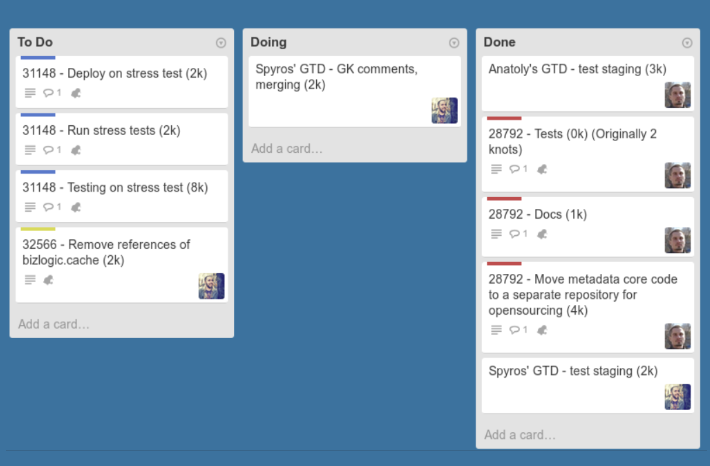

<!-- headingDivider: 3 -->
<!-- class: default -->
# Scrum
## What is Scrum?

* [Scrum](https://en.wikipedia.org/wiki/Scrum_(software_development)) is a framework for delivering products (usually software)
* Designed for teams of ten or fewer members
* Scrum Values
  * ***Minimal chance of failure***: product is worked on in small increments
  * ***Transparency***: changes are visible to the team
* Work is split to ***Sprints***: goals that can be completed within time-constrained iterations
  * Sprints are most commonly two weeks long (for us, shorter)
  * Progress is tracked and re-planned in ***Dailies***, 15-minute time-boxed meetings 

## Why Scrum for game development?

* Through its practices and principles, Scrum creates ***conditions*** to achieve good results 
* Scrum gives ***agency*** to team members: meeting the goal is a team effort
* Scrum creates ***transparency***: problems get addressed early
* Scrum isn't magic: you need to continuously enforce its practices in action

---
* ***Cross-discipline teams***: Enables teams to deliver features and mechanics that have clear value
* ***Self-management***: Enables teams to select the amount of work they can commit to every sprint and complete that work through whatever means they find appropriate
* ***Self-organization***: Enables teams to have a degree of authority and responsibility to select their membership

<!--
* ***True leadership***: Provides leadership focused on mentoring and facilitation to free the best performance possible from the team
## Cross-discipline teams
* Team members share the same goal and therefore the same priorities
* To make sure ***no work goes to waste***, synchronization of the disciplines happens every sprint. 
* avoid one discipline getting too far ahead of the others!

## Self-management
* No unnecessary management layers
* Scrum teams are usually composed of 5 to 9 cross-disciplined developers who create vertical slices of major features every sprint.
* How is this achieved?
  * Choose the amount of work to accomplish for the coming sprint and commit to it
  * Decide the best way to work together
  * Every Daily: Estimate your own work and monitor progress toward a committed goal
  * Every Sprint: Demonstrate sprint goals achieved to the stakeholders
  * Take responsibility for performance and find ways to improve it 

## Self-organisation

* Team selects their own members to complete tasks
* Some sprints, like before release, might require a complete reorganization
-->

# Scrum basics

## Scrum people

### Dev team

* Small team that aims to deliver a product
* Organizes itself and its work
* Collaborates with Product owner
* Creates product increments in a series of sprints

### Scrum master

* Helps to facilitate usage of Scrum to the team
* Ensures the Scrum framework is followed
* Aims to improve team's workflow
  * Basically an acting producer!
* Can be a part of the dev team (a "peer leader")
  * ...but should not be the product owner
* Can be a different person every Sprint

### Product owner

* Accountable for profit & loss
* Listens to the client's wishes
* Manages the Product Backlog
* Representation of stakeholders and clients to the Dev Team
* Chooses what to release - and when

<!-- _footer: "In this course, the teacher will act as this." -->

### The rest

* Stakeholders (not actually part of the team)
  * People outside the Scrum team who have an interest in the product
  * Sales, marketing, end customers, etc
* Client
  * Monitors product backlog
  * Is responsible for the upkeep of the product backlog

<!-- _footer: "In this course, the teacher will act as these." -->

## Backlogs

### Product backlog

* Holds the requirements for the product
* Managed by the Product Owner
* Composed of ***tasks***
  * unit of deliverable work
  * completable during a single sprint
  * Features, Bugfixes, Content...

---

### Sprint backlog

* A list of tasks to be completed during the Sprint
* Selected from the Product backlog
* A *forecast* of what is aimed to be done during the Sprint, not a promise!!!

---

### Definition of Done

* When is a task considered done?
* This is decided by the Dev team in Sprint ***Retrospective*** ("Retro")
* Can change as project progresses
  	* "It works" -> "It passes tests"

<!-- * "Fully completed" should refer to ***completely releasable*** -->

## Sprint Events

* First day: Sprint Planning
* Every day: Daily Scrum
* Last day: Sprint Review & Sprint Retrospective

### Sprint planning

* Starts a new Sprint
* The whole Scrum team attends
  * inspects the whole Product Backlog
* A Sprint Goal is created and dissected into a new Sprint Backlog
  * The Sprint Goal is ***immutable***
  * The exact implementations are not discussed
    * those are rather left for the Dev Team to decide
* New tasks are given to the Dev Team

### Daily Scrum ("Daily")

* Only Dev Team attends, with these goals:
  * Inspect the progression towards the Sprint Goal
  * Inspect how the Sprint Backlog is clearing out
  * Create a plan for the next 24 hours
* Max. 15 min long!
* Keeps everyone on the same page
  * $\Rightarrow$ Optimizes collaboration and performance of the Dev Team
---
* Example topics to address in a Daily:
	* What have you achieved since the last Daily?
	* What problems have you faced?
	* How does the team address problems?
	* Is there need for (re)allocation of tasks?

### Sprint review

* Attended by the Scrum team and stakeholders
* Goal: Offer feedback and open up discussions about the Sprint
* Starts off with a feature demonstration
* Product Owner presents the state of the Product Backlog
  * What is releasable?
* Dev Team tells what happened during the Sprint
  * How different problems were addressed?
  * What was their effect?
* Everybody provides *and listens* for feedback

### Sprint retrospective ("Retro")

* After every Sprint Review
* Only the Scrum team attends
	* worries and thoughts are brought up
* Possible discussion topics
	* What went right?
	* What should be improved?
	* Tools needed and used?
	* The suitability of the Scrum process.
	* What does Done mean, and should it be redefined?

## Scrum master tasks

* Continuously:
  1. Make sure the task board on GitHub is up to date.
  2. Make sure everyone is able to attend the dailies.
  3. Make sure everyone is heard and contributes at dailies.
  4. If someone needs help, you help them find assistance or assist them yourself.
* Before the dev meeting:
  1. Make sure the task board on GitHub is up to date.
  2. Make sure someone is ready to present the newest working version of the program, with all the new changes pushed
  3. Write down the state of tasks listed in the Sprint backlog
  4. Discuss what problems were encountered during the last Sprint, and how were they addressed.

