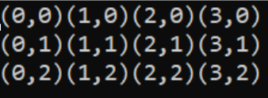

<!-- headingDivider: 3 -->
<!-- class: invert -->
# Loops and Lists
# Loops

## Loops
* used for:
  * repeating blocks of code 
  * looping through collections of data (more later...)
  * running a program (more laterer...)
* types of loops:
  * While
  * Do While
  * For
  * Foreach


## `while` loop
* while loop keeps executing its code block as long as the condition in its statement is true:
```c#
int count = 0;
while(count < 4)
{
    Debug.Log(count);
    count++;
}

// Outputs '0', '1', '2' and '3'
```
## `do while` loop

* similar to while loop, but it executes the code block once **even if the statement isn't true**
* try the following code: what happens if you change the initial value of `count` to 5?

```c#
int count = 0;
do
{
    Debug.Log(count);
    count++;
} while (count < 4);

// Outputs '0', '1', '2' and '3'
```
## `for` loop
* for loops are used when the number of iterations is **predefined**
* for loop is initialized in three steps:
```c#
for (initialvalue;condition;increment)
{
    doStuff();
}
```
* **The initial value** is set *before the first* iteration
* **The condition** is checked *before each* iteration
* **The increment** is executed *after each* iteration

### For loop example 1

```c#
for (int i = 0; i < 4; i++)
{
    Debug.Log("Current: " + i);
}
/* Outputs
Current: 0
Current: 1
Current: 2
Current: 3 
*/
```

### For loop example 2

```c#
for (int i = 4; i > 0; i--)
{
    Debug.Log("Current: " + i);
}
/* Outputs
Current: 4
Current: 3
Current: 2
Current: 1 
*/
```

## Breaking out of loops: `break`

* To stop the execution of a loop completely, use the `break` keyword:
  ```c#
  int i = 0;
  while (true)
  {
      i++;
      if (i == 3)
          break;
  }
  // i is now 3
  ```

## Skip ahead: `continue`

* To skip the **current** iteration, use the `continue` keyword
  ```c#
  int i = 0;
  while(i < 10)
  {
      i++;
      if (i % 2 == 0)
          continue;
      Debug.Log(i);
  }
  // Prints every odd number from 1 to 10
  ```


## Nested loops

* Loop inside a loop is often used for generating or going through two-dimensional data
  ```c#
  int columns = 3;
  int rows = 4;

  for (int i = 0; i < columns; i++)
  {
      for (int j = 0; j < rows; j++)
      {
          Debug.Log("(" + j.ToString() + "," + i.ToString() + ")");
      }
  }
  ```
  


## While vs. for: when to use?

* for loops when the number of iterations is **predefined**
  * when going through a list, for example.
* while loops when we want to do something many times, but don't know when to stop


## Exercise 1. 
<!-- _backgroundColor: teal -->


# Arrays

## Arrays

* Arrays are a collection of variables of the same type, which allocate neighboring memory locations
* Declared with square brackets following the type of the elements:
	```c#
	int[] userIds;
  ```
* Declaring an array does not *yet* allocate space from memory
## Creating empty arrays

* Initialize an empty array with a length of 3 using the following syntax:
  ```c#
  int[] userIds = new int[3];
  ```
* Assign a value to an element in an array by specifying the index in square brackets:
  ```c#
  userIds[0] = 104;
  ```
* Indexing starts from `0`, so the above line assigns a value of 104 to the **first element** of the array
## Creating and populating arrays simultaneously

* You can also create an array containing values with one statement:
  ```c#
  string[] names = new string[3] { "Johannes", "Rene", "Ville" };
  ```
* The same works without specifying the length in the brackets:
  ```c#
  double[] balances = new double[] { 1.3, 200.3, 9332.14 };
  ```
### Arrays: Unity example

* Creating and accessing an array of gameobjects
```c#
public GameObject[] players;

void Start ()
{
	players = GameObject.FindGameObjectsWithTag("Player");
	
	for(int i = 0; i < players.Length; i++)
	{
		Debug.Log("Player Number "+i+" is named "+players[i].name);
	}
}
```
## Multidimensional arrays
* C# supports multidimensional arrays:
  ```c#
  char[,] letters = new char[3, 4]
  {
      {'a', 'b', 'c', 'd'},
      {'e', 'f', 'g', 'h'},
      {'i', 'j', 'k', 'l'}
  };
  Debug.Log(letters[1, 3]);       // Outputs "h"
  ```

# Lists


## Which to use?

* Use Lists if you are changing the size of the array
* If there are a fixed number of elements, use arrays

## Array methods
  * Find
  * Filter


## Exercise 2. Dimensionality
<!-- _backgroundColor: teal -->

Create two-dimensional data 


# Iterating through lists and arrays