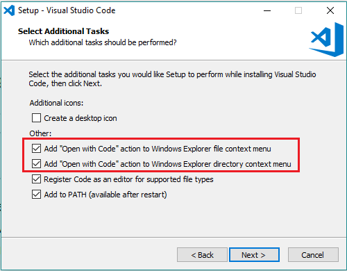
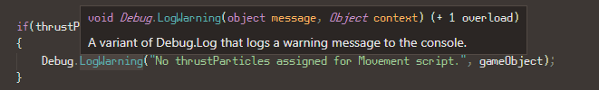

<!-- headingDivider: 3 -->
<!-- class: default -->
# Unity and VS Code

## VS Code installation

* During installation, check these two options:
  

## Unity side setup

* Include the *Visual Studio Code Editor* Package in your projects
  * If you removed it, you can add it in *Window > Package Manager*
* Set VS Code as your Unity default editor
  * *Edit > Preferences > External Tools > External Script Editor*
  * You might have to click the *Regenerate project files* button to get all features working 

## VS Code side setup
* Install the prerequisities for code completion & other niceness
  * You need two things:
    * [.NET Core SDK](https://code.visualstudio.com/docs/other/unity#_prerequisites)
      * Remember to reboot your computer after installing
    * [.NET Framework 4.7.1 Developer Pack](https://code.visualstudio.com/docs/other/unity#_enabling-code-completion-for-recent-versions-of-unity)
      * ***Be sure to download the Developer pack, not Runtime!!***
  * VS Code C# extension
* Open the project folder in VS Code
  * Either by opening the folder from File Explorer context menu (*Open with Code*)
  * Or in VS Code *File >  Open Folder...*

## VS code shortcuts

* ***CTRL+SHIFT+UP/DOWN*** move code line
* ***CTRL+SHIFT+D*** duplicate line
* ***CTRL+Ö*** for showing/hiding terminal
* ***CTRL+.*** for auto-"using" / auto-creating missing functions
* ***CTRL+TAB*** / ***CTRL+SHIFT+TAB*** 
  * *View: Open Next/Previous Recently Used Editor*
  * By default, these shortcuts open the recently used tab, and it can be confusing
  * You can change the behaviour in *Preferences > Keyboard Shortcuts*
  * Set behaviour to *View: Open Next Editor* / *View: Open Previous Editor*
  
## C# tips

* ***F2***: Rename variable and automatically update references
  * Naming things correctly on the first go is difficult!
* ***CTRL+LMB*** 
  * when clicking a method reference: *jump to definition*
  * when clicking the method definition: *jump to references*
* Hover over a method name to see details
  
  * argument types, return types, method overloads...
  * this feature only works if dotnet and the C# extension are installed

## Extra: Other extensions
<!-- _backgroundColor: pink -->
* *Marp for VS Code*
  * if you want to read these slides inside VS code
  * after installation, open this .md file from the course repository
  * click on the *Open preview to the side* button
    * a vertically split square with a magnifying glass on the top right corner