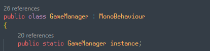
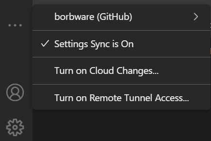
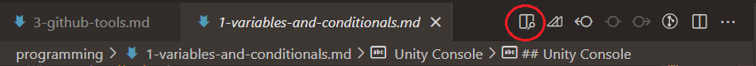

<!-- headingDivider: 3 -->
<!-- class: invert -->
# Unity and VS Code

## VS Code installation

* During installation, check these two options:
  

## Unity side setup

* Include the *Visual Studio Code Editor* Package in your projects
  * If you removed it, you can add it in *Window > Package Manager*
* Set VS Code as your Unity default editor
  * *Edit > Preferences > External Tools > External Script Editor*
  * You might have to click the *Regenerate project files* button to get all features working 

## VS Code side setup
* Install the prerequisities for code completion & other niceness
  * You need to install these applications:
    * [.NET Core SDK](https://code.visualstudio.com/docs/other/unity#_prerequisites)
      * Remember to reboot your computer after installing
    * [.NET Framework 4.7.1 Developer Pack](https://code.visualstudio.com/docs/other/unity#_enabling-code-completion-for-recent-versions-of-unity)
      * ***Be sure to download the Developer pack, not Runtime!!***
  * And these VS Code extensions:
    * C#
    * Unity code snippets
* Open the project folder in VS Code
  * Either by opening the folder from File Explorer context menu (*Open with Code*)
  * Or in VS Code *File >  Open Folder...*

## Omnisharp

* After the previous procedure, VS code should have ***Omnisharp*** enabled
  * Number of references are shown on top of every variable & class
    
  * You can hover over a method name to see details
    
    * argument types, return types, method overloads...

### Omnisharp troubleshooting

* Sometimes Omnisharp stops working. Here's something you can try to fix it:
1) Check that .NET is installed by running `dotnet` in the VS code terminal
2) In Unity: *Edit > Preferences > External tools > Regenerate Project Files*
3) In VS Code: ***CTRL+SHIFT+P*** *> Omnisharp: Restart Omnisharp*
4) In VS Code: Add this line inside the curly braces to the configuration file `.vscode/settings.json`:
    ```
    "omnisharp.useModernNet": false
    ```

## Logging into VS Code

* You can log in with your GitHub account to VS Code in the ***Accounts*** tab
* Then, by turning on ***Settings sync***, your user-defined settings are carried over to whichever computer you're working on
  

## VS code shortcuts

* ***CTRL+F*** find from file
* ***CTRL+SHIFT+F*** find from all files
* ***CTRL+SHIFT+H*** find and replace from all files
* ***ALT+UP/DOWN*** move code line
* ***CTRL+.*** for auto-"using" / auto-creating missing functions
* ***CTRL+K***, then ***CTRL+C*** comment selection
* ***CTRL+K***, then ***CTRL+U*** uncomment selection
* ***CTRL+SHIFT+P*** command palette
* ***CTRL+P*** search for files palette
* ***CTRL+Ö*** for showing/hiding terminal

### Omnisharp shortcuts
  * ***F2***: Rename variable and automatically update references
    * Naming things correctly on the first go is difficult!
  * ***CTRL+LMB*** 
    * when clicking a method reference: *jump to definition*
    * when clicking the method definition: *jump to references*

### Editing keyboard shortcuts

* In *Preferences > Keyboard Shortcuts*, you can add own shortcuts and change existing ones 
* For example, ***CTRL+TAB*** / ***CTRL+SHIFT+TAB***:
  * Default behaviour is *View: Open Next/Previous Recently Used Editor*
  * This opens the tabs in the order of recent use, and it can be confusing
  * I tend to set the behaviour to *View: Open Next Editor* / *View: Open Previous Editor* instead
* Some shortcuts need an additional ***When*** parameter to know when they should be used
  * Examples in the next slide

### Extra shortcuts that I like to use (not enabled by default)
* ***CTRL+TAB*** / ***CTRL+SHIFT+TAB*** *View: Open Next Editor* / *View: Open Previous Editor*
* ***ALT+F3*** *Select All Occurrences of Find Match* when `editorFocus`
* ***CTRL+SHIFT+D*** *Copy line down* when `editorTextFocus && !editorReadOnly`
* ***CTRL+SHIFT+⬇*** *Move line down* when `editorTextFocus && !editorReadOnly`
* ***CTRL+SHIFT+⬆*** *Move line up* when `editorTextFocus && !editorReadOnly`
* ***CTRL+Ä*** 
  * *View: Focus Active Editor Group* when `terminalFocus`
  * *Terminal: Focus Terminal* elsewhere
* ***CTRL+SHIFT+Ä*** *View: Toggle Maximized Panel* (makes terminal big)

## Extra: Other extensions
<!-- _backgroundColor: #5d275d -->
* *Marp for VS Code*
  * If you want to read these slides inside VS Code
  * After installation, open this .md file from the course repository
  * Click the *Open preview to the side* button

    