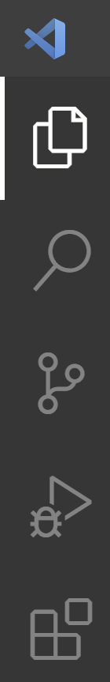
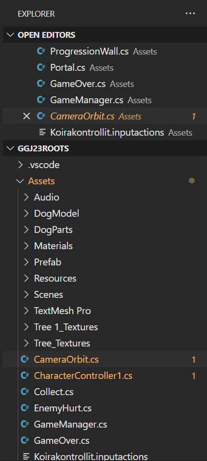
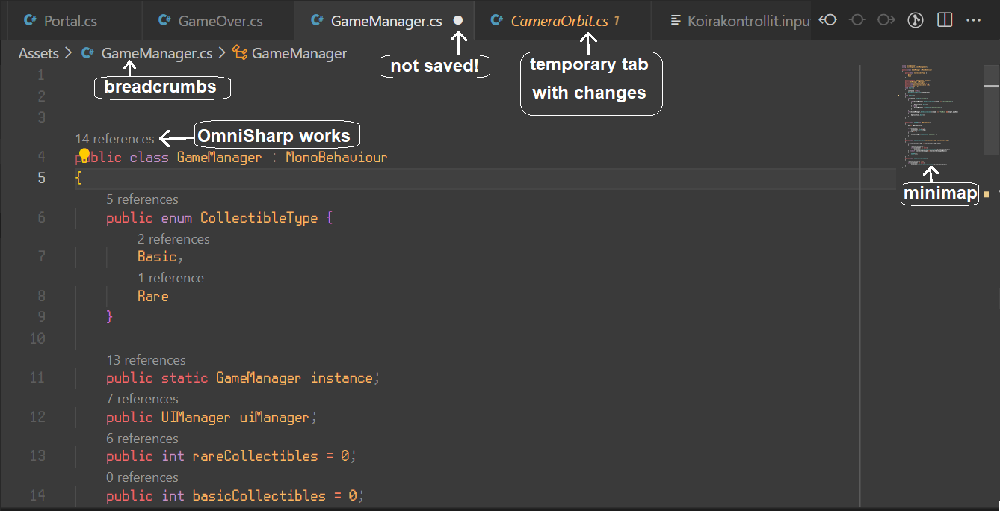

<!-- headingDivider: 3 -->
<!-- class: invert -->

# Using VS Code

## Project folder as a workspace

* We'll unlock some important features of VS Code by opening our project folder as a ***workspace***
  * You can even have workspace-specific settings
* If you are working on multiple projects at once, keep things clear and open dedicated VS code windows for the respective projects!
* When you open VS Code from the start menu, it has no workspaces open
  * To open a folder as a workspace, click *Open Folder* and navigate to the root folder of your project
* Another way is to not open VS Code from the start menu at all
  * Instead,  right-click the project folder in the Windows file explorer and choose *Open with Code*

## The VS code interface

* VS code [user interface](https://code.visualstudio.com/docs/getstarted/userinterface) has three important views to consider:
  * The tabbed ***side bar*** (B)
  * The code ***editor groups*** (C)
  * The terminal ***panel*** (D)

## Side bar

* Use the buttons (or their respective keyboard shortcuts) in the activity bar to display (and hide!) different views in the side bar
1) Explorer (***CTRL+SHIFT+E***): Display project folder and ints contents
2) Search (***CTRL+SHIFT+F***): Search your project
3) Source control (***CTRL+SHIFT+G***): Use [Git](../project-management/1-git-basics.md) actions. See more here
4) Run and Debug: Debugging. Not in use in this course
5) Extensions (***CTRL+SHIFT+X***): Install & manage extensions
* Some extensions add icons that appear under these five. 

### Explorer

* In the explorer view, you can
  * see a list of open editors
  * and more importantly, access files inside your project folder

## Editor groups

* The opened tabs have two modes: temporary and permanent
* The filename of a temporary tab is shown with *cursive*
  * If you single-click a file on the explorer view, a file will open as a temp file
  * There are only one temp file at once: Click another, and it will replace the previous one
  * Double-click the file or the tab title to make a temporary tab permanent 
* You can show editors side-by side by grabbing from the tab title
* If changes to a file are not saved, the close button will appear as ⚪ instead of $\times$
* Tabs with changes are shown in an effect colour

---

## Using VS code like a pro

* The key to using VS code effectively is ***mastering the shortcuts***.
* This way, you'll minimize your mouse usage and can focus on using your ***keyboard***.

## VS code shortcuts

* ***CTRL+§***: open another instance of the same file to the side
* ***CTRL+W***: Close current tab
* ***CTRL+F*** find from file
* ***CTRL+SHIFT+F*** find from all files
* ***CTRL+SHIFT+H*** find and replace from all files
* ***ALT+⬆/⬇*** move code line up/down
* ***CTRL+K***, then ***CTRL+C*** comment selection
* ***CTRL+K***, then ***CTRL+U*** uncomment selection
* ***CTRL+SHIFT+P*** command palette
* ***CTRL+P*** search for files palette
* ***CTRL+Ö*** for showing/hiding terminal

### Omnisharp shortcuts
  * ***F2***: Rename variable and automatically update references
    * Naming things correctly on the first go is difficult!
  * ***CTRL+LMB*** 
    * when clicking a method reference: *jump to definition*
    * when clicking the method definition: *jump to references*
* ***CTRL+.***  auto-import / auto-create missing functions
### Editing keyboard shortcuts

* In *Preferences > Keyboard Shortcuts*, you can add own shortcuts and change existing ones 
* For example, ***CTRL+TAB*** / ***CTRL+SHIFT+TAB***:
  * Default behaviour is *View: Open Next/Previous Recently Used Editor*
  * This opens the tabs in the order of recent use, and it can be confusing
  * I tend to set the behaviour to *View: Open Next Editor* / *View: Open Previous Editor* instead
* Some shortcuts need an additional `When` parameter to know when the shortcuts are used
  * Examples in the next slide

### Extra shortcuts that I like to use (not enabled by default)

* ***CTRL+TAB*** / ***CTRL+SHIFT+TAB*** *View: Open Next Editor* / *View: Open Previous Editor*
* ***ALT+F3*** *Select All Occurrences of Find Match* when `editorFocus`
* ***CTRL+SHIFT+D*** *Copy line down* when `editorTextFocus && !editorReadOnly`
* ***CTRL+SHIFT+⬇*** *Move line down* when `editorTextFocus && !editorReadOnly`
* ***CTRL+SHIFT+⬆*** *Move line up* when `editorTextFocus && !editorReadOnly`
* ***CTRL+Ä*** 
  * *View: Focus Active Editor Group* when `terminalFocus`
  * *Terminal: Focus Terminal* elsewhere
* ***CTRL+SHIFT+Ä*** *View: Toggle Maximized Panel* (makes terminal big)