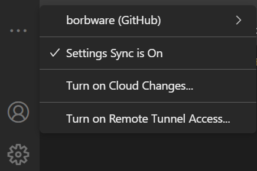
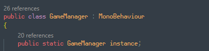
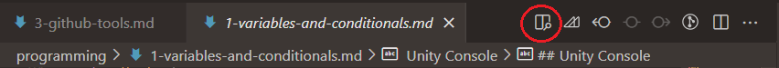

<!-- headingDivider: 3 -->
<!-- class: invert -->
# VS Code setup

## What is Visual Studio Code?

* VS Code (or just VSC) is a popular open source text editor / IDE (integrated development environment) by Microsoft
* Very ***extensible*** by extensions
* Has many language-specific features like Omnisharp for C#
## Visual Studio Code is not Visual Studio
  * Visual Studio is an older, bulkier IDE, also by Microsoft
    * it has more features!
  * Visual Studio Code is quite new, relatively lightweight
    * originally scarce in features
    * more popular in web development
* Both are used for Unity development
* We'll be using VS Code on this course

## VS Code installation

* During installation, check these two options:
  

## Logging into VS Code

* You can log in with your GitHub account to VS Code in the ***Accounts*** tab
* Then, by turning on ***Settings sync***, your user-defined settings are carried over to whichever computer you're working on
  


## Unity side setup

* Include the *Visual Studio Code Editor* Package in your projects
  * If you removed it, you can add it in *Window > Package Manager*
* Set VS Code as your Unity default editor
  * *Edit > Preferences > External Tools > External Script Editor*
  * You might have to click the *Regenerate project files* button to get all features working 

## VS Code side setup
* Install the prerequisities for code completion & other niceness
  * You need to install these applications:
    * [.NET Core SDK](https://code.visualstudio.com/docs/other/unity#_prerequisites)
      * Remember to reboot your computer after installing
    * [.NET Framework 4.7.1 Developer Pack](https://code.visualstudio.com/docs/other/unity#_enabling-code-completion-for-recent-versions-of-unity)
      * ***Be sure to download the Developer pack, not Runtime!!***
  * And these VS Code extensions:
    * C#
    * Unity code snippets
* Open the project folder in VS Code
  * Either by opening the folder from File Explorer context menu (*Open with Code*)
  * Or in VS Code *File >  Open Folder...*

## Omnisharp

* ***Omnisharp*** is a set of tools that makes programming C# easier
* After the previous procedure, VS code should have Omnisharp enabled
  * Number of references are shown on top of every variable & class
    
  * You can hover over a method name to see details
    
    * argument types, return types, method overloads...

### Omnisharp troubleshooting

* Sometimes Omnisharp stops working. Here's something you can try to fix it:
1) Check that .NET is installed by running `dotnet` in the VS code terminal
2) In Unity: *Edit > Preferences > External tools > Regenerate Project Files*
3) In VS Code: ***CTRL+SHIFT+P*** *> Omnisharp: Restart Omnisharp*
4) In VS Code: Add this line inside the curly braces to the configuration file `.vscode/settings.json`:
    ```
    "omnisharp.useModernNet": false
    ```

## Extra: Other extensions
<!-- _backgroundColor: #5d275d -->
* *Marp for VS Code*
  * If you want to read these slides inside VS Code
  * After installation, open this .md file from the course repository
  * Click the *Open preview to the side* button

    
* GitLens & Git Graph (See [Git basics](../project-management/1-git-basics.md))