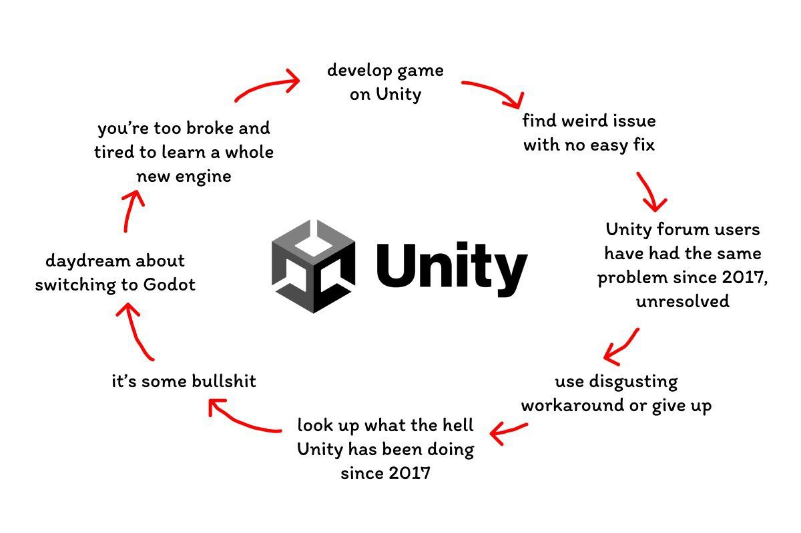

<!-- headingDivider: 3 -->
<!-- class: invert -->

# 0. What is Unity

## About Unity

* A commercial closed-source game engine
* Free to use for projects under $100 000 revenue
* Pretty much the industry standard
	* $\Rightarrow$ Plenty of resources available online!
* Much used especially in game jams & mobile
* A huge "kitchen sink" software: you won't ever need all the features
* Made originally for 3D games ("Unity3D")
* Can be used for 2D & 3D
* uses the C# programming language for scripting

## Games made with Unity

* *My Summer Car*, Johannes Rojolan tekemä suomalaiselle maaseudulle sijoittuva autonrakennussimulaattori 
* *Hollow Knight*, kolmen hengen tekemä metroidvania-tasoloikka
* *Cities: Skylines*, alle kahdenkymmenen hengen yhtiön kaupunginrakennussimulaattori
* *Fall Guys*, kahdensadan hengen yhtiön eliminaatiominipeleistä koostuva online-moninpeli
* *Genshin Impact*, neljäntuhannen hengen yhtiön avoimen maailman toimintaroolipeli ja yksi menestyneimmistä peleistä koskaan
  
## Continuous updates

* Unity has been around for a long time now
  * Originally released for Mac in 2005
  * 3.0 was the first version with Windows support
* Unity is updated continuously!
  * Usually people are stuck with the version they started the project with
    * -> Common to have multiple versions on the same machine
    * Unity Hub helps here

## Note about deprecation

  * Sometimes, old features & programming styles are slowly deprecated as new ones are introduced
    * e.g., The input system
    * It helps to understand Unity if you study the history of Unity
    * It's useful to know which ways are old and "shouldn't be used" and which are still encouraged today
    * Then again, tomorrow everything might have changed

---

## Unity as an application

* [Unity can occasionally crash...](https://twitter.com/christinelove/status/994651382606020610?lang=en)
  * Save your work constantly!
* Unity does many things for you that you do not need to learn about
  * Treat some aspects of Unity as black boxes
  * You give them input, and they give you the (hopefully!) desired output
* Unity is closed source: you ***can't*** learn everything about it

## The Asset Store

* You can download assets to your project from the Asset Store
* 3D models, tools, character controllers, etc
* Some assets are free, some paid
* With the Asset store, you don't have to reinvent every single wheel
  * Get the ball rolling and prototype quickly
  * But beware - there isn't a free lunch
  * By using assets, you become more dependent on third-party code
  * Sometimes it's faster to make your own system than learn another person's way of thinking

## "The Unity Way"

* There are usually many ways to approach a problem
* Sometimes, implementing something can feel downright impossible!
* The reason might be that you're swimming against the current
  * I.e., you're not doing it *the way Unity wants you to do it!*
  * Learning from Unity projects by more experienced devs gives you perspective 
  * Example: [FPS template](https://learn.unity.com/project/fps-template)

## Unity Documentation

* [Manual](https://docs.unity3d.com/Manual/UnityManual.html)
* [Script Reference](https://docs.unity3d.com/ScriptReference)
* If you don't know how something works, this should be the first place to learn from
* Docs will be heavily featured during the course!
* Note: There are different docs for different versions of Unity
  * See the top left corner and the page URL if it matches
  * Some pages are missing from newer docs so I'll refer to older ones in those cases 