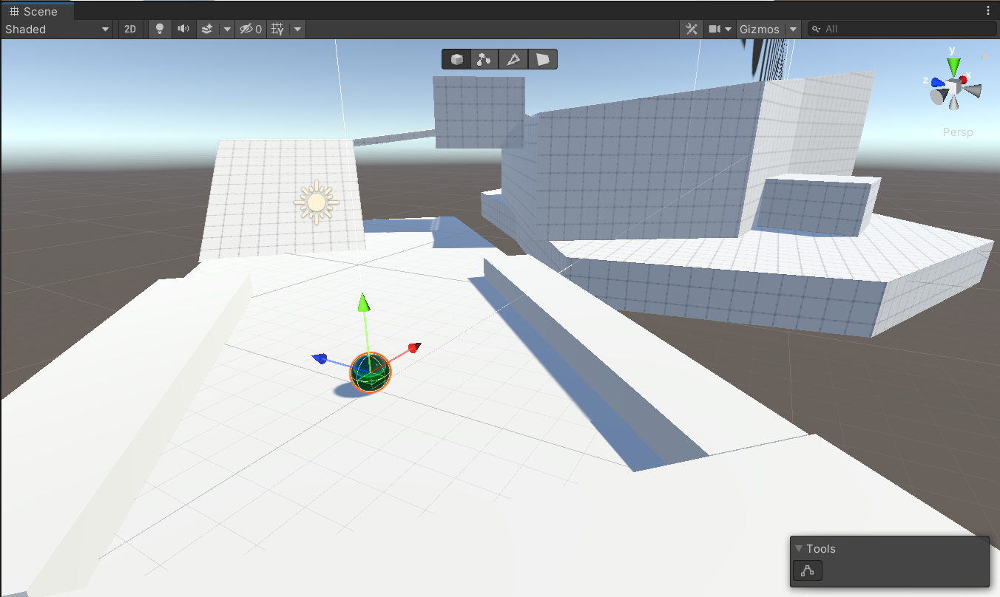
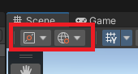

<!-- headingDivider: 3 -->
<!-- class: invert -->
# 1. The Unity Interface

## Editor views

* [Manual: Unity's Interface](https://docs.unity3d.com/Manual/UsingTheEditor.html)
* Views
  * Hierarchy window
  * Scene view
  * Game view
  * Inspector window
  * Project window
  * Console

* Views can be rearranged by dragging & dropping
* Try out different layouts from the top right "Layouts" dropdown menu
## Hierarchy window

* [Manual: Hierarchy](https://docs.unity3d.com/Manual/Hierarchy.html)
* Shows the list of GameObjects in a scene
* Double click to show object in Scene view
* GameObjects can be nested
  * Parent-child hierarchy!
* Add new GameObjects: ***RMB*** + choose from list

<!-- _footer: "LMB, MMB, RMB: Left/Middle/Right mouse button" -->
---

## Scene view
* [Manual: Scene view navigation](https://docs.unity3d.com/Manual/SceneViewNavigation.html)
* Navigation shortcuts
  * Maximize view: ***Shift +Spacebar***
  * Move: ***MMB***
  * Orbit: ***ALT+LMB***
  * Zoom: roll ***MMB*** / ***ALT+RMB***
  * Rotate camera: ***RMB***
  * Flythrough: hold ***RMB***, fly with ***WASD + Q/E***
* The Scene Gizmo
  * "the axis thingy on the top right"
  * Axis cones: change view to that axis
  * Center cube: perspective / isometric
* [Manual: Scene view camera](https://docs.unity3d.com/Manual/SceneViewCamera.html)
## Shortcuts for scene & hierarchy
* ***CTRL+Z*** + ***CTRL+Y*** undo & redo
* ***CTRL+C*** + ***CTRL+V*** copy & paste
* ***CTRL+D*** duplicate
* ***F***: center camera on selected object
  * Helps e.g., if camera zooms in too large increments
  * Press twice to follow the object
* Tip: Select camera and press ***CTRL+SHIFT+F*** to align camera view with the Scene window viewpoint

### QWERTY Tools
* Used for manipulating existing stuff
* Activating the tool changes the ***LMB*** behaviour
* Navigation shortcuts still available in other tools!
* In move/rotate/scale, you can use the red, green and blue shapes to manipulate x,y,z axes, respectively
---
* The tools:
  * ***Q***: View Tool (navigate)
  * ***W***: Move Tool
    * the squares in the center: move along a plane
  * ***E***: Rotate Tool
  * ***R***: Scale Tool
  * Those were the most important ones, but there're also...
  * ***T***: Rect Tool
    * Alternative Scale Tool
  * ***Y***: Move+Rotate+Scale multitool
* Different tools have different ***tool handles*** 
  * Move tool has arrows, rotate tool has arcs, etc.

## Tool handle orientation

* Let's consider these two important settings:
  
  
1. Tool handle position (Pivot / Center)
  * For multiple selected GameObjects, **center** sets the tool handle to the "average" center of the GameObjects. For a parent GameObject with children, it shows the average of parent + its children
  * **pivot** sets the tool handle to the last selected GameObject when multiple are selected, and shows the *actual location* of a parent GameObject 
  * ***Note:*** If you want to rotate a child GameObject according to its parent's position, set to ***pivot***
---
2. Tool handle rotation (Local / Global)
  * Scene has a ***global*** coordinate system, and all GameObjects have their ***local*** coordinate systems
  * Global setting shows the tool handle rotated always along the global coordinate system
  * Local setting shows the tool handle rotated along the local coordinates.
  * ***Note:*** To move GameObjects according to their local x,y,z axes, set to local (global by default)

  
## Inspector window

* [Manual: Inspector](https://docs.unity3d.com/Manual/UsingTheInspector.html)
* GameObject properties
  * Active (the checkbox)
  * Name
  * Tag
  * Layer
* Inspector shows what components does a game object have
* Components can be turned off
* UI tips:
  * drag variable to change value
  * hover over variable name to show info
 
## Game view

* [Manual: Game view](https://docs.unity3d.com/Manual/GameView.html)
* Simulates what your final rendered game will look like through your Scene Cameras
* Play & pause buttons
* When game is running, you can still manipulate the values in the Inspector
  * A nice way to mess around and find the right values for variables
  * But... changes made during the play mode do not persist!
  * ***Protip:*** Go to *Edit > Preferences > Colors* and change the play mode tint to red.
* To make play mode bigger,  change *Play focused* to *Play maximized*
* Fullscreen play is supported on Unity 2022 versions.

## Project window

* [Manual: Project window](https://docs.unity3d.com/Manual/ProjectView.html)
* List of ***Assets*** & ***Packages*** in your projects
* Assets
	* Scenes
	* Prefabricated game objects (prefabs)
	* Materials
	* Graphics, Sound effects, Music...
* Packages
  * Additional code & assets installed from the Unity Package Registry

## Console window

* [Manual: Console window](https://docs.unity3d.com/Manual/Console.html)
* Error messages
* Debug messages
* Other messages
* Helpful options:
  * ***Clear*** (remove old messages)
  * ***Collapse*** (don't repeat duplicate messages)
  * *$\vdots$ > Log Entry > 1 Line* (show only one line per message)

## Toolbar

* [Manual: Toolbar](https://docs.unity3d.com/Manual/Toolbar.html)
* Pause/Play
* Global seach

## Searching

* [Manual: Searching in the Editor](https://docs.unity3d.com/Manual/Searching.html)
* You can search for a component by its name in the Scene or Hierarchy view search bar.
* To find references to a given component, right click the component top bar in Inspector and select ***Find References In Scene***.
* To find references to a given asset, right click the asset in Project view and select ***Find References In Scene***.

## Reading

* [Sepeli ry: Unity basics (In Finnish)](https://sepeliry.github.io/unity1.html)
* [GMTK: The Unity Tutorial For Complete Beginners](https://www.youtube.com/watch?v=XtQMytORBmM)
* [GMTK: How I learned Unity without following tutorials](https://www.youtube.com/watch?v=vFjXKOXdgGo)