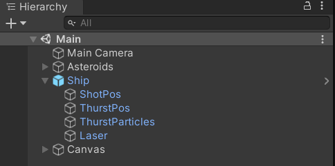

<!-- headingDivider: 3 -->
<!-- class: invert -->

# 2. Unity's building blocks

## Building Blocks

* Unity games consist of ***Scenes***
* Scenes consist of ***GameObjects***
* GameObjects consist of ***Components*** 

## Scenes

* [Manual: Scenes](https://docs.unity3d.com/Manual/CreatingScenes.html)
* Scene is a container for content
  * A game can be just one scene, or a combination of multiple ones
* Example scenes:
  * Main Menu
  * Level
  * Game Over
* Create New Scene: ***Assets > Create > Scene***
* New scenes use Unity's default Scene template, but you can create your own
  * [Manual: Scene templates](https://docs.unity3d.com/Manual/scene-templates.html)

## GameObjects

* [Manual: GameObjects](https://docs.unity3d.com/Manual/GameObjects.html)
* Pretty much everything in Unity is a ***GameObject***
* Fundamental objects in Unity that represent characters, props and scenery
* Some examples...
  * [Manual: 3d primitives](https://docs.unity3d.com/Manual/PrimitiveObjects.html): Cube, Cylinder, Sphere
  * Camera
  * Light
  * Empty

## GameObject Hierarchy

* GameObjects can have multiple ***child*** GameObjects $\Rightarrow$ they become ***parents***
* Children inherit their parent's...
  * position
  * rotation
  * scale
  * activeness
* [Manual: Hierarchy: Parenting](https://docs.unity3d.com/Manual/Hierarchy.html#Parenting)
* [Manual: Transform: Parenting](https://docs.unity3d.com/Manual/class-Transform.html#Parenting)
* ***Note:*** Rotating child GameObjects can have wonky results if parent has any other scale than $(1,1,1)$.

## Components

* [Manual: Components](https://docs.unity3d.com/Manual/Components.html)
* GameObjects act as containers for ***Components*** that implement various functionalities
* GameObject's components and their settings are listed in the Inspector window

## Some important components 

### Spatial information

* ***Transform***
  * [Manual: Transform](https://docs.unity3d.com/Manual/class-Transform.html)
  * position, rotation, scale
  * parenting information
  * included in every GameObject

### Interacting with other GameObjects

* ***RigidBody***
  * [Manual: RigidBody](https://docs.unity3d.com/Manual/class-Rigidbody.html)
  * for interacting with the physics engine
  * can receive forces and torque
* ***Collider***
  * [Manual: BoxCollider](https://docs.unity3d.com/Manual/class-BoxCollider.html)
  * enables collision with other GameObjects
  * there are different shapes and sizes
    * CapsuleCollider(2D), BoxCollider(2D), PolygonCollider2D...
  * `isTrigger`
    * ✅ -> Collider is ignored by the physics engine, but can trigger events

### Drawing the GameObject

* ***MeshFilter***
  * The ***mesh***, or the 3d geometry of a GameObject
* ***Renderer***
  * [Manual: MeshRenderer](https://docs.unity3d.com/Manual/class-MeshRenderer.html)
  * The component for drawing the GameObject on screen
  * MeshRenderer, SpriteRenderer, LineRenderer, TrailRenderer...
* ***Material***
  * [Manual: Material Inspector Reference](https://docs.unity3d.com/Manual/class-Material.html)
  * MeshFilter only defines the geometry, but the Material component defines color and other properties

### Custom Functionality

* ***Script***
  * [Manual: Scripting](https://docs.unity3d.com/Manual/ScriptingSection.html)
  * The most versatile component
  * For inserting custom C# code into the GameObject
  * We'll dive deeper into this in [4. Scripting GameObjects](4-scripting-gameobjects)
