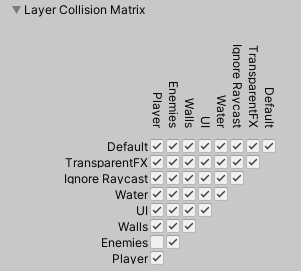

<!-- headingDivider: 3 -->
<!-- class: invert -->

# 4. Scripting GameObjects

## The GameObject class

[Manual: Important classes - GameObject](https://docs.unity3d.com/Manual/class-GameObject.html)

## Creating a new script

* There are two ways to do it:
  a) *Inspector > Add Component > New Script > Create and Add*
  b) *Project > Right click > Create > C# script*, then drag and drop to a GameObject

## The Script Class

* C# is object-oriented: the script is a new ***Class***
  * it ***inherits*** an Unity class [`MonoBehaviour`](https://docs.unity3d.com/Manual/class-MonoBehaviour.html)
* Inside the class, we can implement Unity's default ***methods***
  * e.g., `Awake()`
* We can also add our own methods
  * e.g., `DoStuffThatWeWant()`
* We can also add new ***fields***: variables inside the class

<!-- _footer: "[More about classes later in Programming 3: Classes and Methods](../programming/6-classes-methods.md)"-->

## Start and update

* A new script includes two ***methods*** by default: `Start` and `Update`
* [`Start()`](https://docs.unity3d.com/ScriptReference/MonoBehaviour.Start.html) is called automatically only once
  * It's used for setting things up when we start using the GameObject
* [`Update()`](https://docs.unity3d.com/ScriptReference/MonoBehaviour.Update.html) is called every frame
  * See FPS in *Play mode > Stats* to check how often it's called!

## Two ways to initialize
  * There are two functions for initializing a script class
  * [`Awake()`](https://docs.unity3d.com/ScriptReference/MonoBehaviour.Awake.html)
    * Called first
    * Called even if the script component is not enabled!
  * [`Start()`](https://docs.unity3d.com/ScriptReference/MonoBehaviour.Start.html)
    * Called second, right before the first Update
    * Only called if the script component IS enabled

## `Update()`
  * There are three functions for updating a script class
  * [`Update()`](https://docs.unity3d.com/ScriptReference/MonoBehaviour.Update.html)
    * Frequency of update calls varies depending on framerate
    * Most things can be updated here
    * Because of framerate-dependence it is *indeterministic*
        * (same input doesn't always produce same output)
## `FixedUpdate()` and `LateUpdate()`
  * [`FixedUpdate()`](https://docs.unity3d.com/ScriptReference/MonoBehaviour.FixedUpdate.html)
    * By default, called every 0.2 seconds (50 FPS)
    * Used mainly for physics calculations
      * Will slow down under heavy load!
      * Not dependent on framerate: *deterministic*
        * (same input always produces same output)
    * ***Note:*** Can't be used for checking ButtonDown input
  * [`LateUpdate()`](https://docs.unity3d.com/ScriptReference/MonoBehaviour.LateUpdate.html)
    * Called every frame after `Update()`.
    * Good for something that has to happen after all game objects have Updated

## Time and Deltatime
* [Important classes: Time](https://docs.unity3d.com/Manual/TimeFrameManagement.html)
* `Time.time`
  * The time passed since starting the game, in seconds
* `Time.deltaTime`
  * ***Deltatime*** is the time spent between update calls, in seconds
    * Relates to FPS, or ***frames per second***
    * `deltatime = 1 / FPS`
  * Can be used for accounting for framerate in movement
    ```c#
    Vector3 velocity = new Vector3(speed * Time.deltaTime, 0.0f, 0.0f);
    transform.position += velocity;
    ```
  * Beware lag spikes, though: what would `velocity` be if deltatime was equal to one second? Three seconds?

## Accessing fields in Inspector

* Every time we change our code, we have to wait for Unity to compile scripts.
* It's especially annoying when fine-tuning variable values
* Luckily, we can edit script variables right in the inspector  
* [Manual: Variables and the Inspector](https://docs.unity3d.com/Manual/VariablesAndTheInspector.html)
* `public` variables show up in Inspector
* ...as do the ones with a `[SerializeField]` attribute
  * [Script Reference: SerializeField](https://docs.unity3d.com/ScriptReference/SerializeField.html)
* Use `public` only when you need to edit the value from other scripts 
  * `[SerializeField]` is safer (can't be edited from other scripts)

## Extra: Other attributes
<!-- _backgroundColor: #5d275d -->

* `[SerializeField]` is not the only handy attribute in Unity.
* `[Header("Explainer for UI")]`
  * Great for team communication
  * [Script Reference: Header Attribute](https://docs.unity3d.com/ScriptReference/HeaderAttribute.html)
* `[Range(x,x)]`
  * Adds a slider to inspector
  * [Script Reference: Range Attribute](https://docs.unity3d.com/ScriptReference/RangeAttribute.html)
* [More about attributes in C# Docs]((https://docs.microsoft.com/en-us/dotnet/csharp/programming-guide/concepts/attributes/))

## Referring to GameObjects
* The GameObject the script is attached to is usable as `gameObject`
* For other GameObjects, there are two options:
  * a) Fast solution
    * Serialize a GameObject field (shows up in the Inspector)
    * Drag & drop the wanted GameObject to the field in Inspector
  * b) Find with code
    * [Script Reference: GameObject.Find](https://docs.unity3d.com/ScriptReference/GameObject.Find.html)
    * [Script Reference: GameObject.FindGameObjectsWithTag](https://docs.unity3d.com/ScriptReference/GameObject.FindGameObjectsWithTag.html)
    * ***Note:*** these functions can't find inactive GameObjects.

## Accessing Children & Parents

* Accessing a child:
  * Unity stores the child-parent hierarchy of GameObjects under the Transform component
  * Access by index number
    * [Script Reference: Transform.GetChild](https://docs.unity3d.com/ScriptReference/Transform.GetChild.html)
    * `parentGameObject.transform.GetChild(indexNumber).gameObject`
   * Access by name
      * [Script Reference: Transform.Find](https://docs.unity3d.com/ScriptReference/Transform.Find.html)
      * `parentGameObject.transform.Find("childName").gameObject`
* Accessing a parent:
  * GameObject only has one direct parent
  * `childGameObject.transform.parent`


## Creating and destroying GameObjects

  * `Instantiate()`: Create copies of GameObjects or Prefabs into the scene with 
    * [Script Reference: Instantiate](https://docs.unity3d.com/ScriptReference/Object.Instantiate.html)
      ```c#
      GameObject newObject = Instantiate(bullet, transform.position, transform.rotation);
      ```
  * `Destroy()`: destroy GameObjects from the scene
    * [Script Reference: Destroy](https://docs.unity3d.com/ScriptReference/Object.Destroy.html)
    * you can give an additional delay in seconds before destroying as a second argument
      ```c#
      Destroy(bullet, 2.0f);
      ```

## Activating and deactivating GameObjects

* Inspector: see the checkbox left to the GameObject's name
* `gameObject.SetActive(false);`
  * will deactivate the object ***AND ITS CHILDREN***.
* `myObject.activeSelf`
  * `false` tells if this _particular_ object has been deactivated
  * even if `true`, `myObject` can still be deactivated if a parent is deactivated
* `myObject.activeInHierarchy`
  * "is `myObject` *really* active right now?"
  * `false` means this object has been deactivated by itself ***or*** by its parents


## Exercise 1. Three, two, one...
<!-- _backgroundColor: #29366f -->

* Create a script on an empty GameObject
* Make it instantiate a bullet Prefab every three seconds. 
* Create another GameObject, and make the script destroy it when three seconds have passed.

## Accessing components


* Access GameObject's components with [GameObject.GetComponent](https://docs.unity3d.com/ScriptReference/GameObject.GetComponent.html)
  ```c#
  OurComponentType ourComponent = ourGameObject.GetComponent<OurComponentType>();
  ```
* For example, to get the Rigidbody component:
  ```c#
  Rigidbody rb = playerObject.GetComponent<Rigidbody>();
  ```
* Dot notation not needed when getting a component of the GameObject the script class is part of:
  ```c#
  Rigidbody rb = GetComponent<Rigidbody>();
  ```

## Checking if component exists

* It's a good idea to check if a component exists before actully using it
  ```c#
  Rigidbody rb = GetComponent<Rigidbody>();
  if (rb != null)
  {
    // do stuff with rb
  }
  ```

  * Another way is to use the [GameObject.TryGetComponent](https://docs.unity3d.com/ScriptReference/GameObject.TryGetComponent.html) method
  ```c#
  if (playerObject.TryGetComponent<RigidBody>(out RigidBody rb))
  {
    // do stuff with rb
  }
  ```
  * Does the syntax look strange? It uses the [out parameter](https://learn.microsoft.com/en-us/dotnet/csharp/language-reference/keywords/out-parameter-modifier). 

## Enabling and disabling components
* enable component:
  * `component.enabled = true;`
* disable component:
  * `component.enabled = false;`
* toggle:
  * `component.enabled = !component.enabled`
* ***Note:*** Disabling a script component only disables calls to Awake, Start, Update, LateUpdate, FixedUpdate...
  * Most event-based callbacks don't get disabled!

## Tags & Layers
* [Manual: Tags and layers](https://docs.unity3d.com/Manual/class-TagManager.html)
* *Edit > Project Settings > Tags and Layers*
* Here, you can set up
  * ***Tags***
  * ***Layers***
  * ***Sorting layers*** 
## Tags

* [Manual: Tags](https://docs.unity3d.com/Manual/Tags.html)
* Marker values that that you can use to identify objects in your Project
* Example tags: EditorOnly, MainCamera, Player
* GameObject can only have ONE tag!
  * Access it with `myGameObject.tag`
* `GameObject.FindWithtag("tagname");`
* `GameObject.FindGameObjectsWithTag("tagname");`

### Tag-based collision

```c#
private void OnTriggerEnter2D(Collider2D other)
{
    if(other.gameObject.tag == "Collectible")
    {
        Destroy(other.gameObject);
    }
```

## Layers
* [Manual: Layers](https://docs.unity3d.com/Manual/Layers.html)
* Layers allow you to separate GameObjects in you scene through UI or scripting
* Some layers: Default, Ignore Raycast, Custom...
* To make Camera ignore some layers:
	* *Inspector > Camera > Culling Mask > Layers*
* To make Viewport ignore some layers:
	* Top right: *Layers* dropdown
* Layers can be used for selective collision detection
  * [Manual: Layer-based collision detection](https://docs.unity3d.com/Manual/LayerBasedCollision.html)

### Layer-based collision detection

* To make Player and Enemies collide with walls, but not with each other:
  * Set Player layer to *Player*
  * Set Enemy layer to *Enemies*
  * Set Walls layer to *Walls*
  * Open *Edit > Project preferences > Physics(2D) > Layer Collision Matrix*
  * Disable collision between *Enemies* and *Player*:
  
### Sorting layers

* For sorting 2D sprites
  * "which goes on top of which"
  * act kind of like Photoshop layers

## About script reusability

* two extreme approaches to scripting GameObjects
  * a) One script per GameObject
    * can make files bloated
  * b) One script per functionality
    * possibly reusable code!
    * possibly more confusing
    * can take more time
* My way: First put everything in one script until some functionality grows enough
  * Then, separate into its own script


## Exercise 2. Available on switch 
<!-- _backgroundColor: #29366f -->

Create a Scene with following GameObjects:

- Three ***light source*** GameObjects
  - render the light bulb as well (it can be a sphere for instance) 
- ⭐ A cube that acts as a ***light switch*** (turns on/off the lights, but bulbs are seen)
- ⭐⭐ A cube that acts as a ***kill switch*** that destroys the lights
- ⭐⭐⭐ A cube that acts as a ***create switch*** that creates new lights if they were destroyed

***Spoiler:*** For a click response, you can use this method:

```c#
void OnMouseOver() {
  if (Input.GetMouseButtonDown(0) {
      // Do stuff
  }
}
```

## Reading

* [Stack Overflow: Component vs Behaviour vs Monobehaviour](https://stackoverflow.com/questions/44540747/what-is-the-difference-between-component-behaviour-and-monobehaviour-and-why-t)
