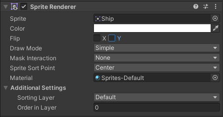

<!-- headingDivider: 3 -->
<!-- class: invert -->
# 4. Unity for 2D

## Using Unity for 2D games

* We've previously focused on 3D (x, y, z)
* Unity does not have a dedicated 2D (x, y) mode
* When creating a new project, you can choose a 2D project template, however
    * It basically just adjusts the Unity UI
    * it exposes some 2D gameobject templates, like sprites and tilemaps
  * It still uses the 3D engine, the z axis is just disregarded
  * You can change between 3D and 2D modes by pressing the *2D* button in the Scene view
* There is a dedicated Vector2 class for 2D vectors
  * Some vectors used in 2D **are still 3D** due to Unity being a 3D engine!

## 2D Components

### Drawing Sprites: Sprite Renderer

* 2d images in games are called ***sprites***
* They're drawn on screen with the ***Sprite Renderer*** component

	

### Example: Using Sprite Assets

1) Create a .png image file
2) Add it to your Assets folder
3) Click it once to see its properties in the Inspector. Set the values:
   * *Pixels per unit* value tells how big the sprite should be on screen
   * If you're using pixelart, you need to take some more things into consideration
     * See: [Pixelart in Unity](../unity-cookbook/2d.md#pixelart-in-unity)
4) Drag it from the Project window into the Sprite field in the Sprite Renderer component

### Line Renderer

### RigidBody 2D

### Colliders

* Polygon Collider 2D
* Circle Collider 2D
* 