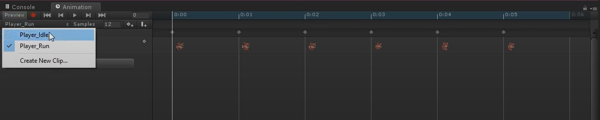
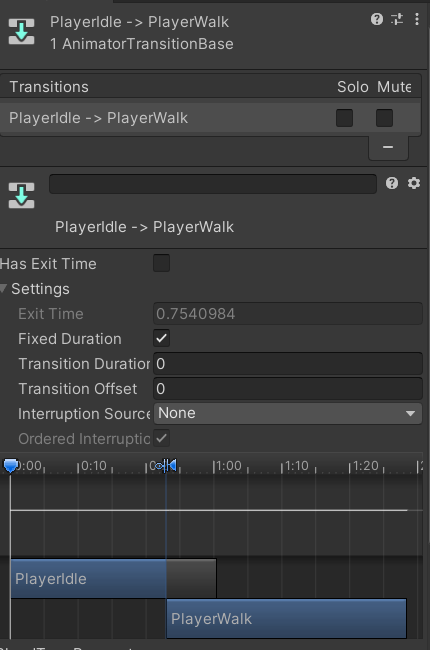

<!-- headingDivider: 3 -->
<!-- class: invert -->

# 2D animation

## Two ways to 2D character animation

* Sprite sheet animation
  * Characters are drawn fully, and animated by hand, frame by frame
  * At best, results in lifelike and beautiful motion
  * At worst, the animator has to draw everything multiple times
  * [Learn: Sprite Animation](https://learn.unity.com/tutorial/introduction-to-sprite-animations)
* Skeletal animation
  * Characters consists of multiple images connected by bones
  * At best, varied procedural movement out of a few assets
  * At worst, stiff and unlifelike motion
  * [Learn: Skeletal Animation](https://unity.com/features/2danimation)

## Sprite-based animation

* For sprite basics, see: [2d Basics: Sprite renderer component](2d-basics#sprite-renderer-component)
* Sprite animation can be created with multiple individual png files, or one sprite sheet with multiple animation ***cels***
* [Brackeys video: 2D animation](https://www.youtube.com/watch?v=hkaysu1Z-N8)

### Creating a new animation

* [Manual: Creating a new Animation Clip](https://docs.unity3d.com/Manual/animeditor-CreatingANewAnimationClip.html)
* Select the GameObject you want to animate
* Open ***Animation Window***: *Window > Animation > Animation*
* Click *Create* to create a new animation (.anim) file, or a ***clip***
  * Good ideas to have separate animation files for *Idle*, *Jumping*, *Running*, etc...
  * Name the first clip ***Player_Idle***

---


* Drag sprites to your Animation timeline
  * ***Note:*** The final frame duration is less than the others. For an easy fix, add the first frame as a duplicate to the end
* Set *Samples* to a lower value to make your new animation less frantic
* You can create new clips in the Player_Idle dropdown

## Animator controller

* When you created new clips, an ***Animator Controller Asset*** was created
  * [Manual: The Animator Controller Asset](https://docs.unity3d.com/Manual/Animator.html)
* This can be modified in the ***Animator Controller Window***
  * [Manual: Animator Controller](https://docs.unity3d.com/Manual/class-AnimatorController.html)
  * ***Note:*** This was previously known as Mecanim State Machine
* To actually use the transition rules, your player GameObject needs the Animator component (it's added automatically)
  * [Manual: Animator Component](https://docs.unity3d.com/Manual/class-Animator.html)

## ...State machine? 

* Unity Animation State Machine can seem daunting if you're not familiar with the concept of a State Machine
* Luckily, the Manual has good resources about the animation state machine 
* [Manual: State Machine Basics](https://docs.unity3d.com/Manual/StateMachineBasics.html)
* Also, note that at its current state, the animator window can be very janky. If you e.g. cannot move the states around, set the inspector into Debug mode
  * *Inspector window > Three dots in the top right corner > Debug*

## Animator controller: Usage


* In Animator, we can create ***transition rules*** between animation clips
* *Right click a state > Make Transition*
* ***Entry*** is the default state: Create an arrow from it to the idle animation!
* Click on the arrow to edit the transition

### Transitions

* [Manual: Animation Transitions](https://docs.unity3d.com/530/Documentation/Manual/class-Transition.html)



* *Has Exit time*:
  * Means: "will exit automatically after this amount of time has passed"
  * You can set *Exit time* from the Settings submenu

### Layers & parameters

* [Manual: Animation Parameters](https://docs.unity3d.com/Manual/AnimationParameters.html)
* ***Layers*** and ***parameters*** can be used to control our animation with code
* Create a new float parameter named *Speed*
* Go to a transition, and create a new ***condition*** for the parameter 
  ```c#
  [SerializeField] Animator anim;

  anim.SetFloat("Speed",_rigidbody.velocity.Magnitude);
  ```
* `anim.SetTrigger("StartWalking")` works similarly

### Controlling animation with code

* Check which animation is playing
  ```c#
  if (anim.GetCurrentAnimatorStateInfo(0).IsName("PlayerAttack"))
  {
        Debug.Log("Playing attack anim!");
  }
  ```
* [Script Reference: Animator.Play](https://docs.unity3d.com/ScriptReference/Animator.Play.html)
  ```c#
  anim.Play("PlayerAttack");
  ```

### Animation Events

* [Manual: Using Animation Events](https://docs.unity3d.com/Manual/script-AnimationWindowEvent.html)
* You can add animation events to call a function in a specific point of an animation

### State machine behaviour scripts

* [Manual: State Machine Behaviours](https://docs.unity3d.com/Manual/StateMachineBehaviours.html)
* To add functionality to animation states, you can add state machine behaviours
* Or ***COULD***, if Unity animator inspector wouldn't be an awful buggy mess

### Extras: Advanced animation states
<!-- _backgroundColor: #5d275d -->

* In real-world, usage, animator states can be way more comples
  * This can lead to so-called transition hell
* [Manual: Animation State Machines](https://docs.unity3d.com/Manual/AnimationStateMachines.html)
* [Manual: Blend trees](https://docs.unity3d.com/Manual/class-BlendTree.html)

## Extra: UI animations
<!-- _backgroundColor: #5d275d -->

* [Packages: Unity UI: Animation integration](https://docs.unity3d.com/Packages/com.unity.ugui@1.0/manual/UIAnimationIntegration.html)

## Extras
<!-- _backgroundColor: #5d275d -->

* 9-Slicing
  * [Manual: 9-Slicing your Sprite](https://docs.unity3d.com/Manual/9SliceSprites.html)
* Sprite Masks
  * [Manual: Sprite masks](https://docs.unity3d.com/Manual/class-SpriteMask.html)
* Sprite Creator
  * For creating (placeholder) sprite graphics
  * *Assets > Create > Sprites*
  * [Manual: Sprite Creator](https://docs.unity3d.com/Manual/SpriteCreator.html)

## Extras: Pixel art in Unity
<!-- _backgroundColor: #5d275d -->

* Sprite import:
  * Texture type: Sprite (2D and UI)
  * Pixels Per Unit: Tile size (e.g., 32)
  * Filter Mode: Point (No filter)
  * Compression: None
* *Edit > Project Settings > Quality > Anti-aliasing: Disabled*

---

<!-- _backgroundColor: #5d275d -->

* Preparing for pixelart
  * https://twitter.com/Davitsu/status/956499799133573120
  * https://hackernoon.com/making-your-pixel-art-game-look-pixel-perfect-in-unity3d-3534963cad1d
* Pixel perfect camera
  * https://docs.unity3d.com/Packages/com.unity.2d.pixel-perfect@1.0/manual/index.html

* ***Note:*** If you still see black gaps in your tilemaps after following these instructions, create a new material with the *Sprites/Default* shader and check *Pixel snap*. Then, add this material to every Tilemap renderer.

## Learning 

* Top-down movement with animation
  * [Top-down movement in Unity](https://pavcreations.com/top-down-movement-and-attack-game-mechanics-in-unity/)
  * [Brackeys video: Top down movement](https://www.youtube.com/watch?v=whzomFgjT50)

* [Madwomb: Basics of Unity 2D](http://madwomb.com/tutorials/GameDesign_Unity2Dintro.html)
* [Madwomb: Mecanim - Animation Controllers and State Machines](http://madwomb.com/tutorials/GameDesign_UnityMecanim.html)