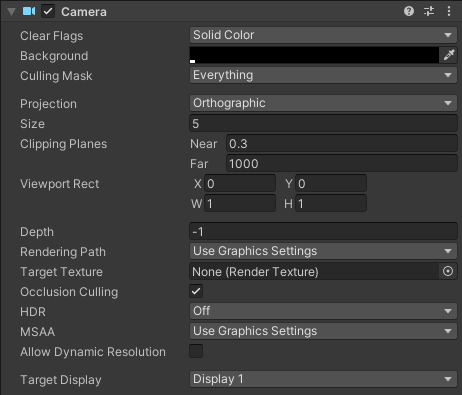
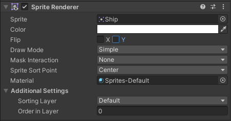

<!-- headingDivider: 3 -->
<!-- class: default -->

# 2D basics

## Using Unity for 2D games

* [Manual: 2D or 3D](https://docs.unity3d.com/Manual/2Dor3D.html)
* [Manual: 2D and 3D Mode settings](https://docs.unity3d.com/Manual/2DAnd3DModeSettings.html)
* [Manual: 2D Game Development Quickstart Guide](https://docs.unity3d.com/Manual/Quickstart2D.html)
  * [Manual: Initial Setup for 2D Games](https://docs.unity3d.com/Manual/Quickstart2DSetup.html)
* Unity is first and foremost a 3D engine (x, y, z)
  * there is no dedicated 2D (x, y) mode
* There is a dedicated `Vector2` class for 2D vectors
  * Some vectors used in 2D, like `transform` are still `Vector3`

## 2D Project template

* When creating a new project, you can choose a 2D project template
* ***IT'S STILL SECRETLY 3D***, the z axis is just disregarded
* It basically just adjusts the Unity UI
  * some 2D GameObject templates, like sprites and tilemaps available
* You can change between 3D and 2D view modes by pressing the *2D* button in the Scene view


## Useful 2D GameObjects

* Sprites
  * [Manual: Sprites](https://docs.unity3d.com/Manual/Sprites.html)
  * See [Sprite Renderer component](#sprite-renderer-component)
* 2D Primitives
  * For drawing basic shapes in 2D
  * [Manual: 2D Primitives](https://docs.unity3d.com/2020.3/Documentation/Manual/2DPrimitiveObjects.html)
* Sprite Shape Asset
  * Curve-based graphics & collision
  * [Manual: Sprite Shape](https://docs.unity3d.com/Packages/com.unity.2d.spriteshape@3.0/manual/index.html)

## Camera component

* 2D camera needs to be orthographic
  

## Collision & Physics components

* Colliders
  * See: [Collision](collision.md)
  * Remember to use the 2D versions of colliders:
    * PolygonCollider **2D**, CircleCollider **2D**, ...
* RigidBody 2D
  * See: [Physics](physics.md)
* Effectors
  * [Manual: Effectors 2D](https://docs.unity3d.com/Manual/Effectors2D.html)

## Sprite Renderer component

* 2d images in games are called ***sprites***
* They're drawn on screen with the ***Sprite Renderer*** component

	

### Example: Using Sprite Assets

1) Create a .png image file
2) Add it to your Assets folder
3) Click it once to see its properties in the Inspector. Set the values:
   * Set ***Texture type*** to *Sprite (2D and UI)*
   * ***Pixels per unit*** value tells how big the sprite should be on screen
   * If you're using pixelart, you need to take some more things into consideration
     * See: [Pixelart in Unity](2d-animation.md#pixelart-in-unity)
4) Drag it from the Project window into the Sprite field in the Sprite Renderer component

## Other renderer components

* Line Renderer
  * Use for drawing a line on screen
  * [Manual: Line Renderer](https://docs.unity3d.com/Manual/class-LineRenderer.html)
* Trail Renderer
  * For drawing trails
  * [Manual: Trail Renderer](https://docs.unity3d.com/Manual/class-TrailRenderer.html)
* Sprite Shape Renderer
  * Draw images along a path, or just paths
  * [Sprite Shape Renderer](https://docs.unity3d.com/Manual/class-SpriteShapeRenderer.html)

## Extra: Two ways for 2D shooting
<!-- backgroundColor: pink -->

* [Brackeys video: 2D shooting](https://www.youtube.com/watch?v=wkKsl1Mfp5M)
* For slow bullets: Instantiate a bullet prefab
* For instant hit: Raycasting (see example below)
  ```c#
  RaycastHit2D hit = Physics2D.Raycast(line.transform.position,
    line.transform.up,
    lineDistance);
  ```

## Extra: Moving on a grid

For grid-based movement, see this thread: [Unity answers: Moving on a grid](https://answers.unity.com/questions/1760651/how-to-make-a-grid-movement-tile-per-tile-1.html)