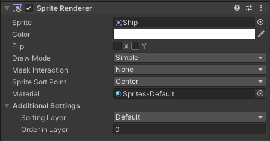

<!-- headingDivider: 3 -->
<!-- class: default -->
# Unity for 2D

## Using Unity for 2D games

* [Manual: 2D or 3D](https://docs.unity3d.com/Manual/2Dor3D.html)
* [Manual: 2D and 3D Mode settings](https://docs.unity3d.com/Manual/2DAnd3DModeSettings.html)
* Unity is first and foremost a 3D engine (x, y, z)
  * there is no dedicated 2D (x, y) mode
* There is a dedicated `Vector2` class for 2D vectors
  * Some vectors used in 2D, like `transform` are still `Vector3`

## 2D Project template

* When creating a new project, you can choose a 2D project template
* ***IT'S STILL SECRETLY 3D***, the z axis is just disregarded
* It basically just adjusts the Unity UI
  * some 2D GameObject templates, like sprites and tilemaps available
* You can change between 3D and 2D view modes by pressing the *2D* button in the Scene view

# GameObjects

## 2D Primitives

* [Manual: 2D Primitives](https://docs.unity3d.com/Manual/2DPrimitiveObjects.html)

# Components

## Camera

* 2D camera needs to be orthographic
  


## Sprite Renderer

* 2d images in games are called ***sprites***
* They're drawn on screen with the ***Sprite Renderer*** component

	

### Example: Using Sprite Assets

1) Create a .png image file
2) Add it to your Assets folder
3) Click it once to see its properties in the Inspector. Set the values:
   * ***Pixels per unit*** value tells how big the sprite should be on screen
   * If you're using pixelart, you need to take some more things into consideration
     * See: [Pixelart in Unity](../unity-cookbook/2d.md#pixelart-in-unity)
4) Drag it from the Project window into the Sprite field in the Sprite Renderer component

## Line Renderer

* [Manual: Line Renderer](https://docs.unity3d.com/Manual/class-LineRenderer.html)
* Used to draw a line on screen


## RigidBody 2D

## Colliders

* Polygon Collider 2D
* Circle Collider 2D
  

# Extras


## Sprite-based art

* http://madwomb.com/tutorials/GameDesign_Unity2Dintro.html
* https://pavcreations.com/top-down-movement-and-attack-game-mechanics-in-unity/


## 2d animation

* [Brackeys video: 2D animation](https://www.youtube.com/watch?v=hkaysu1Z-N8)
* Components needed
  * Sprite Renderer
  * Animator

### Animator screen
* State Machine
* Transitions
  * Exit time
  * Can Transition To Self
  * Transition hell
* Animation parameters
  * Controlling with code
  * anim.SetFloat("Last_X",PlayerInput.x);
  * anim.SetTrigger("StartWalking"); 
* Blend trees
## Pixel art in Unity


* preparing for pixelart
  * https://twitter.com/Davitsu/status/956499799133573120
  * https://hackernoon.com/making-your-pixel-art-game-look-pixel-perfect-in-unity3d-3534963cad1d
* pixel perfect camera
  * https://docs.unity3d.com/Packages/com.unity.2d.pixel-perfect@1.0/manual/index.html
## Tilemaps

* [Brackeys video: Tilemaps](https://www.youtube.com/watch?v=ryISV_nH8qw)
  * Autotiling
    * 2d extras
    * Rule tile
    * https://www.youtube.com/watch?v=nfjAznD_MaU
* Tilemap collider 2d


## 2d shooting

* [Brackeys video: 2D shooting](https://www.youtube.com/watch?v=wkKsl1Mfp5M)
* "Slow": prefab
* "Instant": raycasting
  ```c#
  RaycastHit2D hit = Physics2D.Raycast(lineRenderer.transform.position,
    lineRenderer.transform.up,
    lineDistance);
  ```