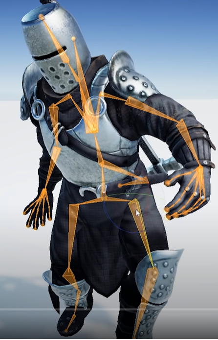
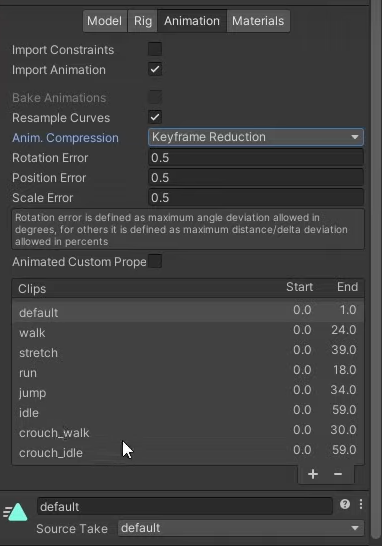
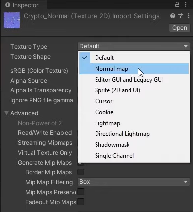
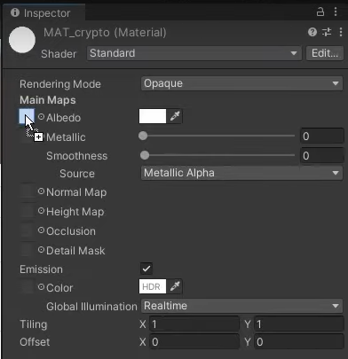
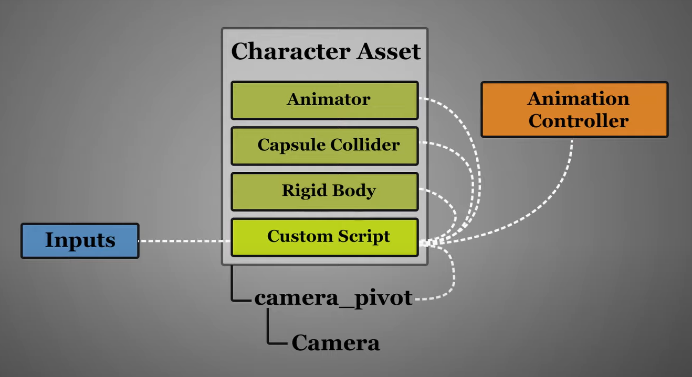
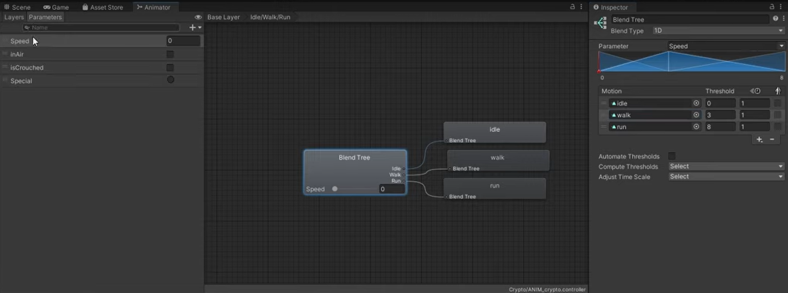
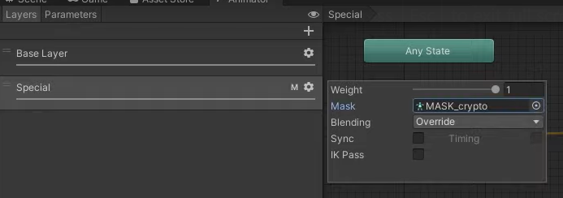
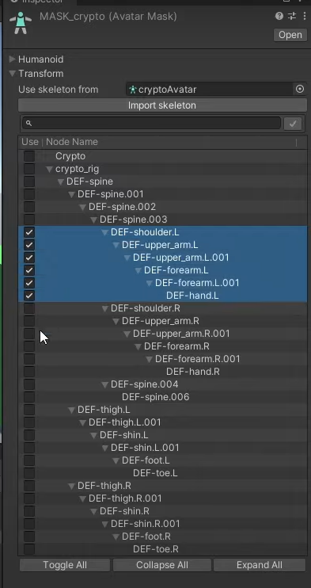

<!-- headingDivider: 3 -->
<!-- class: invert -->

# 3D animation

## 3D character animation

* A 3D character is created in a dedicated 3d program like Blender
  * ***Skeletal animations*** are created for the character in the program as well, and then exported to a format Unity understands
* In Unity, a 3D character usually consists of three GameObjects:
  * **Character** GameObject that contains the *Animator* component
    * **Mesh** GameObject that is used to draw the character
    * **Skeleton** GameObject that contains the *rig*

## Importing animations from Blender to Unity

* Easiest way to import animations from Blender to Unity is to use ***Game Rig Tools***
* [Game Rig Tools (Blender addon)](https://toshicg.gumroad.com/l/game_rig_tools)
* Video tutorial: [Blender to Unity - Generic Character Setup: #1 Rigging & FBX Export](https://www.youtube.com/watch?v=z3cdbYTl3Ms)
* Video tutorial: [Blender to Unity - Generic Character Setup: #2 Unity Setup](https://www.youtube.com/watch?v=c84j-A7bZ8s)

## Unity side setup

## Importing the model

* [Docs: Importing a model](https://docs.unity3d.com/Manual/ImportingModelFiles.html)
* [Docs: Model Import Settings window](https://docs.unity3d.com/Manual/class-FBXImporter.html)
1) Add imported .fbx file to your the assets folder of your Unity project
2) Edit .fbx import settings in the Inspector view:
* *Rig* tab
  - Animation type: *Generic* or *Humanoid*
  - Avatar Definition: *Create from this model*
  - Click *Apply*

---

 * *Animation* tab
   * Animation clips show up here (Blender *actions* are called *clips* in Unity)
   * For looping clips, check the *Loop time* box.
 * *Materials* tab
   * Click *Extract Materials...* to import Blender materials
   * The imported material should show up under *Remapped materials*

### Importing textures

* Move your textures to the Unity assets folder
* Set special textures to their correct types:
  * Normal map should have a corresponding *Texture type* (Fig. 1)
* Then, drag the textures to the imported material(s): Albedo to albedo slot, etc. (Fig. 2)
<!-- Avatar is a representation of bones that can be used for another asset in Unity. -->

## Setting up the character

* Next, we'll setup the character with some components and GameObjects.

	

---

1) Add the imported character to your scene
2) Add components:
   * Animator (if does not yet exist)
   * Rigidbody
   * Capsule collider
3) Add a new empty called *Camera pivot* under the character
   * Add a Camera GameObject under the pivot
4) Add a movement script that controls the animations

### Animator Controller

* Here's how to control the animations with an Animator Controller (see [2d animation](2d-animation#animator-controller) for more info)
* Create a new Animator Controller for the character
  * Drag and drop the controller to the character's *Animator* component
* Add parameters to control the animations with (`speed`, `isCrouching`, etc...)
* Create states for the animations. Here's a blend tree for walking/running: 

	

### Extra: Interactive animations with Avatar mask
<!-- _backgroundColor: #5d275d -->

* If you want to play interactive animations (like yawning or talking) during other (walking, idle...) animations, add a new layer in the animator controller
  * Create a state for the special animation, and add a transition condition from *New state*  
* Create a new Avatar mask that has only the bones applied that are needed for the special animation
  * Apply the mask for the special layer 

	

* See also [Brackeys video: Make your Characters Interactive!](https://www.youtube.com/watch?v=Htl7ysv10Qs)

## Reading

* Free ready-to-use characters by Adobe: [Mixamo](https://www.mixamo.com/)
* [Docs: Inverse Kinematics](https://docs.unity3d.com/Manual/InverseKinematics.html)