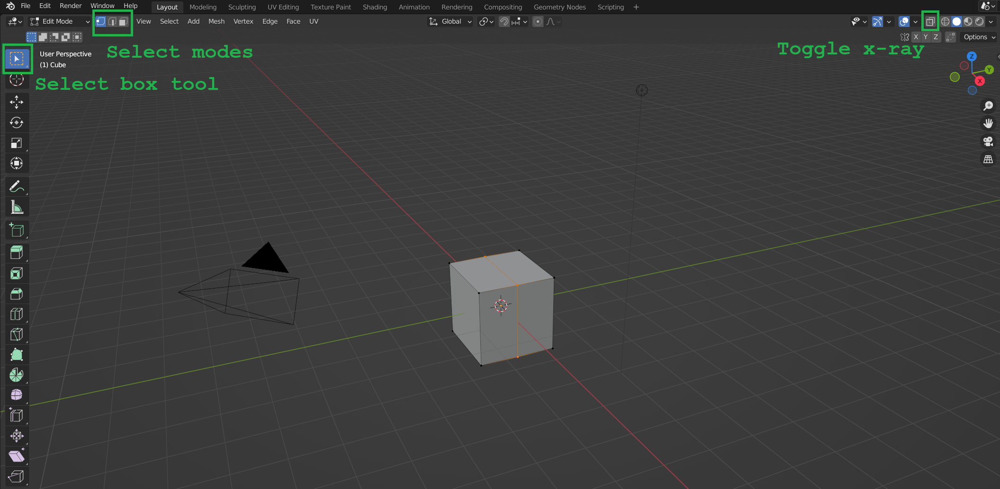

<!-- headingDivider: 3 -->
<!-- class: invert -->

## Blender basics

* Before we start:
  * In *Edit > Preferences > Keymap*, Change *Spacebar action* to *Search*.
* 3D objects consist of vertices (points), edges and faces.
* The default 3D object in Blender is a cube.
* Use left click to choose an object.
* We can manipulate the shape of the chosen object in the Edit mode, and move the objects themselves around in Object mode.

## Navigation

* Hold Mouse wheel button to rotate view.
* Shift+hold Mouse wheel to pan the current view. 
* Roll the mouse wheel to zoom in/out
* To move between cardinal axis views, press numpad 1/3/5/7.
* Press numpad 5 to change between perspective and orthographic views.

## Edit mode

---

* ***Tab***: jump between Edit/Object mode.
* In Edit mode, we have three select modes: 
  * Vertex select
  * Edge select
  * Face select
* Be sure you have the *Select box tool* selected!
* Use ***LMB*** to select.
  * Hold ***CTRL*** to select more!
* ***Protip:*** Click the *Toggle x-ray* button to see vertices, edges and faces behind the surface.

## Transform selection tools

* ***E***: Extrude selection
* ***S***: Scale selection
* ***R***: Rotate selection
* After choosing any of the three tools above, you can press ***X***, ***Y***, or ***Z***, to only transform along that axis.
  * Press ***X***,***Y***, or ***Z*** again to transform along object's local axis.
  * You can also press ***Shift+X*** etc. to transform along a plane (in this example, the Y-Z plane)

## Cutting tools

* ***CTRL+R***: use loop cut tool to add a new subdivision 
  * Click once to choose which face to loop cut, then:
  * Roll mouse wheel to choose how many subdivisions you want
  * Press ***Enter*** to confirm or ***ESC*** to cancel.
* ***K***: to use knife tool to add a new subdivision 
  * Click ***LMB*** to start cutting
  * Click again to start a new cut 
  * Press ***Enter*** to confirm or ***ESC*** to cancel.

## Extras: Vertex colors from Blender to Unity

https://stackoverflow.com/questions/48312958/showing-a-model-with-vertex-painted-colours-in-unity