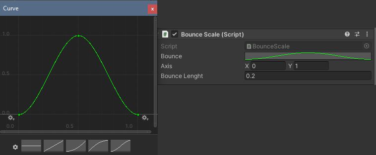

<!-- headingDivider: 3 -->
<!-- class: default -->

## Custom interpolation with an animation curve

* for custom interpolation curves, use the `AnimationCurve` variable
* `public AnimationCurve curve;`
  * it can be manipulated in the inspector:
  


### Code


```c#
public AnimationCurve bounce;
...
// If timer is on, do animation
if(Time.time < bounceTimer)
{
    // Calculate valid time for curve (in between 0 and 1)
    float scaleTime = (bounceTimer - Time.time) / bounceLenght;

    // Get the value from curve at the time of the animation
    // and multiply it with the desired scaled axis
    // then add it to default scale (1, 1, 1)
    transform.localScale = Vector2.one + axis * bounce.Evaluate(scaleTime);
}
```

* Here, `bounce.Evaluate` acts similarly as `Mathf.Lerp`
* You just get to decide the shape of the graph!

## Exercise: Animation curve