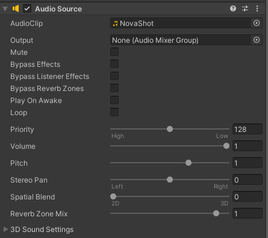
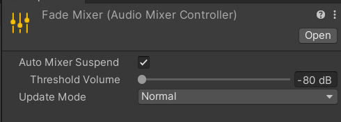
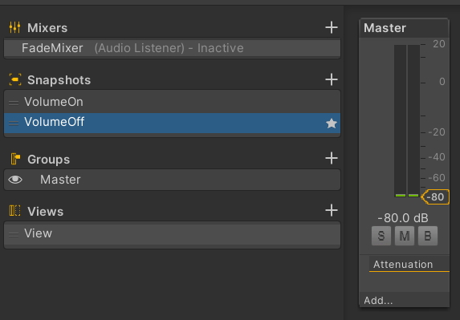
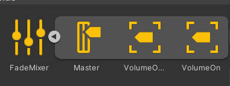
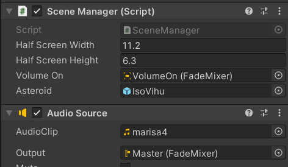

<!-- headingDivider: 3 -->
<!-- class: invert -->

# Audio playback

## How to play a sound

* You need two components to play a sound
* *AudioSource*
  * You can have multiple of these
* *AudioListener*
  * There can only be one

## AudioSource

* You can have multiple of these
* [Manual: AudioSource component](https://docs.unity3d.com/Manual/class-AudioSource.html)
* Insert to every GameObject that should be able to make a sound
  * E.g., if a Coin GameObject should have a *\*bling\** sound effect when collected
  * Drag and drop a *bling.wav* sound effect file into the component
  * Supported audio file formats are listed here: [Manual: Audio Files](https://docs.unity3d.com/Manual/AudioFiles.html)

### Controlling audio with code

* [Script Reference: AudioSource class](https://docs.unity3d.com/ScriptReference/AudioSource.html)
* The most important functions to control the component are:
  * `.Play()`
  * `.Pause()`
  * `.Stop()`
  ```c#
  [SerializeField] AudioSource audio;
  if (PlayerGrabbedCoin)
      audio.Play();
  if (DoSomethingElse)
      audio.Stop();
  ```
### AudioSource component



* For background music, tick *Loop* checkbox to play it indefinitely

## AudioListener

* You can think of this component as the ears of the player character
* Receives input from any given Audio Source in the scene and plays sounds through the computer speakers
* [Script Reference: AudioListener class](https://docs.unity3d.com/ScriptReference/AudioListener.html)
* [Manual: AudioListener component](https://docs.unity3d.com/Manual/class-AudioListener.html)
* There can only be one per scene
* Usually, under the *Camera* GameObject

## Spatial Audio

* For sound effects that get louder when the AudioListener is closer to the source 
* AudioSource settings
  * Set spatial blend to 1 (3D)
  * In 3D Sound Settings, set Volume Rolloff to Logarithmic Rolloff
    * (You can customize the graph yourself!)
  * Set Max distance to something fitting for your scene
    * This is visualized as a sphere
<!-- _footer: "[Scott Rowell Video: Unity Spatial Audio](https://www.youtube.com/watch?v=_2BhQN7-bGk)" -->

## SFX Exercise
<!-- _backgroundColor: #29366f -->

Time to add sound effects to your game! Either:

a) Download from [freesound](https://freesound.org/) (you'll need an account)
b) Record with your PC mic by using Audacity
c) Create new sounds by using bfxr

Then, add sounds to your game. Try at least these two kinds of sound effects:

1) a one-time sound effect that can be triggered with code
2) looping sound that plays all the time

## Note: Playing sound when something gets destroyed

* If you add an audio source to a GameObject that gets destroyed when the sound should be played, the sound stops abruptly
* Instead, add the audio source to some GameObject that you know won't be destroyed
* E.g, for playing a sound when collecting a coin, add a CoinPlayer GameObject with an Audiosource component, and call its `.Play()` method when collecting the coin.

## Fading between volume levels

There are many ways to fade in/out audio. Here, we present an example that needs very minimal code.

* Create a new audio mixer asset: *Create > Audio Mixer*.
* Name it "FadeMixer" or something like that.
  
    * Click *Open*

---



* In the Mixer view:
  * Name the existing Snapshot to *VolumeOn*
  * Create a new snapshot *VolumeOff*
    * Set its volume in the *Master* mixer group's slider to -80dB.
  * Right click *VolumeOff* and select *Set as start Snapshot*. 

---

* In project view, expand the mixer asset to see the *Master* mixer group and the two snapshots *VolumeOn* and *VolumeOff*.
* Drag the *Master* group to the audio source component that you want to fade.
* Then, in the script where you want to control the fade, create a new variable:
  ```c#
  using UnityEngine.Audio;
  ...
  [SerializeField] AudioMixerSnapshot VolumeOn;
  ```
  * Drag the *VolumeOn* snapshot to the inspector to the corresponding variable.
  * Then, we can fade from the default *VolumeOff* snapshot to the *VolumeOn* snapshot by calling the method
    ```c#
    VolumeOn.TransitionTo(3); // fade takes 3 seconds
    ```

---

<div class="columns" markdown="1">
<div markdown="1">



Here's what the audio mixer asset looks like when expanded.

</div>
<div markdown="1">



Here, the *Master* audio mixer group is dragged to Audio Source, and the *VolumeOn* snapshot to SceneManager.

</div>
</div>