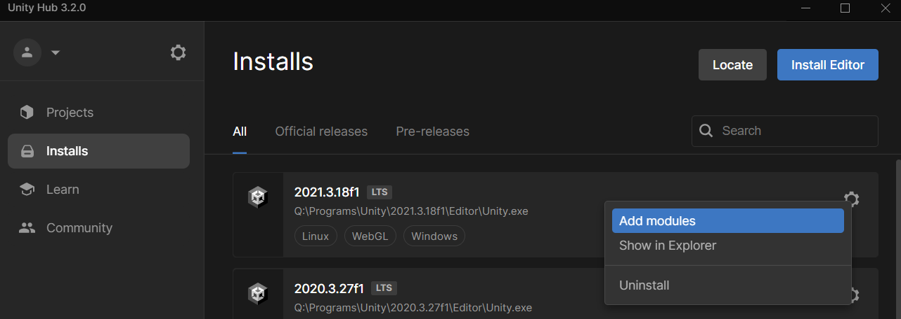
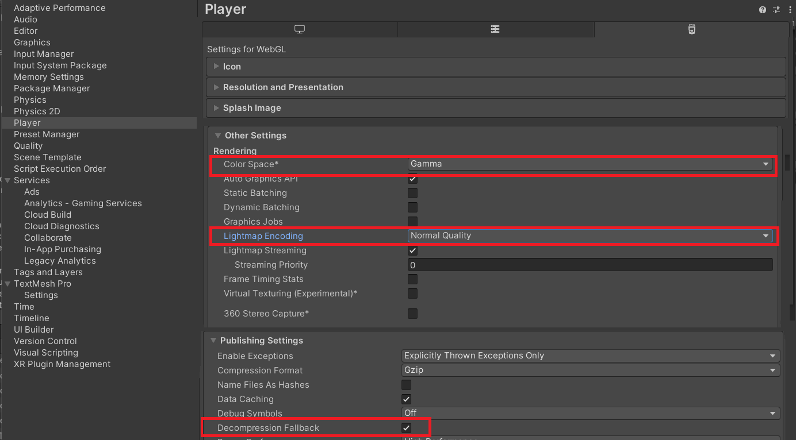
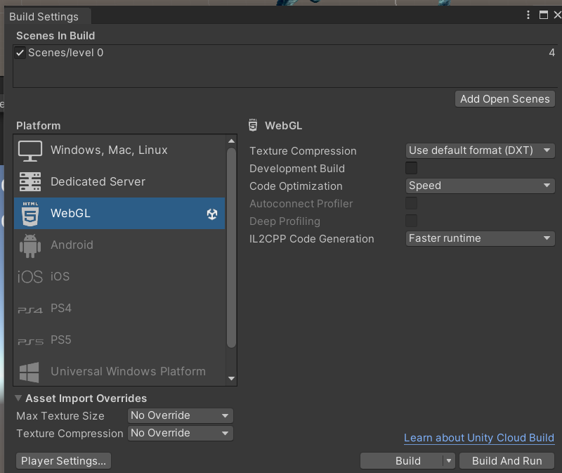
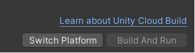

<!-- headingDivider: 3 -->
<!-- class: default -->

# Building

## Fast build

* Two options to build your game:
  * *File > Build and Run*
  * *File > Build Settings*
    * Add all scenes to your build settings (see [Scenes](scenes.md#building-a-game-with-multiple-scenes))
    * Click ***Build***
## Other platforms

* The instructions above create a ***native build*** by default (if you're on Windows, it's a Windows build)
* To build for other platforms, you need to install the dedicated modules for them in the Unity Hub

## Target resolution

* shown resolution is set in the Game view. Click *Free Aspect* and change the aspect ratio to your liking
* the exported resolution is set in *Project settings > Player > Resolution and Presentation*
  * untick *Default Is Native Resolution* to set resolution manually
* If you have *Canvas* GameObjects (for [UI](UI.md)), set the *Reference Resolution* in the *Canvas Scaler* component to match the target resolution

## Web build

* If you want your game to be played on a web browser (and you should!), you can create a ***web build***
* To build for web, go to build settings and select WebGL as a platform. 
* If you haven't yet, you need to install the WebGL module to build for web on the Unity Hub.

---

* Then, check these three settings in *Project preferences > Player*:

---

---

* On the list to the left on *Build settings*, choose the WebGL platform and then click on *Switch Platform*

* (You might need to restart Unity to see the build tools as installed.)

## Running web builds with a server

* To run a web build, you need a web server
* Or, you can host the web build in itch.io or similar
* Or, you can just click "build and run" to run the web build once.
* xx

## Uploading Web builds to itch.io

## Building with Profiler

[Manual: Profiling your application](https://docs.unity3d.com/Manual/profiler-profiling-applications.html)
[Manual: Profiler](https://docs.unity3d.com/Manual/Profiler.html)
