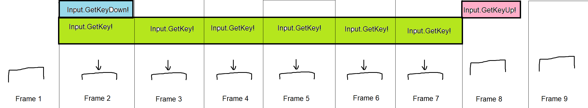

<!-- headingDivider: 3 -->
<!-- class: invert -->

# Input handling

## The two ways: Input Manager

* [Manual: Input](https://docs.unity3d.com/Manual/Input.html)
* There are two ways to get input in Unity
* The legacy [Input Manager](https://docs.unity3d.com/Manual/class-InputManager.html)
  * uses the Input class
  * uses Directinput
  * works almost always
  * (but sometimes controller axes are screwed up)
  * easier to setup -> this is the one we'll be using

## The two ways: Input system

* The new [Input System]((https://docs.unity3d.com/Packages/com.unity.inputsystem@1.3/manual/index.html))
  * Read more [on these slides](input-system)
  * Needs to be installed as a separate package
  * Needs more work to get it running than Input Manager
  * Uses XInput
  * "action-based"
  * We'll stick to the legacy input manager for now...

---



* Here's a button press event visualized across multiple frames.
* The colored boxes show which are the frames when the corresponding function returns `true`.

## Keyboard input

* uses [Keycodes](https://docs.unity3d.com/ScriptReference/KeyCode.html)
* [`Input.GetKeyDown(KeyCode.Space)`](https://docs.unity3d.com/ScriptReference/Input.GetKeyDown.html)
  * returns `true` for one frame when pressed down 
  * Good for jumps, navigating the UI, other ***discrete*** actions 
* [`Input.GetKey(KeyCode.Space)`](https://docs.unity3d.com/ScriptReference/Input.GetKey.html)
  * returns `true` for the duration of pressage
  * Good for movement or other ***continuous*** actions
* [`Input.GetKeyUp(KeyCode.Space)`](https://docs.unity3d.com/ScriptReference/Input.GetKeyUp.html)
  * return `true` for one frame when we stop pressing a button
  * Good for a charge weapon: hold down for charge, release button to shoot
  * Needed less often than the previous ones

## More general input

* What if you want to be able to change game controls?
* Or check both keyboard and game controller input?
* Use the ***GetButton*** functions instead
  * [`Input.GetButtonDown("Jump")`](https://docs.unity3d.com/ScriptReference/Input.GetButtonDown.html)
  * [`Input.GetButton("Jump")`](https://docs.unity3d.com/ScriptReference/Input.GetButton.html)
  * [`Input.GetButtonUp("Jump")`](https://docs.unity3d.com/ScriptReference/Input.GetButtonUp.html)
* But what IS the "Jump" button?
  * The keyboard and controller button mappings for "Jump" and other buttons are defined in the *Input table*

### Input table

* *Edit > Project Settings > Input Manager*
* You can change the names, and the buttons that correspond to the names
  * "Fire1" could be changed to "Crouch", for instance! 
* *Positive button* refers to a button being pressed
* *Negative button* is only needed for directional input
* You can assign an Alt Button for an alternate input method
* ***Note***: Keyboard and controller bindings are in their separate entries!
* Add new entries by increasing the *Size* property
  * It will duplicate the last entry in the list. Oh wow
* Use [this link](https://ritchielozada.com/2016/01/16/part-11-using-an-xbox-one-controller-with-unity-on-windows-10/) to see which button numbers correspond to which controller buttons
  * For example, `joystick button 0` is the Xbox button A
  * See button naming convention in [Docs: Input manager](https://docs.unity3d.com/Manual/class-InputManager.html)

## Analog input

* [Script Reference: Input.GetAxis](https://docs.unity3d.com/ScriptReference/Input.GetAxis.html)
* how to account for analog sticks? They aren't buttons you press
  * rather a two-dimensional field of many possible coordinates
  * -> separate input to two axes, vertical and horizontal
  * Sliding scale between -1 and 1
* [`Input.GetAxis(axisName)`](https://docs.unity3d.com/ScriptReference/Input.GetAxis.html)
  * Smoothing with *Gravity* and *Sensitivity*
  * *Deadzone* applied (no input registered if only move the analog stick a bit)
  * `float h = Input.GetAxis("Horizontal");`

### GetAxisRaw

* [`Input.GetAxisRaw(axisName)`](https://docs.unity3d.com/ScriptReference/Input.GetAxisRaw.html)
  * `float h = Input.GetAxisRaw("Horizontal");`
  * just the raw input data as-is
  * no deadzone, no smoothing

## Exercise 1. Player input
<!-- _backgroundColor: #29366f -->
Create a top-down player character with a sprite renderer that can
* change color with the ***Fire1*** button
* move with the analog stick

## Extra: Mouse input

<!-- backgroundColor: #5d275d -->
* [`Input.GetMouseButton(0)`](https://docs.unity3d.com/ScriptReference/Input.GetMouseButton.html)
  * Down & Up methods work similarly to previous examples as well
* get mouse position:
  * [`Vector2 mousePos = Input.mousePosition;`](https://docs.unity3d.com/ScriptReference/Input-mousePosition.html)
* you can also create a dedicated method for checking if the mouse cursor is on a GameObject:
  ```c#
  OnMouseDown()
  {
      // do stuff
  }
  ```

### Mouse input example

* [Script Reference: Input.GetMouseButton](https://docs.unity3d.com/ScriptReference/Input.GetMouseButton.html) (GetMouseButtonDown, GetMouseButtonUp)
* [Script Reference: Input.mousePosition](https://docs.unity3d.com/ScriptReference/Input-mousePosition.html)
```c#
    private Rigidbody rb;

    void Awake()
    {
        rb = GetComponent<Rigidbody>();
    }
    void OnMouseDown()
    {
        if (Input.GetMouseButton(0))
        {
            rb.AddForce(- transform.forward * 500f);
            rb.useGravity = true;
        }
    }
```

## Extra: Touch input

* [Script Reference: Input.GetTouch](https://docs.unity3d.com/ScriptReference/Input.GetTouch.html)
* [Script Reference: Input.touches](https://docs.unity3d.com/ScriptReference/Input-touches.html)
* [Script Reference: Camera.ScreenToWorldPoint](https://docs.unity3d.com/ScriptReference/Camera.ScreenToWorldPoint.html)
  ```c#
  if (Input.touchCount > 0)
    {
      Touch touch = Input.GetTouch(0);
      // Move thing if the screen has the finger moving.
      if (touch.phase == TouchPhase.Moved)
      {
        Vector3 position = new Vector3(
          touch.position.x,
          touch.position.y,
          Camera.Main.nearClipPlane
        );
        transform.position = Camera.Main.ScreenToWorldPoint(position);
      }
    }
  }
  ```

## Extra: Multiplayer input

* With the input table, you can assign the joystick index for every input with *Joy Num*
  * $\Rightarrow$ For multiplayer games, you need to create new entries for other players
  * ***ALSO:*** you need to set the positive button to "joystick **2** button 0" etc
* The new Input System handles this a bit more elegantly, see this tutorial:
  * [Madwomb: Unity Local Multi-player](http://madwomb.com/tutorials/GameDesign_UnityLocalMultiplayer.html)