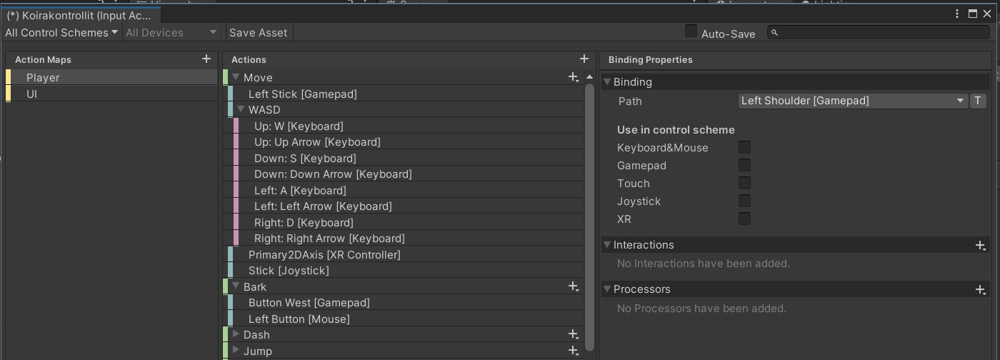
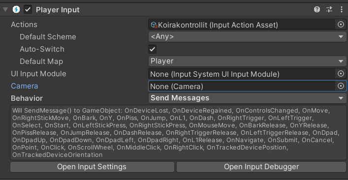

<!-- headingDivider: 3 -->
<!-- class: invert -->

# Input system

## 1. Installation & Setup

1) Install the Input System package to your project
     * Set the option *Project Settings > Player > Other settings > Configuration > Active Input Handling: Both*
    * This enables both the new Input System and the old Input Manager.
2) Create a new Input action asset (a `.inputactions` file) in *Create > Input Actions*.

### Input actions

* [Input System Manual: Input Actions](https://docs.unity3d.com/Packages/com.unity.inputsystem@1.0/manual/Actions.html)
* The purpose of input actions is to separate the input checking from the actual performed action
* After all, we might want a player to jump by pressing spacebar, pressing the A button of controller #1, touching an on-screen button, etc!
  * In the Input System, these are called *Input Schemes*. 
* So in the code, we don't want to check those all at once (what if the mappings change?), but rather check if a certain action has triggered

---



This is how an input action asset looks like in Unity.
* [Input System Manual: Input Action Assets](https://docs.unity3d.com/Packages/com.unity.inputsystem@1.0/manual/ActionAssets.html)

### Input action asset

* In the input asset window we define which inputs the actions are mapped to.
* On the left, we have the ***Action Maps*** panel
  * For instance, in a multiplayer game we would have different maps for different players.
  * In the image above, we have action maps for Player and UI.
* In the middle, we have the ***Actions*** panel
  * *Actions* are defined here (green).
  * Their input *bindings* are under the actions (blue).
  * Composite bindings have their *paths* under them (pink).
* On the right, we have the ***Binding properties*** panel
  * Here, we define what kind of input types are used for the input bindings under the Actions panel.

## 2. Create new bindings

1) Press the $+$ icon in the Actions panel to create a new action `Bark`. By default, it has no bindings.
2) Click `<No binding>` to create a new binding, or press the action's own $+$ icon (or right click the action) and create a new binding.
3) Click *Path* in the Binding properties panel
	* Either search for the input you want to bind to the action
	* ...or press the *Listen* button and just ***perform*** the input you want to bind. 

## 3. Add a player input component

* To use your inputs, you need to add a *Player input* component to the GameObject that you want to control with your inputs:
  
* Under the component, drag your Input Actions asset file into the *Actions* slot.
* Set the *Default map* to the one you want to use for this GameObject.
* Set Behavior to *Send Messages*.
  * Underneath, you will see what message listener functions are now usable!

## 4. Use the input system in code with `Send Messages`

* Add a controller script for the GameObject you added the Player input component into 
* To use the input system in the script, import the input system first with
  ```c#
  using UnityEngine.InputSystem;
  ```
* Now, add a new message listener function according to the name of your action (you can check their names from the list mentioned earlier):
  ```c#
  function OnBark() {
	// do stuff
  }
  ```

<!-- * See connected devices in *Window > Analysis > Input Debugger*
* If you don't see any devices, restart Unity. -->

## Reading

* [Video: How to use NEW Input System Package](https://www.youtube.com/watch?v=Yjee_e4fICc)
* [Madwomb: Unity Local Multi-player](http://madwomb.com/tutorials/GameDesign_UnityLocalMultiplayer.html)