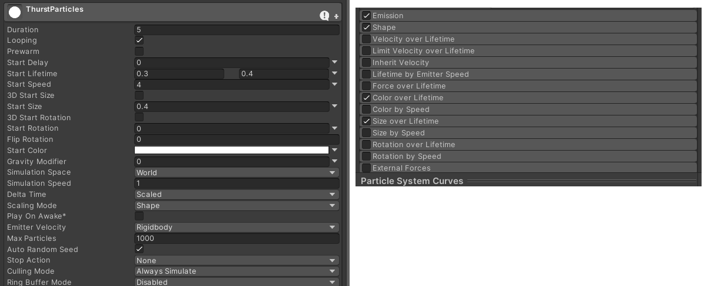

<!-- headingDivider: 3 -->
<!-- class: invert -->

# Particle system

## Two ways to create a particle system

* [Manual: Choosing your particle system solution](https://docs.unity3d.com/Manual/ChoosingYourParticleSystem.html)
  * [Built-in Particle system](https://docs.unity3d.com/Manual/Built-inParticleSystem.html)
  * [Visual Effect Graph](https://docs.unity3d.com/Manual/VFXGraph.html)

## Built-in particle system

* [Manual: Particle System component](https://docs.unity3d.com/Manual/class-ParticleSystem.html)
* [Script Reference: ParticleSystem](https://docs.unity3d.com/ScriptReference/ParticleSystem.html)

### Particle system component in Inspector


## Particle system modules

* [Manual: Particle System Modules](https://docs.unity3d.com/Manual/ParticleSystemModules.html)
* [Main](https://docs.unity3d.com/Manual/PartSysMainModule.html)
  * *Looping*
  * *Start Speed, Start Size, Start Lifetime*
  * *Simulation Space: World / Local*
  * *Play On Awake*
* [Emission](https://docs.unity3d.com/Manual/PartSysEmissionModule.html)
  * *Rate over time*

---

* [Shape](https://docs.unity3d.com/Manual/PartSysShapeModule.html)
  * Shape of the particle emitter
  * *Shape* (Circle is good for 2D)
  * *Radius*
  * *Arc*
  * *Position*, *Rotation*
* [Color over lifetime](https://docs.unity3d.com/Manual/PartSysColorOverLifeModule.html)
  * You can add a gradient so the particles change color over time
  * With the handles on top of the gradient, you can also change alpha value (opacity)
* There's also modules for changing other properties over lifetime

---

* [Texture Sheet Animation](https://docs.unity3d.com/Manual/PartSysTexSheetAnimModule.html)
  * If you want your particles to have a sprite animation, use this
  * *Grid*: tell how many cels your sprite sheet has
* [Renderer](https://docs.unity3d.com/Manual/PartSysRendererModule.html)
  * *Material*
    * You need to create a new material for your particles (see next slide!)
  * *Sorting fudge*: Bigger numbers mean particles are more probably in front of ofter GameObjects. Yeah.
  * *Order in layer*: Tells the draw order of particles in accordance to 2D layers, like tilemaps.

## Particle material

* Create a new material file with *Create > Material*
* Set some settings for it.
  * For basic sprite particles:
    * *Shader: Particles/Standard Unlit*
    * *Rendering Mode: Fade* or *Cutout*
    * Drag your particle sprite (or sprite sheet for animated particles!) to *Albedo*

## Control particle system with code

* How to stop / start emitting particles:
	```c#
	public ParticleSystem particles;

	if (!particles.isEmitting && Input.GetButtonDown("Fire1"))
	{
	    particles.Play();
	}
	if (particles.isEmitting && Input.GetButtonDown("Fire1"))
	{
	    particles.Stop();
	}
	```
* To emit 20 particles on command:
	```c#
	if (particles.isPlaying && Input.GetButtonDown("Fire2"))
	{
	    particles.Emit(20);
	}
	```

## Change properties with code

* You can't change module properties directly like this:
  ```c#
  dustParticles.shape.rotation = somethingNew
  ```
* You have to assign a new variable for the module first, and change the variables there:
	```c#
	var shape = dustParticles.shape;
	shape.rotation = new Vector3 (
		0, 0, Mathf.Atan2(PlayerMove.y, PlayerMove.x) * Mathf.Rad2Deg
	);
	var main = dustParticles.main;
	main.startSpeed = 2 * PlayerMove.magnitude;
	```

## Collision modules

* [Collision](https://docs.unity3d.com/Manual/PartSysCollisionModule.html)
  * *Type*: *World*
  * *Mode*: *2D* / *3D*
  * *Lifetime loss*: *1* (Die on collision)
  * *Collider Force* (Bounce on collision)
  * *Collide with*: You can change the collision layers so the particles only collide with specific layers. 
    * (GameObject's Collision layer does not affect particles!!)
* To run a script on particle collision:
  * *Send Collision Messages* has to be checked
  * add callback function [OnParticleCollision()](https://docs.unity3d.com/ScriptReference/MonoBehaviour.OnParticleCollision.html) (works also in 2D, there is no `OnParticleCollision2D`)

---

* [Triggers](https://docs.unity3d.com/Manual/PartSysTriggersModule.html)
  * allows you to access and modify particles based on their interaction with specific colliders
  * Add colliders to the List under the Triggers module
  * Set *Inside, Outside, Enter* and *Exit* to preferred value
    * ***Ignore***: does nothing
    * ***Kill***: destroys particle
    * ***Callback***: calls the [OnParticleTrigger()](https://docs.unity3d.com/ScriptReference/MonoBehaviour.OnParticleTrigger.html) callback on attached scripts (again, there is no `OnParticleTrigger2D`)

## Reading

* [Learn: Introduction to particle systems](https://learn.unity.com/tutorial/introduction-to-particle-systems#)
* [Brackeys video: Everything to know about the Particle system](https://www.youtube.com/watch?v=FEA1wTMJAR0)
* [Video Game Animation Study: How to Animate Game Explosions](https://www.youtube.com/watch?v=3JRAGfOnp0U)