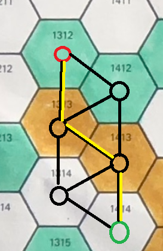

<!-- headingDivider: 3 -->
<!-- class: invert -->
# Pathfinding

## Artificial Intelligence (AI)

* In video games, AI is a catch-all term for techniques to create ***seemingly*** intelligent non-player characters (NPCs)
  * Nothing to do with [machine learning](https://en.wikipedia.org/wiki/Machine_learning), a technique behind more sophisticated AI systems
* The most important problem in programming a game AI:
  * *"How to figure out a path from A to B?"*
  * After this is solved, we can easily...
  	* make enemies patrol around
  	* make enemies follow the player
  	* make enemies attack other enemies?!?
* One of the earliest games to utilize pathfinding was [Tanktics (1976)](https://en.wikipedia.org/wiki/Tanktics:_Computer_Game_of_Armored_Combat_on_the_Eastern_Front) 

### Note

* Pathfinding is not necessary to create interesting enemy behaviour, though
  * In Super Mario Bros, enemies just go left and right
* You can create complex behaviour out of reactive rules without pathfinding!

## Quick intro to Unity 3D Navigation System

* [Learn: Navigation](http://unity3d.com/learn/tutorials/topics/navigation)
* [Manual: Navigation and pathfinding](https://docs.unity3d.com/Manual/Navigation.html)
* [Manual: Navigation System in Unity](https://docs.unity3d.com/Manual/nav-NavigationSystem.html)
* In 3D, we can use the Unity Navigation System for pathfinding
* It consists of:
  * NavMesh: walkable surfaces
  * NavMesh Agent: entities that walk on NavMeshes
  * NavMesh Link: shortcuts
  * NavMesh Obstacle: movable objects blocking navigation

## 2D pathfinding

* Unity doesn't have 2D NavMeshes by default, yay
* There are many 3rd party assets for that, though
  * [Aron Granberg: A*](https://arongranberg.com/astar) (This is the one we'll be using!)
  * [H8man: NavMeshPlus](https://github.com/h8man/NavMeshPlus)
  * [Nodal Pathfinding in Unity 2D with A*](http://www.jgallant.com/nodal-pathfinding-in-unity-2d-with-a-in-non-grid-based-games/)
  * [noobtuts: Navigation2D](https://noobtuts.com/unity/navigation2d)

## A* pathfinding algorithm



* [A*](https://en.wikipedia.org/wiki/A*_search_algorithm) (pronounced A-star) is a pathfinding algorithm commonly used in video games
* For an interactive example of A* and other pathfinding algorithms, see [Pathfinding.js](https://qiao.github.io/PathFinding.js/visual/)
* Pathfinding happens on a ***graph***: a network of possible routes
  * The network consists of nodes (a.k.a. ***waypoints***) (marked with circles in the image) that are connected by lines
* The path from point A (red circle) to point B (green circle) can only be created via connected nodes
  * A gap in the map could be created by removing a connection between nodes

## Adding A* pathfinding to your 2D project

1) Download the free version of the A* project [here](https://arongranberg.com/astar )
2) Drag and drop the downloaded Unitypackage file to your Unity editor, then click *Import*. Now it's in your Assets folder!
3) Create a new Empty GameObject and name it *Pathfinder*.
1) Add a new component, also named *Pathfinder* to it.

* [A* Docs: Getting started](https://arongranberg.com/astar/docs/getstarted.html)
* [A* Docs: Pathfinding in 2D](https://arongranberg.com/astar/docs/pathfinding2d.html)

### Setting up the Pathfinder component

5) *Inspector > Add new Graph > Grid graph* ([A* Docs: Grid graph](https://arongranberg.com/astar/docs/gridgraph.html))
6) Check the *2D* box. Now the graph should be visible in the Scene view.
7) Also check the *Use 2D physics* box.  
8) Set the *Obstacle Layer Mask* to *Everything* or a specific ***layer*** of your collision tiles.
   * ***Note:*** Not the sorting layer; a layer of the tilemap GameObject!
9)  Make the graph bigger with the Scale tool to envelop the whole level.
10) Click *Scan* in the bottom to update the grid. (Do this after every change!)
11) Click on the *Eye icon* in your *Grid Graph* to hide the scan.

* ***Note:*** You can largen the *Diameter* if your paths go too close to walls.
* ***Note 2:*** Uncheck *Cut Corners* so the enemies won't 

### Setting up the enemy

1) Create a new Empty GameObject named *Enemy*
2) Create a new 2D Sprite GameObject named *EnemyGfx* as the child of *Enemy*
3) Add a new component *AI Path (2D,3D)* to *Enemy*. This adds ***two*** components:
   1) a [Seeker](https://arongranberg.com/astar/docs/seeker.html) script that seeks the path
   2) an [AI path](https://arongranberg.com/astar/docs/aipath.html) script that controls the movement
4) For *AI Path*, set *Orientation* to *YAxisForward*.
5) Add a [AI Destination Setter](https://arongranberg.com/astar/docs/aidestinationsetter.html) component and drag *Player* to *Target* to make the enemy follow the player.

* ***Note:*** See links for documentation!

### Fine-tuning

* AI Path settings to consider: 
   * *Pick Next Waypoint Dist*: The distance where the script picks the next waypoint
   * *Max Speed*
   * *Radius*
   * *Gravity* (you might need to set this to *None*)
   * *Enable Rotation*

---

* To show the path in real time, enable *Gizmos > Seeker* in Game Mode.
  


## Path Scripting

* In AI destination Setter component, the *Target* is a public variable, so you can change it from any script with
  ```c#
  _aiDestinationSetter.target = newTarget;
  ```
* Sometimes you need to scan the path again to update it dynamically:
  ```c#
  path.active.Scan();
  ```
* To add custom functionality to when AI Path has reached its target, you can add code to AIPath.cs in method `onTargetReached`:
  ```c#
  public virtual void OnTargetReached () {
    SendMessage("TargetIsReached");
  }
  ```

## Scripting 1. Flip the sprite based on velocity

```c#
using Pathfinding;

[SerializeField] AIPath aiPath;

void Update()
{
  if (aiPath.desiredVelocity.x > 0.0f)
    _spriteRenderer.flipX = false;
  else if (aiPath.desiredVelocity.x < 0.0f)
    _spriteRenderer.flipX = true;
}

```

## Scripting 2. Changing target when on screen

* When enemy is on screen, make it follow the player.
* Otherwise, make it return to its spawn point.
* Add an empty GameObject "EnemySpawnpoints" in the scene that will be used as a container for spawn points.

### I. Setup

```c#
using Pathfinding;

public class FollowOnScreen : MonoBehaviour
{
    AIDestinationSetter aiset;
    GameObject Player;
    GameObject Spawnpoint;
    GameObject Spawnpointcontainer;

    void Start()
    {
        aiset = GetComponent<AIDestinationSetter>();
        Player = GameObject.FindGameObjectWithTag("Player");
        // Find Enemyspawnpoints GameObject & create a new empty Spawnpoint as its child
        Spawnpointcontainer = GameObject.Find("EnemySpawnpoints");
        Spawnpoint = Instantiate(
            new GameObject(),
            transform.position,
            transform.rotation,
            Spawnpointcontainer.transform
        );
    }
```
### II. Behaviour
```c#
    bool OnScreen()
    {
        float cameraHalfHeight = Camera.main.orthographicSize;
        float cameraHalfWidth = cameraHalfHeight * Camera.main.aspect;
        Vector3 difference = Camera.main.transform.position - transform.position;
        return (
            Mathf.Abs(difference.x) < cameraHalfWidth 
            && Mathf.Abs(difference.y) < cameraHalfHeight
        );
    }
    void Update()
    {

        if (OnScreen())
            aiset.target = Player.transform;
        else
            aiset.target = Spawnpoint.transform;
    }
}
```

## Scripting 3. Moving between targets

* Enemy has an empty child GameObject *Patrolpoints* that contains empty GameObjects *Point1*, *Point2*, etc.
  * These are the targets the enemy moves between 
* We don't create any new GameObjects now, but instead we move the whole *Patrolpoints* GameObject under the *EnemyPatrolpoints* GameObject.
* We add the patrol point transforms to a list.
* Then, when enemy reaches a point, it gets assigned the next target on the list.
### I. Setup

```c#
using Pathfinding;

public class PatrolEnemy : MonoBehaviour
{
    AIDestinationSetter aiset;
    AIPath aipath;
    [SerializeField] List<Transform> patrolPoints = new List<Transform>();
    [SerializeField] int currentTarget;

    void Start()
    {
        aiset = GetComponent<AIDestinationSetter>();
        aipath = GetComponent<AIPath>();

        // move patrolpoints under enemypatrolpoints so they won't move as enemy moves
        Transform points = transform.Find("Patrolpoints");
        GameObject newParent = GameObject.Find("EnemyPatrolpoints");
        points.SetParent(newParent.transform);
        
        for (int i = 0; i < points.childCount; i++)
        {
            patrolPoints.Add(points.GetChild(i));
        }
        SetCurrentTarget(0);
    }
```

### II. Behaviour

```c#
    void SetCurrentTarget(int i)
    {
        // modulo makes sure we choose a target from the list
        aiset.target = patrolPoints[i % patrolPoints.Count];
        currentTarget = i % patrolPoints.Count;
    }

    void Update()
    {
        Vector3 distance = aiset.target.transform.position - transform.position;

        // endReachedDistance can be changed in AI Path component's inspector 
        if (distance.magnitude < aipath.endReachedDistance)
            SetCurrentTarget(currentTarget + 1);
    }
}
```

## Scripting 4. Custom behaviour

* The following Enemy behaviour script is an alternative to the *AI Path* and *AI Destination Setter* scripts, so remove them if you follow these.
  * You do need the *Seeker* script, however!
* Add a Collider component so your Enemy can't walk through obstacles.
* Add a Rigidbody so you can control your Enemy with forces and collisions.


### I. Initializations

```c#
using System.Collections;
using System.Collections.Generic;
using UnityEngine;
using Pathfinding;

public class EnemyAI: MonoBehaviour
{
    [SerializeField] Transform target;
    [SerializeField] float speed = 200f;
    [SerializeField] float nextWaypointDistance = 3f;

    Path path;
    Seeker seeker;
    Rigidbody2D rb;

    int currentWaypoint = 0;
    bool reachedEndOfPath = false;

    ...
I
```

### II. Start, UpdatePath, OnPathComplete

```c#
void Start()
{
    seeker = GetComponent<Seeker>();
    rb = GetComponent<Rigidbody2D>();

    InvokeRepeating("UpdatePath", Of, .5f);
}
void UpdatePath()
{
    if (seeker.IsDone())
        seeker.StartPath(rb.position, target.position, OnPathComplete);
}
void OnPathComplete (Path p)
{
    if (!p.error)
    {
      path = p;
      currentWaypoint = 0;
    }
}
```

### III. FixedUpdate

```c#
void FixedUpdate()
{
    if (path == null)
        return;
    
    if (currentWaypoint >= path.vectorPath.Count)
    {
        reachedEndOfPath = true;
        return;
    }
    else
    {
        reachedEndOfPath = false;
    }
    Vector2 direction = ((Vector2) path.vectorPath[currentWaypoint] - rb.position).normalized;
    Vector2 force = direction * speed * Time.deltaTime;

    rb.AddForce(force);

    float distance = Vector2.Distance(rb.position, path.vectorPath[currentWaypoint]);

    if (distance < nextWaypointDistance)
    {
        currentWaypoint++;
    }
}
```

## Exercise 0. Point and click
<!-- _backgroundColor: #29366f -->

Make a point and click character controller:
* When you click on a walkable spot, make the character walk to it. 

## Exercise 1. Enemy on patrol
<!-- _backgroundColor: #29366f -->

Create a non-player character that patrols between three points on a 2d top-down area.

## Exercise 2. Tactical Espionage Action
<!-- _backgroundColor: #29366f -->

Add a visibility cone for the enemy. If it sees the player, make it follow it.

If the player is outside the visibility cone for five seconds, make the enemy return to its patrol route.

## Learning

* [Brackeys video: 2D Pathfinding](https://www.youtube.com/watch?v=jvtFUfJ6CP8)
* [GMTK: What Makes Good AI?](https://www.youtube.com/watch?v=9bbhJi0NBkk)
* [Jeff Orkin: Three States and a Plan: The A.I. of F.E.A.R.](https://www.gamedevs.org/uploads/three-states-plan-ai-of-fear.pdf)