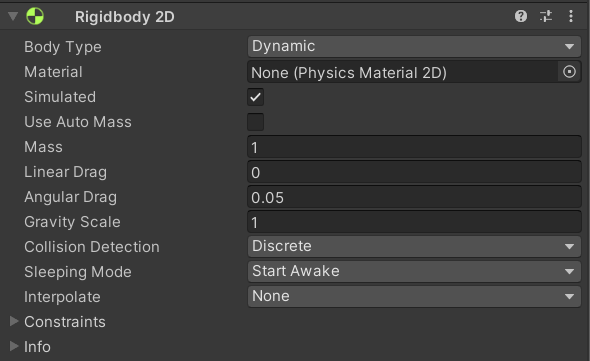
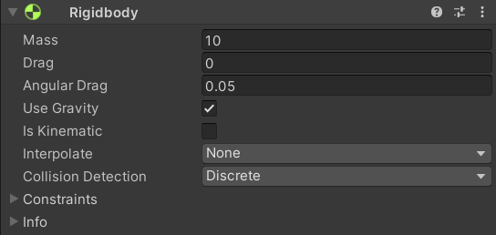

<!-- headingDivider: 3 -->
<!-- class: invert -->

# Physics

## Unity physics engines

* [Manual: Physics](https://docs.unity3d.com/Manual/PhysicsSection.html)
* A physics engine is used to calculate accelerations, collisions, gravity and other forces 
  * In 3D, Unity uses NVIDIA's **PhysX** for its physics
  * In 2D, Unity uses **Box2D**
* When you add a physics component to a GameObject, it is then part of the physics system
  * Rigidbody, Rigidbody2D

## Built-in physics engines

* [Manual: 3D Physics for object-oriented projects](https://docs.unity3d.com/Manual/PhysicsOverview.html)
* [Manual: Physics reference 2D](https://docs.unity3d.com/Manual/Physics2DReference.html)

## Rigidbody

* 3D
  * [Manual: Rigidbody overview](https://docs.unity3d.com/Manual/RigidbodiesOverview.html)
  * [Manual: Rigidbody class](https://docs.unity3d.com/Manual/class-Rigidbody.html)
  * [Script Reference: Rigidbody](https://docs.unity3d.com/ScriptReference/Rigidbody.html)
* 2D
  * [Manual: Rigidbody 2D class](https://docs.unity3d.com/Manual/class-Rigidbody2D.html)
  * [Script Reference: Rigidbody 2D](https://docs.unity3d.com/ScriptReference/Rigidbody2D.html)
* Literally: a body (object) that does not deform, i.e., is rigid
* Takes over the movement of the GameObject it is attached to
* ***Note:*** Do not move it from a script by changing the Transform properties such as position and rotation
  * Instead, you should apply ***forces***

### The Rigidbody components

<div class="columns" markdown="1">
<div markdown="1">



</div>
<div markdown="1">



</div>
</div>

* Every rigidbody has a ***mass***, which affects how much forces influence them 
* ***Note:*** If you have problems having two non-moving Rigidbody2Ds collide, set *Sleeping Mode* to *Never Sleep*

## Types of rigidbodies
* ***Dynamic***
  * is part of the physics engine and behaves like a "regular" physics-based object
  * can be controlled indirectly (with forces)
* ***Kinematic***
  * is not affected by the physics system
  * only queries the physics engine for collisions
  * can be controlled directly:
    * in 2D, use `Rigidbody2D.MovePosition`, `Rigidbody2D.MoveRotation`
    * in 3D, manipulate `transform.position`
* ***Static*** (only 2D)
  * an immovable object, can only collide with non-static rigidbodies

### Interpolation

* [Script Reference: Rigidbody Interpolation](https://docs.unity3d.com/ScriptReference/Rigidbody-interpolation.html)
* Interpolation allows you to smooth out the effect of running physics at a fixed frame rate.

### Constraints

* [Script Reference: Rigidbody Constraints](https://docs.unity3d.com/ScriptReference/Rigidbody-constraints.html)
* "which degrees of freedom are allowed for the simulation of this Rigidbody"
* You can freeze position or rotation of a given axis

## Moving dynamic Rigidbodies

* You should interact with the physics system in `FixedUpdate`, not `Update`

* [Script Reference: Rigidbody.AddForce](https://docs.unity3d.com/ScriptReference/Rigidbody.AddForce.html)
  ```c#
  if (Input.GetButton("Jump"))
  {
      //Apply a force to this Rigidbody in direction of this GameObjects up axis
      m_Rigidbody.AddForce(transform.up * m_Thrust);
  }
  ```
* [Script Reference: Rigidbody.AddTorque](https://docs.unity3d.com/ScriptReference/Rigidbody.AddTorque.html)
  ```c#
  float turn = Input.GetAxis("Horizontal");
  rb.AddTorque(transform.up * torque * turn);
  ```

## Force modes


* When applying a force, you can give the function a second argument: the mode with which the force is applied
* [ScriptReference: ForceMode](https://docs.unity3d.com/ScriptReference/ForceMode.html) has a good example project showcasing all four modes
  * `ForceMode.Force` is the default: the resulting acceleration is dampened by the mass of the rigidbody
  * `ForceMode.Acceleration` gives acceleration directly, disregarding the mass of the body.
  * `ForceMode.Impulse` gives the body a **velocity** (dampened by its mass), not an acceleration, resulting in snappier movement
  * `ForceMode.VelocityChange` is like impulse, but disregards the mass of the body.
* ***Note:*** Rigidbody2D only supports `ForceMode.Force` and `ForceMode.Acceleration`!

## Extra: More functions
<!-- _backgroundColor: #5d275d -->

* [Rigidbody.AddRelativeForce](https://docs.unity3d.com/ScriptReference/Rigidbody.AddRelativeForce.html)
  * Adds a force to the rigidbody relative to its coordinate system.
* [Rigidbody.AddRelativeTorque](https://docs.unity3d.com/ScriptReference/Rigidbody.AddRelativeTorque.html)
  * Adds a torque to the rigidbody relative to its coordinate system.
* [Rigidbody.AddForceAtPosition](https://docs.unity3d.com/ScriptReference/Rigidbody.AddForceAtPosition.html)
  * Applies force at position. As a result this will apply ***a torque and a force*** on the object.

## Changing the velocity directly

* You can also manipulate rigidbody velocity directly
  * ***Do this only if you don't get desired effects with AddForce or AddTorque***
* Velocity
  * [Script reference: Rigidbody.velocity](https://docs.unity3d.com/ScriptReference/Rigidbody-velocity.html) (Vector3)
  * [Script reference: Rigidbody2D.velocity](https://docs.unity3d.com/ScriptReference/Rigidbody2D-velocity.html) (Vector2)
* Angular velocity
  * [Script reference: Rigidbody.angularVelocity](https://docs.unity3d.com/ScriptReference/Rigidbody-angularVelocity.html) (Vector3)
  * [Script reference: Rigidbody2D.angularVelocity](https://docs.unity3d.com/ScriptReference/Rigidbody2D-angularVelocity.html) (float)

<!-- _footer: "See [Hyperphysics](http://hyperphysics.phy-astr.gsu.edu/hbase/rotq.html) for more info about angular quantities" -->

## Gravity

* ***Note:*** by default, gravitational acceleration is $9.81m/s^2$
* You can change it from Unity settings
  * *Edit > Project Settings > Physics (2D) > Gravity*
  * for top-down 2d games, you want gravity to be zero

## Extra: Raycasting

<!-- _backgroundColor: #5d275d -->
* See [2D basics](2d-basics#extra-two-ways-for-2d-shooting)

## Links

* [Manual: Physics HOWTOs](https://docs.unity3d.com/Manual/PhysicsHowTos.html)