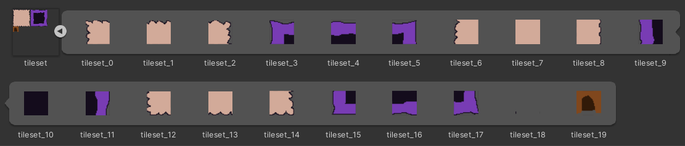

<!-- headingDivider: 3 -->
<!-- class: invert -->

# Tilemaps and tile-based backgrounds

## What is a tilemap?

* Tilemaps are images that are split into constant-size tiles
  * They're used often for creating loads of background art in 2D games
* A good introduction to Unity tilemaps:
  * [Brackeys video: Tilemaps](https://www.youtube.com/watch?v=ryISV_nH8qw)
* See this [free asset pack](https://cupnooble.itch.io/sprout-lands-asset-pack) for example!

## Tilemap asset

* [Manual: Tilemap workflow](https://docs.unity3d.com/Manual/Tilemap-workflow.html)
* To create a new tilemap, add an image into your project that contains a tilemap
* Change its settings in inspector (see image)
  * Set *Sprite mode* to *Multiple*
  * Set *Pixels per unit* to grid size (e.g., 32)
* Open *Sprite Editor* and click *Slice*
  * Set *Type* to *Grid by cell size*, click *Slice*
  * Close the Sprite editor and save.
* Now the sprite asset should have the individual tiles visible like this:
  * 

## Tilemap & Grid GameObjects

* Create a new [Tilemap](https://docs.unity3d.com/Manual/class-Tilemap.html) GameObject: *2D Object > Tilemap > Rectangular*
  * We will draw the levels to the TileMap GameObject
* A [Grid](https://docs.unity3d.com/Manual/class-Grid.html) GameObject gets creates as the parent object of the tilemap
  * It defines the level-wide grid
  * We usually only need one Grid GameObject per scene
* For multiple layers, you can create multiple tilemaps under the same grid
  * It's a good idea to have at least two layers: 
  * "Terrain tiles" for traversable background
  * "Wall tiles" for collidable walls
* Tilemap GameObject has two components
  * Tilemap Component, [Manual: Tilemap](https://docs.unity3d.com/Manual/class-Tilemap.html)
  * Tilemap Renderer Component, [Manual: Tilemap renderer](https://docs.unity3d.com/Manual/class-TilemapRenderer.html)

## Creating a Tile Palette

* First off, create a new folder for the tile assets (e.g. *Assets/Tiles*) we'll create shortly
* We need a new window, ***Tile Palette***, to pick the tiles we draw on the tilemap
  * *Window > 2D > Tile Palette*
* By default, it does not contain any tiles (a.k.a., a palette) to choose from.
  * Click *Create new palette*
* Choose a name that describes the tile palette (Like GroundTilePalette), and click *Create*. Save the palette asset to the tile assets folder we created
  * The tile palette is a prefab asset that we don't need to touch

    

### Drawing with the tile palette

* Now that we have a palette, we can drag the tilemap sprite asset from the Project window to the Tile Palette window.
* This creates ***tile assets*** for all tiles: [Manual: Tile Assets](https://docs.unity3d.com/Manual/Tilemap-TileAsset.html)
  * Choose the folder we created earlier *Assets/Tiles* to save the assets into
* Then, paint away to create your tile-based level! The brush tool should be active by default.
* ***Note:*** We can also drag regular single sprites into the tile palette!

### Tile palette pro tips

* Use the *Pick or marquee select* tool (Eyedropper) to quickly copy-paste areas in the tilemap.
* There are also hidden flip & rotate tools!
  * Go to *Preferences > 2D > Tile Palette*
  * Select a tool in the list and press the + Button.
    * *FlipXTool, FlipYTool, RotateClockwiseTool, RotateCounterClockwiseTool*
  * The tools are a bit counterintuitive, but they're easier to use with hotkeys
    * On Finnish keyboard:
      * Rotate: ***`***, ***Å***
      * Flip: ***SHIFT +`***, ***SHIFT + Å***,)

## Collision

* To add collision to your tilemap layer, just add the [Tilemap Collider 2D component]((https://docs.unity3d.com/Manual/class-TilemapCollider2D.html))
* Shape of the collider is decided automatically by Unity for every tile
  * Enter play mode once to see how the collider is shaped 
  * You can change tile collider for every tile:
    * Open the Sprite settings and go to *Sprite editor > Custom Physics Shape*
    * Click on a tile that had bad collision shape and click *Generate*
* ***Note:*** If you want to only have square grid collisions, you can also just use a separate invisible layer for collisions (disable its Tilemap Renderer component)

## 2D Tilemap Extras

* [Packages: 2D Tilemap Extras](https://docs.unity3d.com/Packages/com.unity.2d.tilemap.extras@1.6/manual/index.html)
* ***2D Tilemap Extras*** Package contains many goodies
  * Autotiling
  * Animated tiles
  * GameObject tiles...
* Comes in 2D projects by default nowadays
<!-- 
  * It's in the Unity Package Manager as a Preview package
  * Cogwheel > Advanced Project Settings > Enable Preview Packages
  * Packages dropdown: Unity Registry
-->

## 2D extras: Autotiling

* ***Autotiling*** is a technique for creating 2d levels faster with ***Rule tiles***
  * E.g., instead of inserting every corner tile by hand, autotiling inserts corner tiles where they should appear 
* [How To Use Auto Tiling in Unity 2020](https://www.youtube.com/watch?v=nfjAznD_MaU) (might be outdated in some aspects)
* Open Project Window and right click, then choose *Create > 2D > Tiles > Rule Tile*
  * Drag a sprite to Inspector
  * Add *Tiling Rules* (see next slide)
  * Then, Drag the Rule Tile to an empty slot in the tile palette. You're done!

## 2D extras: Animated tile

* Use the ***Animated Tile*** to create tiles with animations in them.
  * Great for waterfalls, animated torches etc. in the background
  * *Create > 2D > Tiles > Animated Tile* 
  * Drag sprites to the tile in the Inspector
  * Set animation speed (if you want the speed to always be the same, set the minimum and maximum speed to a same value)
  * Drag the newly created animated tile from Project window to Tile Palette
    * Now you can draw with the animated tile!

## 2D extras: GameObject tile

* GameObjects can be "drawn" (created) as tiles in the tilemap with the GameObject brush
* It's a different brush than the default brush we've been using and has to be set up first
* Remember to go back to default brush when you want to draw background tiles again!
* You'll need a Prefab of the GameObject you want to spawn in the tilemap

### GameObject tile setup

1. Drag a sprite to the tile palette that you want to use as the created GameObject
2. Tile palette: Change *Default brush* to *GameObject brush*
3. Choose the brush tool
4. Click *Edit* to enter the edit mode
     * ***BE CAREFUL!*** Remember to exit edit mode later.
5. Drag the GameObject Prefab to *Element 0*
6. Click on the tile you added the sprite to
7. Click *Edit* to exit *Edit* mode.
   * Now, when you click on the chosen tile, it should display the GameObject.
8. Use the GameObject brush to add new GameObjects - they'll show up in Hierarchy right away.

## Exercise 1. A tiled level
<!-- _backgroundColor: #29366f -->

Import a tilemap from an existing sprite sheet. Create a tiny level out of your tile assets!

## GameObject on a grid

* ***Note:*** If snapping to the grid is your concern, you're better off using the GameObject tile
* Without the GameObject tile, you can do it like this:
* To snap a player character to a grid, you have two options:
  a) Move the grid to position (0.5, 0.5)
  b) Make the player's sprite renderer a child GameObject, and move it to coordinates (0.5,-0.5,0)
	* Also, add the same offset to player's RigidBody
* Then, click on the *Snap to grid* button (left side of *Play* button)

## Fixing ugly seams in tilemap

* Many things can cause this.
* In Game Mode, create a new resolution and set it to a *Fixed resolution* that is a multiple of your tile size
  * For example, for a tile size of 32, a 480x320 is a good choice.
* *Edit > Project Settings > Quality > Anti-aliasing: Disabled* 
  * See also [2D animation: Pixel art in unity](./2d-animation#extras-pixel-art-in-unity)
* You might even have to create a custom material for all pixelart sprites that has *Pixel snap* enabled